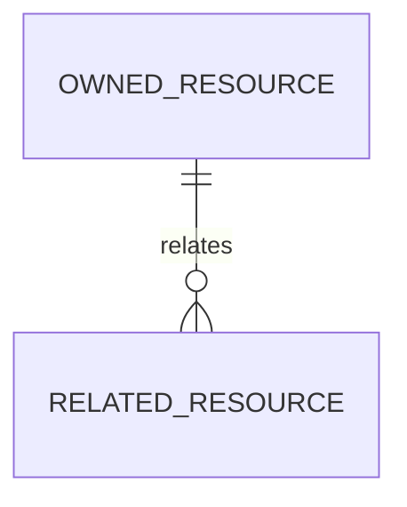

# Backend Feature Specification: [FEATURE NAME]

**Phase / Spec**: [Phase NN / SPEC-BE-NNN of 014]  
**Working Branch**: `main`
**Feature Directory**: `[apps/api/specs/NNN-name]`  
**Base Revision**: `[commit]`  
**Created**: [DATE]  
**Status**: Draft  
**Input**: "$ARGUMENTS"

## Objective and Scope

[State the backend outcome, owned boundary, and explicit exclusions.]

## Dependencies and Repository Baseline

- **Prior Specs**: [dependencies]
- **Current repository facts**: [verified facts]
- **Governing documents**: Backend Constitution and Backend Master Plan

## Owned Resources

List every table, view, function, trigger, API, queue, job, event, cache, Storage
bucket, migration family, and operational contract owned by this Spec. State
explicitly what belongs to other Specs.

## User Scenarios and Testing

### User Story 1 - [Title] (Priority: P1)

[Outcome]

**Why this priority**: [rationale]

**Independent Test**: [observable test]

**Acceptance Scenarios**:

1. **Given** [state], **When** [action], **Then** [outcome].

### Edge Cases

- [Boundary or failure case and required behavior.]

## Database Design

### Owned Tables

[Complete columns, types, nullability, defaults, PK/FK, constraints, and indexes.]

### Relationships and ERD

### RLS, Grants, and Authorization

[Deny-by-default policies, grants, roles, and positive/negative tests.]

## API Contracts

| Method | Path | Auth | Request | Success response | Errors |
|---|---|---|---|---|---|
| [verb] | [path] | [boundary] | [contract] | [contract] | [stable codes] |

## Functions, Views, and Triggers

[Owned database objects and exact behavioral contracts.]

## Queues, Jobs, and Events

[Owned queue topics, jobs, retry/idempotency rules, and event schemas.]

## Business Rules

- [Testable invariant.]

## Security and Privacy Requirements

[Applicable OWASP ASVS/API/Top 10/MASVS controls and release blockers.]

## Performance and Caching Requirements

[P95/P99, payload, query, timeout, cache, and load-test requirements.]

## Mobile and Admin Integration

[Contract impact, mock mapping, client secrets boundary, and cutover ownership.]

## Functional Requirements

- **FR-001**: The backend MUST [testable requirement].

## Tests and Verification Evidence

[Unit, contract, integration, E2E, pgTAP, security, performance, concurrency,
container, migration, recovery, and scan evidence required by the Spec.]

## Migration and Rollback Strategy

[Order, checksums, compatibility, rollback, correction, and reconciliation.]

## Observability and Operations

[Logs, metrics, traces, alerts, runbooks, and safe cardinality.]

## Assumptions

- [Documented default derived from approved architecture.]

## Out of Scope

- [Explicit exclusion and owning Spec where known.]

## Acceptance Criteria

- **AC-001**: [Measurable acceptance criterion.]

## Success Criteria

- **SC-001**: [Technology-agnostic measurable outcome.]

## Definition of Done

- [ ] All owned scope, tests, security, performance, observability, migration,
      rollback, recovery, and acceptance evidence required by this Spec passes.
- [ ] After local pre-push gates pass, the verified Spec is committed and pushed
      directly to `main` so remote-only evidence can run.
- [ ] The Spec is complete only after all local and remote release blockers pass;
      remote failures are corrected by forward-fix commits on `main`.

Verification listed in this document is required evidence, not a claim that it
has already been executed.
