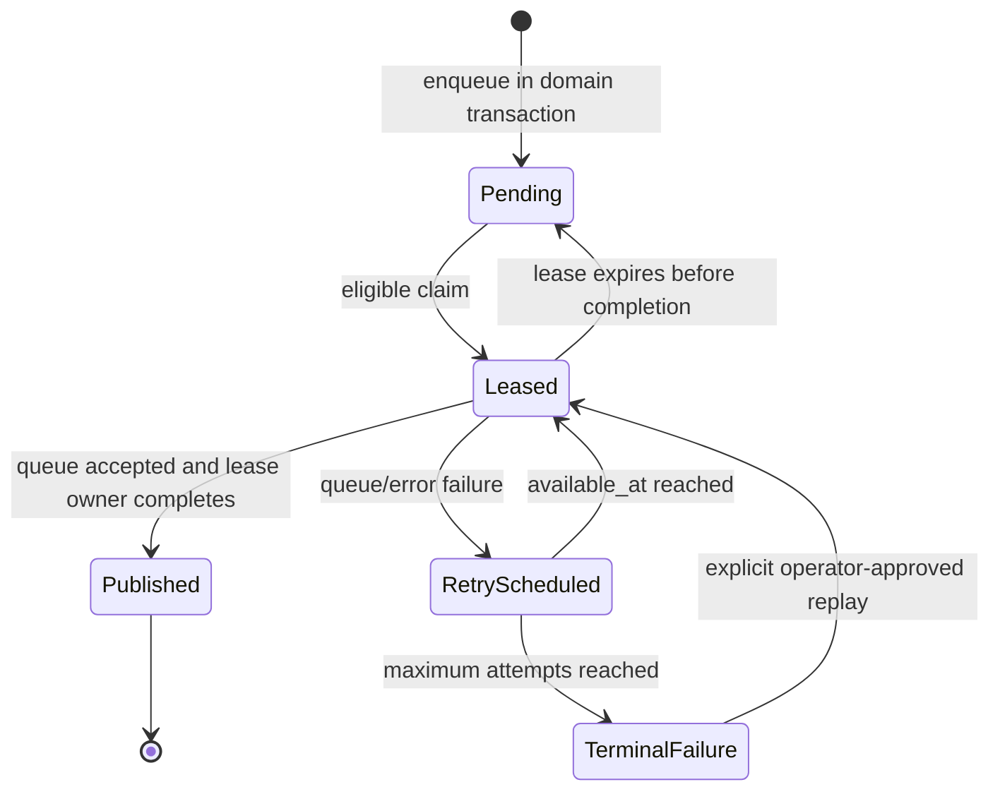
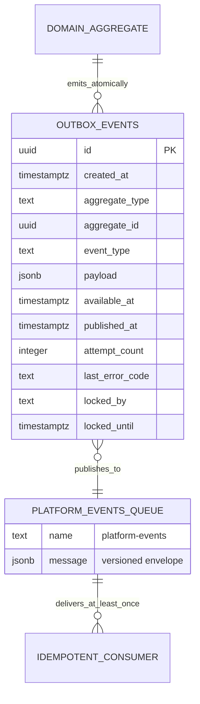

# Data Model: SPEC-BE-001 Backend Foundation

**Date**: 2026-08-27  
**Source**: [spec.md](./spec.md) and [plan.md](./plan.md)  
**Database authority**: Ordered immutable SQL under root `supabase/migrations/`

## Ownership Summary

| Kind | Owned object |
|------|--------------|
| Schema | `private`, `audit` baseline and privileges |
| Table | `private.outbox_events` |
| Function | `private.set_updated_at_and_version()` |
| Function | `private.enqueue_outbox_event(text,text,uuid,jsonb)` |
| Function | `private.claim_outbox_batch(text,integer,integer)` |
| Queue | logged internal `platform-events` Supabase Queue/`pgmq` queue |
| Storage bucket | `support-attachments` |
| Storage bucket | `report-exports` |
| Storage bucket | `voice-temp` |

No other relation, function, trigger attachment, public view, queue, policy,
seed domain, or product record is created by this Spec.

## Database Schemas And Roles

### Schemas

| Schema | Purpose | Client access |
|--------|---------|---------------|
| `public` | Reserved for later client-safe domain objects; baseline default privileges are hardened | No new public object in this Spec |
| `private` | Outbox and reusable internal functions | No `anon` or `authenticated` usage |
| `audit` | Reserved private namespace for SPEC-BE-003 audit objects | No objects and no client usage in this Spec |
| `extensions` | Approved Supabase extensions, including `pgcrypto`, `pgmq`, and test-only `pgtap` where applicable | No direct client access |

### Privilege Roles

Migrations define NOLOGIN group roles; deployment binds runtime credentials to
them outside SQL without placing passwords in migrations.

| Role | DDL | Direct outbox DML | Function execution | Queue access |
|------|-----|-------------------|--------------------|--------------|
| migration owner | yes, deployment job only | yes | all owned functions | create/configure/smoke |
| API runtime | no | none | enqueue only for authorized server operations | none |
| worker runtime | no | lifecycle column update only | enqueue and claim | send/read only as required by dispatcher/readiness |
| `anon` | no | none | none | none |
| `authenticated` | no | none | none | none |

Default schema, table, sequence, and function privileges are revoked before
minimum grants. PUBLIC execute is revoked from every owned function.

## Table: `private.outbox_events`

### Complete Column Design

| Column | PostgreSQL type | Nullable | Default | Key / constraints | Mutation rule |
|--------|-----------------|----------|---------|-------------------|---------------|
| `id` | `uuid` | no | `gen_random_uuid()` | PK | immutable |
| `created_at` | `timestamptz` | no | `now()` | UTC enqueue time | immutable |
| `aggregate_type` | `text` | no | none | trimmed length 1..64; lower-case namespace token pattern | immutable |
| `aggregate_id` | `uuid` | yes | `null` | no FK because aggregates span later Specs | immutable |
| `event_type` | `text` | no | none | trimmed length 3..128; lower-case namespaced event pattern | immutable |
| `payload` | `jsonb` | no | none | JSON object; serialized size <=64 KiB | immutable |
| `available_at` | `timestamptz` | no | `now()` | eligible retry time | worker lifecycle only |
| `published_at` | `timestamptz` | yes | `null` | null until accepted by queue | worker lifecycle only; once non-null cannot return to null |
| `attempt_count` | `integer` | no | `0` | `attempt_count >= 0` | worker increments only |
| `last_error_code` | `text` | yes | `null` | length 1..64 when present; stable safe code pattern | worker lifecycle only |
| `locked_by` | `text` | yes | `null` | length 1..128 when present | worker lifecycle only |
| `locked_until` | `timestamptz` | yes | `null` | present exactly when `locked_by` is present | worker lifecycle only |

### Table Constraints

The migration creates named constraints equivalent to:

```sql
primary key (id)
check (char_length(btrim(aggregate_type)) between 1 and 64)
check (aggregate_type ~ '^[a-z][a-z0-9_-]*$')
check (char_length(btrim(event_type)) between 3 and 128)
check (event_type ~ '^[a-z][a-z0-9_-]*(\.[a-z][a-z0-9_-]*)+$')
check (jsonb_typeof(payload) = 'object')
check (octet_length(payload::text) <= 65536)
check (attempt_count >= 0)
check (last_error_code is null or (
  char_length(last_error_code) between 1 and 64 and
  last_error_code ~ '^[A-Z][A-Z0-9_]*$'
))
check ((locked_by is null) = (locked_until is null))
check (locked_by is null or char_length(locked_by) between 1 and 128)
check (published_at is null or (locked_by is null and locked_until is null))
```

Event approval is enforced by reviewed versioned event contracts and authorized
server callers. The database enforces bounded namespaced syntax and object size;
it does not add a speculative event-registry table.

### Indexes

| Name | Definition | Query served |
|------|------------|--------------|
| `outbox_events_pkey` | unique btree `(id)` | event identity and lease completion |
| `outbox_events_claim_idx` | btree `(published_at, available_at)` where `published_at is null` | eligible unpublished claim scan required by the Master Plan |
| `outbox_events_claim_order_idx` | btree `(available_at, id)` where `published_at is null` | deterministic claim order without sorting the unpublished backlog |
| `outbox_events_aggregate_history_idx` | btree `(aggregate_type, aggregate_id, created_at)` | bounded aggregate delivery diagnosis |
| `outbox_events_lease_recovery_idx` | btree `(locked_until)` where `published_at is null` | expired lease recovery and alerting |

The claim query uses this required index and applies deterministic `id` ordering
within eligible rows. The one-million-row EXPLAIN gate must prove the final plan;
any later index change requires an approved Master Plan update and new evidence.

### Row-Level Security And Grants

- Enable and force RLS on `private.outbox_events`.
- Add no `anon`, `authenticated`, or API row policy.
- Revoke all table privileges from PUBLIC, `anon`, and `authenticated`.
- API runtime has no table privilege; it can only execute the enqueue function.
- Worker runtime receives `SELECT` and column-level `UPDATE` only on
  `available_at`, `published_at`, `attempt_count`, `last_error_code`,
  `locked_by`, and `locked_until`, plus an RLS worker policy.
- The worker policy never grants INSERT or DELETE and immutable columns have no
  update grant.
- Every completion/failure SQL statement includes both `id = $eventId` and
  `locked_by = $workerId`; completion also clears both lease columns. Zero
  updated rows means stale lease and must not be retried as success.
- No row is physically deleted by the dispatcher. Published-history retention
  policy is later operational governance and cannot remove failed evidence.

### State Model



State predicates:

| State | Predicate |
|-------|-----------|
| Pending | unpublished, available, and no active lease |
| Leased | unpublished and `locked_by/locked_until` present with future expiry |
| RetryScheduled | unpublished, no active lease, `available_at > now()`, attempts >0 |
| TerminalFailure | unpublished, attempts at configured maximum, safe terminal code retained |
| Published | `published_at` set and lease cleared |

There is no exactly-once state. A crash after queue acceptance and before
`published_at` can publish a duplicate; downstream idempotency is mandatory.

## Function: `private.set_updated_at_and_version()`

### Signature

```sql
private.set_updated_at_and_version() returns trigger
```

### Contract

- `BEFORE UPDATE` trigger helper for later mutable tables that explicitly attach
  it in their owning migrations.
- Requires `updated_at timestamptz` and `version bigint` columns on the target.
- Always assigns `NEW.updated_at = now()` and `NEW.version = OLD.version + 1`.
- Caller-supplied lifecycle values are overwritten.
- Fixed `search_path = pg_catalog`; no dynamic SQL and no runtime execute grant.
- SPEC-BE-001 creates only the function, not a trigger on outbox or later tables.

## Function: `private.enqueue_outbox_event(...)`

### Signature

```sql
private.enqueue_outbox_event(
  event_type text,
  aggregate_type text,
  aggregate_id uuid,
  payload jsonb
) returns uuid
```

### Contract

1. Trim and validate names against the same table bounds/patterns.
2. Require object-shaped payload at most 64 KiB.
3. Reject keys matching the central forbidden sensitive-key denylist, including
   token, authorization, cookie, secret, password, credential, connection
   string, and raw provider response forms.
4. Insert exactly one row with generated ID and defaults.
5. Return that ID.
6. Execute in the caller transaction; caller rollback removes the row.

It is `SECURITY DEFINER`, owned by the migration owner, uses a fixed
`search_path`, schema-qualifies every object, revokes PUBLIC execute, and is
granted only to approved server privilege roles. Authorization for the domain
mutation remains in the caller; this helper cannot authorize a product action.

## Function: `private.claim_outbox_batch(...)`

### Signature

```sql
private.claim_outbox_batch(
  worker_id text,
  limit_count integer,
  lease_seconds integer
) returns setof private.outbox_events
```

### Contract

- `worker_id`: trimmed length 1..128.
- `limit_count`: 1..100.
- `lease_seconds`: 1..300; deployment default 30.
- Eligible rows are unpublished, available, and either unlocked or lease-expired.
- Selection order is `available_at asc, id asc`.
- Claim uses `FOR UPDATE SKIP LOCKED`, updates lease owner/expiry atomically, and
  returns only the claimed rows.
- Concurrent calls return disjoint rows.
- Invalid bounds fail with a stable database error mapped to a safe worker code.

It is `SECURITY DEFINER`, fixed-search-path, non-public, and executable only by
the worker role. It does not publish, mark success, or delete rows.

## Queue: `platform-events`

| Property | Design |
|----------|--------|
| Type | Basic logged durable Supabase Queue (`pgmq`) |
| Access | PostgreSQL only; not exposed through `pgmq_public`/Data API |
| Producers | `outbox.dispatch` only |
| Payload | Versioned envelope from `contracts/events.md` |
| Ordering | Queue FIFO is advisory across retries; consumers rely on aggregate/version rules, not global ordering |
| Delivery | At least once end to end |
| Visibility | Consumer-specific, bounded; later consumer owners set within their Spec |
| Archival | No generic archive consumer in SPEC-BE-001; outbox remains publication evidence |
| Failure | Queue outage leaves outbox unpublished and schedules retry |

`pgmq` creates its own internal queue relations. They are platform-managed
implementation details, are not exposed to clients, and must not be modified by
application migrations except through approved queue creation/removal APIs.

## Storage Buckets

| Bucket | Public | SPEC-BE-001 policy | Later owner |
|--------|--------|--------------------|-------------|
| `support-attachments` | false | no client upload/read; server-generated keys required | SPEC-BE-011 workflow/retention |
| `report-exports` | false | no client upload/read; server-generated keys required | SPEC-BE-010 generation/expiry |
| `voice-temp` | false | no client upload/read; server-generated keys required | SPEC-BE-009 media/retention |

This phase inserts only bucket metadata and deny-by-default policies through SQL
migrations. MIME allowlists, size limits, validation, malware scanning,
quarantine, signed URLs, retention, and deletion are added by the owning domain
Spec before any upload path is enabled.

## Dedicated ERD



`DOMAIN_AGGREGATE` and `IDEMPOTENT_CONSUMER` are logical boundaries only. This
Spec creates neither as a database table.

## Migration Order

1. Create approved extensions, `private`/`audit` schemas, NOLOGIN privilege
   roles, and hardened default privileges.
2. Create `private.outbox_events`, indexes, functions, RLS, and the logged
   `platform-events` queue.
3. Create the three private Storage bucket records and deny-by-default policies.
4. Apply final minimum grants after every object exists.
5. Run pgTAP from `supabase/tests`; test helpers/data are never production SQL.

Each migration is additive and checksum-registered. Later correction is a new
migration. Destructive teardown is allowed only in a guarded disposable test
path and must reject a production-like environment.

## Database Acceptance Evidence

- Structure tests assert every column, type, default, nullability, PK, check,
  index, function signature, owner, search path, bucket, queue, and role grant.
- Negative tests impersonate PUBLIC, `anon`, `authenticated`, API, and worker
  boundaries and prove forbidden select/insert/update/delete/execute paths.
- Behavioral tests prove enqueue commit/rollback, disjoint concurrent claims,
  bounds 1/100/101, lease expiry, stale completion, retry, duplicate queue
  acceptance, outage recovery, and terminal retained failure.
- Performance tests retain `EXPLAIN (ANALYZE, BUFFERS)` and P95 samples against
  one million rows with predominantly published history.
