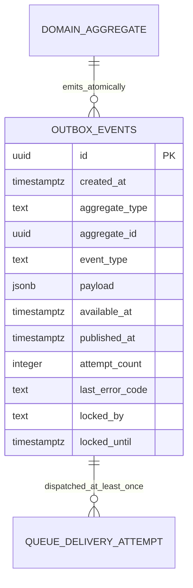

# Backend Feature Specification: Backend, Docker & Supabase Foundation

**Phase / Spec**: Phase 01 / SPEC-BE-001 of 014  
**Feature Branch**: `codex/backend-spec-be-001`  
**Feature Directory**: `apps/api/specs/001-backend-foundation`  
**Base Revision**: `b1ba259c6fbd0c3b6dc34615c50aae2a69a001a3`  
**Created**: 2026-08-27  
**Status**: Draft  
**Input**: "Read the complete BACKEND_MASTER_PLAN.md and specify Phase 01 - SPEC-BE-001: Backend, Docker & Supabase Foundation."

## Objective and Scope

Create the runnable, secure, observable backend platform required by all later
Masarifi Backend Specs without implementing a product domain. The phase must
establish the independently managed API package, modular-monolith boundaries,
separate API and worker processes, official local Supabase workflow, canonical
SQL migration and pgTAP layout, private Storage bucket foundations, reliable
outbox dispatch, Docker development/test/production boundaries, health and meta
contracts, OpenAPI and error conventions, runtime configuration validation,
graceful shutdown, CI security gates, and deployment migration execution.

This Spec owns platform primitives only. It must not create customer identity,
RBAC, reference, account, ledger, sync, planning, import, AI, reporting,
notification, billing, operational-governance, or client-cutover features owned
by Specs 002-014.

## Dependencies and Repository Baseline

- **Prior Backend Specs**: None. SPEC-BE-001 is the prerequisite platform Spec.
- **Branch dependency**: The branch is based on the approved backend integration
  revision `b1ba259c6fbd0c3b6dc34615c50aae2a69a001a3` and contains no other Backend
  Spec implementation.
- **Current API state**: `apps/api/README.md` states that the future NestJS API
  is uninitialized; no API package, runtime entry point, or tests exist.
- **Current database state**: Root `supabase/migrations`, `supabase/policies`,
  `supabase/seed`, and `supabase/tests` exist as placeholders and contain no
  canonical schema implementation.
- **Current container state**: Root `docker/local` and `docker/production` are
  placeholders. There is no backend Dockerfile, Compose orchestration, or root
  backend CI workflow.
- **Current client state**: Mobile and Admin do not consume `/health/live`,
  `/health/ready`, or `/api/v1/meta`. Existing client mocks remain active.
- **Repository convention**: Admin and Mobile are independently managed
  packages. The API remains independently managed and does not require a root
  workspace conversion.
- **Governing documents**: `apps/api/.specify/memory/constitution.md` version
  1.0.0 and `docs/Back end/BACKEND_MASTER_PLAN.md` are mandatory.
- **Future provider configuration**: Clerk, Supabase, OpenRouter, Stripe, SMTP,
  and other providers are represented only by validated environment variable
  names. Live provider behavior belongs to later owning Specs.

## Owned Resources

SPEC-BE-001 is the sole owner of the following resources:

| Resource type | Owned resources |
|---|---|
| Database table | `private.outbox_events` |
| Database schemas/baseline | creation and baseline privileges for `private` and `audit`; use of `public`; migration-owned roles and required extension baseline |
| Functions | `private.set_updated_at_and_version`, `private.enqueue_outbox_event`, `private.claim_outbox_batch` |
| Views | None |
| Triggers | reusable updated/version trigger function only; no domain trigger attachment |
| API namespaces | `GET /health/live`, `GET /health/ready`, `GET /api/v1/meta` |
| Jobs | `outbox.dispatch`, `migration.apply` |
| Events | `platform.started`, `platform.ready`, `outbox.published`, `outbox.delivery_failed` |
| Queue primitive | safe publication bridge from the Postgres outbox to the approved Supabase Queue/`pgmq` foundation |
| Storage foundation | private buckets `support-attachments`, `report-exports`, and `voice-temp`, including private defaults and server-generated object-key baseline |
| Container contracts | shared production image with separate API, worker, and one-off migration commands; local and test orchestration profiles |
| Shared API contracts | `/api/v1` prefix, request/correlation ID, safe error envelope, validation defaults, content-type/body limits, timeout baseline, OpenAPI generation and drift gate |
| CI/release contracts | backend checks, SBOM, SAST, secret/dependency/image scans, immutable image metadata, signature/provenance evidence |

Later Specs own domain use of these primitives. They may call the outbox helper
inside their transactions but may not write `private.outbox_events` directly.
Specs 009, 010, and 011 own the retention and workflow behavior for their
respective Storage buckets. Spec 013 owns durable operational job-run tables,
aggregate dashboards, backup/DR governance, and system operations APIs.

## User Scenarios and Testing

### User Story 1 - Start a Reproducible Backend Environment (Priority: P1)

As a backend engineer, I need a documented clean-clone workflow that starts the
API and worker against the official local Supabase stack so every later Spec is
built and tested on the same platform contract.

**Why this priority**: No domain implementation can begin until the platform can
be reproduced locally and in CI.

**Independent Test**: From a clean clone with documented local prerequisites and
non-secret development values, start the official Supabase stack plus the API
and worker containers, then observe successful liveness and readiness.

**Acceptance Scenarios**:

1. **Given** a clean clone and valid local configuration, **When** the documented
   startup workflow runs, **Then** API and worker start without repository-wide
   workspace conversion or duplicated Supabase containers.
2. **Given** the required database or queue is unavailable, **When** readiness is
   checked, **Then** liveness remains truthful while readiness returns a safe
   failure and the service receives no production traffic.
3. **Given** local, test, and production configurations, **When** they are
   reviewed, **Then** their container settings and secret sources are explicitly
   separated and production inherits no development settings.

### User Story 2 - Operate API and Worker Safely (Priority: P1)

As an operator, I need separate API and worker processes with truthful health,
bounded shutdown, and safe logs so deployment and recovery decisions are based
on observable state.

**Why this priority**: Process safety and health contracts gate every release.

**Independent Test**: Run each process from the same immutable image, send
`SIGTERM`, and verify new work stops, in-flight work receives the bounded drain
window, and the process exits without losing a leased outbox item.

**Acceptance Scenarios**:

1. **Given** a healthy API process, **When** `/health/live` is requested, **Then**
   it returns only status, release version, and process start time without a
   dependency query or sensitive metadata.
2. **Given** healthy required dependencies, **When** `/health/ready` is requested
   from an authorized internal path, **Then** it reports database and queue as up.
3. **Given** termination begins, **When** the 30-second drain window is active,
   **Then** readiness fails, new work is refused, and in-flight work completes or
   becomes safely retryable.

### User Story 3 - Apply Canonical Database Changes (Priority: P1)

As a release engineer, I need one ordered, immutable SQL migration path with
checksums, advisory locking, pgTAP assertions, and smoke checks so schema state
cannot drift between environments.

**Why this priority**: SQL migrations are the only allowed schema source of
truth for all 14 Backend Specs.

**Independent Test**: Apply all migrations twice to disposable local Supabase
states, verify the second pass is safe, then alter a recorded migration checksum
and verify deployment fails closed.

**Acceptance Scenarios**:

1. **Given** two migration jobs start concurrently, **When** both request the
   migration advisory lock, **Then** only one applies changes and the other exits
   safely without racing API replicas.
2. **Given** a historical migration checksum differs, **When** deployment runs,
   **Then** no traffic moves to the release and the mismatch is reported safely.
3. **Given** a schema version newer than the application's compatible range,
   **When** the application starts, **Then** it fails readiness rather than
   operating against an unknown schema.

### User Story 4 - Deliver Domain Events Reliably (Priority: P1)

As a future domain owner, I need one transaction-compatible outbox contract so
business mutations can publish events at least once without losing committed
state or creating a second event subsystem.

**Why this priority**: Later asynchronous workflows depend on a single reliable
publication primitive.

**Independent Test**: Enqueue events, run multiple workers concurrently, inject
publication failures and lease expiry, and verify every row remains recoverable
and no worker claims the same active lease.

**Acceptance Scenarios**:

1. **Given** a valid domain transaction, **When** it calls the outbox helper,
   **Then** one validated row is inserted in the same transaction.
2. **Given** multiple workers, **When** they claim unpublished rows, **Then**
   batches are disjoint, bounded to 100, and leased with `SKIP LOCKED` behavior.
3. **Given** queue publication fails, **When** retry policy is applied, **Then**
   the row is retained, backoff uses jitter, attempt evidence increments, and
   terminal exhaustion raises an operations signal rather than dropping data.

### User Story 5 - Produce a Secure Release Artifact (Priority: P1)

As a security reviewer, I need a minimal non-root immutable backend image and
release evidence so exploitable dependencies, embedded secrets, development
tools, or unsafe runtime permissions block production.

**Why this priority**: The container is a production trust boundary.

**Independent Test**: Build the production image, inspect its user, packages,
ports, filesystem mode, secrets, SBOM, signature/provenance, and vulnerability
scan, then run both API and worker commands.

**Acceptance Scenarios**:

1. **Given** a production image, **When** it runs, **Then** it runs as non-root,
   uses a read-only root filesystem where supported, exposes only the API port,
   and contains no development dependency or source secret.
2. **Given** an exploitable Critical or High vulnerability, secret finding, or
   failed required check, **When** CI evaluates the release, **Then** image
   publication or deployment is blocked.
3. **Given** a released image, **When** its metadata is inspected, **Then** it is
   identified by immutable commit/release version and has SBOM and provenance
   evidence.

### User Story 6 - Consume Stable Platform Contracts (Priority: P2)

As a future Mobile/Admin adapter or backend module, I need stable meta, error,
validation, correlation, and OpenAPI contracts so later Specs integrate without
inventing incompatible platform conventions.

**Why this priority**: Shared contracts prevent every domain from creating its
own envelope and error semantics.

**Independent Test**: Exercise successful and failed requests against the three
owned endpoints and compare the generated OpenAPI document and response
envelopes to approved snapshots.

**Acceptance Scenarios**:

1. **Given** an authenticated request to `/api/v1/meta`, **When** the request ID
   is absent or valid, **Then** the service creates or propagates a safe ID and
   returns the API version and UTC server time.
2. **Given** an invalid content type, oversized body, unknown property, timeout,
   or validation error, **When** the request is rejected, **Then** the response
   uses a stable safe error code, request ID, and bounded field errors without
   stack, SQL, provider, or secret details.
3. **Given** a contract change, **When** CI compares generated OpenAPI with the
   approved artifact, **Then** undocumented drift blocks release.

### Edge Cases

- A request supplies a malformed or excessively long `X-Request-Id`; it is
  rejected or replaced according to the bounded request-ID policy and never
  copied unsafely into logs or response headers.
- The database is up while the queue extension or required queue is unavailable;
  readiness reports only the failed safe check name and returns `503`.
- A readiness check exceeds one second; it fails closed and the five-second
  in-process cache must not preserve an earlier healthy result beyond its TTL.
- A worker crashes after queue publication but before marking the outbox row;
  redelivery is allowed and the consumer contract is idempotent.
- A lease expires while the original worker is still alive; stale ownership
  cannot overwrite a newer lease result.
- An outbox payload is not a JSON object, event name is outside the approved
  namespace, limit exceeds 100, or lease duration is invalid; the function
  rejects the call before mutation.
- Published history reaches the documented retention/partition threshold; purge
  or archive work remains bounded and never scans the active unpublished path.
- A required startup value is missing, empty, malformed, or unknown; startup
  fails before traffic and logs the key name only, never its value.
- Optional future provider keys are absent while their domain is disabled; the
  platform starts, but enabling the corresponding feature without required
  values fails readiness.
- Local Supabase ports or API ports are occupied; the documented workflow reports
  the conflict explicitly and does not start a second hidden stack.
- The final runtime base cannot remove its shell/package manager safely; the
  selected minimal base and compensating restrictions must be documented and
  reviewed rather than claiming the tool is absent.
- Storage object key, MIME, size, or quarantine state is unsafe; no domain may
  make the object publicly readable through the foundation policy.

## Database Design

### Owned Table: `private.outbox_events`

| Column | Type | Null | Default | Constraints and meaning |
|---|---|---:|---|---|
| `id` | `uuid` | no | `gen_random_uuid()` | Primary key; immutable event identifier |
| `created_at` | `timestamptz` | no | `now()` | Immutable enqueue time in UTC |
| `aggregate_type` | `text` | no | none | Nonempty bounded registered aggregate type |
| `aggregate_id` | `uuid` | yes | `null` | Optional domain aggregate identifier |
| `event_type` | `text` | no | none | Approved namespaced event type; immutable |
| `payload` | `jsonb` | no | none | Must satisfy `jsonb_typeof(payload) = 'object'`; safe event data only |
| `available_at` | `timestamptz` | no | `now()` | Earliest eligible claim time |
| `published_at` | `timestamptz` | yes | `null` | Set only after successful queue publication |
| `attempt_count` | `integer` | no | `0` | Check `attempt_count >= 0`; increments per failed publication attempt |
| `last_error_code` | `text` | yes | `null` | Stable safe code only; no provider payload or exception |
| `locked_by` | `text` | yes | `null` | Current worker lease owner; bounded and never client supplied |
| `locked_until` | `timestamptz` | yes | `null` | Lease expiry; cleared or superseded safely |

Keys and indexes:

- Primary key: `outbox_events_pkey (id)`.
- Claim index: `(published_at, available_at)` where `published_at is null`, as
  defined by the Master Plan; the final claim query plan must prove the bounded
  unpublished path before acceptance.
- Claim-order index: `(available_at, id)` where `published_at is null`; measured
  claim queries use it to satisfy deterministic ordering without an unbounded
  sort while preserving the Master Plan index above.
- Aggregate history index: `(aggregate_type, aggregate_id, created_at)`.
- Lease recovery index: `(locked_until)` where `published_at is null`.
- No foreign key is defined for `aggregate_id` because events span resources
  owned by later Specs; callers must validate ownership before enqueue.
- The row has no generic update/delete grant. Payload, aggregate identity, event
  type, ID, and creation time are immutable after insert.

### Relationships and ERD



`DOMAIN_AGGREGATE` and `QUEUE_DELIVERY_ATTEMPT` are logical boundaries, not
tables owned or created by this Spec. Durable job attempts belong to SPEC-BE-013.

### RLS, Grants, and Authorization

- `private` and `audit` have no `anon` or `authenticated` usage or object grants.
- The migration owner alone may alter schemas, roles, functions, policies, or
  table definitions. Application runtime roles have no DDL authority.
- API connections operating with a user's Clerk JWT cannot select, insert,
  update, or delete outbox rows.
- Domain code may enqueue only by executing `private.enqueue_outbox_event` from
  an authorized server-side transaction; no direct table insert grant exists.
- The worker role may execute the bounded claim function and update only lease,
  attempt, safe error, and publication lifecycle fields through owned functions.
- Worker access cannot alter immutable event identity or payload fields.
- Default schema/table/function privileges are revoked before explicit minimum
  grants are applied.
- All security-definer functions use fixed `search_path`, explicit ownership,
  least privilege, bounded arguments, deterministic safe errors, and no dynamic
  SQL from caller input.
- pgTAP must prove positive migration/worker behavior and negative anonymous,
  authenticated user, unauthorized API, and over-privileged worker behavior.

## API Contracts

All timestamps are ISO 8601 UTC. Responses include a bounded `requestId` under
the shared envelope policy. Health endpoints are outside `/api/v1`; all future
product endpoints use `/api/v1`, and Admin product endpoints use
`/api/v1/admin`.

| Method | Path | Authorization | Request | Success response | Failure behavior |
|---|---|---|---|---|---|
| `GET` | `/health/live` | Public | No body or query | `200 {status:'ok',version:string,startedAt:ISODate}` | `503` only when process cannot truthfully serve; no dependency or secret details |
| `GET` | `/health/ready` | Internal container/orchestrator network or protected operations boundary | No body or query | `200 {status:'ready',checks:{database:'up',queue:'up'}}` | `503 {status:'not_ready',checks:{database:'up'|'down',queue:'up'|'down'}}`; safe names only |
| `GET` | `/api/v1/meta` | Valid Clerk JWT | Optional bounded `X-Request-Id`; no body | `200 {apiVersion:'v1',serverTime:ISODate,minMobileVersion?:string,minAdminVersion?:string}` | Shared `401`, `403`, `429`, `500`, `503` safe error envelope |

Shared error envelope:

```json
{
  "code": "STABLE_ERROR_CODE",
  "message": "Safe user-facing message",
  "requestId": "bounded-correlation-id",
  "fieldErrors": [
    { "field": "fieldName", "code": "VALIDATION_CODE", "message": "Safe validation message" }
  ]
}
```

- `fieldErrors` is omitted when not applicable.
- Stack traces, SQL, internal hosts, ports, filesystem paths, configuration
  values, provider payloads, tokens, secrets, and account-existence hints are
  forbidden.
- Unknown DTO properties are rejected. Request bodies require approved JSON
  content type, explicit allowlists, bounded size, and global timeout policy.
- OpenAPI is generated from runtime contracts and compared with an approved CI
  snapshot. Production Swagger UI exposure follows an explicit disabled or
  protected policy; the OpenAPI artifact remains available to CI.

## Functions, Views, and Triggers

### `private.set_updated_at_and_version()`

- Ownership: SPEC-BE-001 reusable helper.
- Trigger timing: `BEFORE UPDATE` on mutable tables attached by their owning Spec.
- Contract: set `NEW.updated_at = now()` and
  `NEW.version = OLD.version + 1`; ignore/reject caller attempts to set either.
- Safety: fixed `search_path`, no client execute grant, and failure on missing
  required lifecycle columns.

### `private.enqueue_outbox_event(event_type, aggregate_type, aggregate_id, payload)`

- Validate nonempty bounded names, approved namespace registration, optional UUID
  aggregate identifier, object-shaped payload, and payload size.
- Insert exactly one `private.outbox_events` row and return its ID.
- Execute only inside an authorized server-side/domain transaction. A rollback of
  the caller transaction must roll back the outbox row.
- Reject raw secrets, tokens, provider payloads, unnecessary PII, or unbounded
  financial details under event-schema validation.

### `private.claim_outbox_batch(worker_id, limit, lease_seconds)`

- Require a nonempty bounded worker ID, `1 <= limit <= 100`, and bounded positive
  lease duration.
- Select eligible unpublished rows where `available_at <= now()` and no active
  lease exists, ordered deterministically by `available_at, id`.
- Use row locking with `FOR UPDATE SKIP LOCKED`, atomically set lease owner/expiry,
  and return only the claimed rows.
- A completion operation must validate the current lease owner before setting
  `published_at`; stale workers cannot complete another worker's lease.

No public view or domain-specific trigger is created by this Spec.

## Queues, Jobs, and Events

### Job `outbox.dispatch`

- Continuously claim batches through the owned function, publish each event to
  the approved Supabase Queue/`pgmq` bridge, and mark publication only after the
  queue accepts the message.
- Delivery is at least once. Every downstream consumer must be idempotent.
- Failures increment attempts, record only a stable safe code, release/reschedule
  using exponential backoff with jitter, and retain the original row.
- Configured attempt exhaustion emits `outbox.delivery_failed` and raises an
  operations alert/incident integration point; the row is never silently dropped.
- Shutdown stops new claims and makes leased incomplete work retryable within the
  30-second process drain policy.

### Job `migration.apply`

- Runs as a one-off deployment container before traffic switches.
- Acquires a dedicated advisory lock, validates migration order and checksums,
  applies pending immutable SQL, executes schema/privilege/health smoke checks,
  records safe duration/status evidence, and exits.
- API and worker startup must never race schema migration execution.
- Production cannot execute test teardown or unmanaged dashboard changes.

### Owned Event Contracts

| Event | Producer | Required safe payload |
|---|---|---|
| `platform.started` | API or worker startup | process kind, release version, started time, correlation ID |
| `platform.ready` | readiness transition | process kind, release version, safe dependency states, observed time |
| `outbox.published` | outbox dispatcher | outbox event ID, event type, aggregate type/ID when safe, attempt count, correlation ID |
| `outbox.delivery_failed` | outbox dispatcher | outbox event ID, event type, attempt count, safe error code, next operator action reference |

Events must use versioned schemas, bounded fields, and no secrets, raw provider
payloads, tokens, unnecessary PII, or financial descriptions.

## Business Rules

- The API must not accept traffic until startup configuration validation passes.
- Unknown configuration keys, missing required values, malformed values,
  migration checksum changes, or an incompatible schema version fail closed.
- Optional provider values may be absent only while their owning feature is
  disabled; enabling a feature without its required values fails readiness.
- The API and worker are separate entry points built from the same immutable
  production image.
- The official Supabase CLI local stack is reused; custom Compose must not
  duplicate Postgres, Studio, Auth, Storage, Queue, or other official services.
- API replicas never apply migrations during ordinary startup.
- Outbox delivery is at least once, never exactly-once by assumption. Consumers
  are idempotent and duplicate delivery is an expected test case.
- A committed domain mutation and its outbox row succeed or fail together.
- No event row is silently deleted because publication failed.
- Storage buckets are private. Object keys are server-generated, and public
  access or direct unvalidated release from quarantine is forbidden.
- The platform must preserve N-1 application/database compatibility through
  expand-migrate-contract rules for all later Specs.
- No Redis, BullMQ, Prisma, microservice, or Edge Function is introduced by this
  phase.

## Security and Privacy Requirements

### Baseline Controls

- Deny by default for network exposure, API routes, database schemas, functions,
  Storage, runtime identities, container permissions, and CI release decisions.
- Validate and normalize headers, content type, body size, JSON structure,
  request IDs, configuration, migration metadata, outbox names/payloads, worker
  IDs, batch limits, and lease duration at their trust boundaries.
- Apply a strict CORS allowlist. Credentialed wildcard CORS is forbidden.
- Apply secure HTTP headers, HTTPS-only production assumptions, safe exception
  filtering, global request timeout, body/decompression/query limits, and no
  production debug route.
- Runtime secrets come only from the deployment secret store. Dockerfile,
  Compose, images, source, migrations, fixtures, OpenAPI, logs, Mobile, and Admin
  must contain no Clerk secret, Supabase service-role key, database credential,
  OpenRouter key, Stripe secret, SMTP credential, or signing secret.
- Logs must redact authorization headers, cookies, JWTs, configuration values,
  connection strings, request bodies by default, provider payloads, and PII.
- Dependency lockfile, SAST, secret scan, dependency scan, CycloneDX SBOM, image
  scan, and released-image signature/provenance are mandatory CI evidence.
- Released containers run non-root, expose only required ports, contain no
  development dependencies, use immutable version tags, support a read-only root
  filesystem, and have explicit writable temp/data mounts only when required.
- The final runtime image should contain no shell/package manager where the
  selected supported minimal base safely permits it.

### OWASP Traceability Required for Planning

- OWASP ASVS 5.0.0 Level 2 controls apply to configuration, HTTP handling,
  validation, error handling, logging, secrets, database privileges, files,
  dependencies, and deployment. Applicable Level 3 controls apply where this
  platform becomes a boundary for later financial/Admin work.
- OWASP API Security Top 10:2023 coverage must include object/function/property
  authorization defaults, unrestricted resource consumption, SSRF-safe outbound
  defaults, inventory/version management, and unsafe API consumption.
- OWASP Top 10:2025 coverage must include security misconfiguration, software
  supply chain, integrity, logging/alerting, and fail-safe exceptional behavior.
- MASVS 2.1.0 traceability for this phase is limited to proving that only safe
  public API URL and Clerk publishable configuration may reach Mobile; server
  credentials and sensitive logs must not reach the client bundle.

### Release-Blocking Security Gates

Release is blocked by any exploitable Critical or High finding, secret exposure,
root production execution, writable-unbounded container filesystem, unsafe CORS,
public private-bucket access, missing negative privilege tests, unsafe error/log
content, unsigned/unprovenanced release artifact, production debug/Swagger
exposure outside policy, or missing alert/runbook evidence.

## Performance and Caching Requirements

- Redis and product caches are forbidden in this Spec.
- `/health/live` performs no dependency query and must remain constant bounded
  work.
- `/health/ready` uses a one-second timeout per required dependency and may cache
  only its own in-process result for at most five seconds. A cached result cannot
  grant authorization or survive process restart.
- `GET /api/v1/meta` must meet P95 250 ms, P99 500 ms, and a maximum compressed
  response size of 50 KB under production-like conditions.
- Outbox claim database duration must remain below 50 ms P95 with one million
  total rows and the documented published-history policy.
- Claim batch maximum is 100. No claim, cleanup, migration inspection, or health
  query may be unbounded or produce N+1 behavior.
- Indexed OLTP query P95 is 50 ms. Interactive request hard timeout is 10 seconds;
  ordinary OLTP statement timeout is 2 seconds unless a narrower owned operation
  is configured.
- The outbox query plan must retain `EXPLAIN (ANALYZE, BUFFERS)` evidence against
  production-like data, including a high proportion of published rows.
- Container startup, readiness, worker throughput, event-loop lag, memory, CPU,
  database pool use, outbox depth, oldest unpublished age, claim latency, and
  publication latency must be measured.
- Load, stress, recovery, concurrent claim, lease expiry, queue outage, cold
  startup, and graceful-shutdown tests are required before acceptance.

## Mobile and Admin Integration

- Mobile and Admin receive only the API base URL, Clerk publishable values, and
  explicitly approved safe client configuration. No provider or server secret is
  exposed through `/api/v1/meta`, environment bundles, source maps, or logs.
- Existing Mobile and Admin mocks remain unchanged and active. This Spec does not
  create a live client adapter or remove any mock.
- `/api/v1/meta` is optional for clients until SPEC-BE-014 owns production
  cutover. `minMobileVersion` and `minAdminVersion` are nullable until an approved
  version policy exists; null must not be interpreted as a security bypass.
- Admin system-health/job contracts are not replaced here. Durable job inventory,
  provider health, incidents, settings, feature flags, maintenance, and Admin
  operations APIs belong to SPEC-BE-013.
- The current Admin system-health and job fixtures remain fictional. Phase 01
  metrics may later feed Spec 013, but this Spec creates no Admin route or DTO.
- No Mobile/Admin source file, environment file, repository, mock handler, or
  application behavior may be modified on this branch.

## Functional Requirements

- **FR-001**: The API package MUST remain independently managed and MUST NOT
  require a repository-wide workspace conversion.
- **FR-002**: One immutable production image MUST support distinct API, worker,
  and one-off migration commands.
- **FR-003**: API and worker production processes MUST run as non-root with
  explicit least-privilege runtime identities.
- **FR-004**: Local orchestration MUST reuse the official Supabase CLI stack and
  MUST NOT duplicate Supabase services in custom containers.
- **FR-005**: Development, testing, and production container configurations MUST
  be explicitly separated.
- **FR-006**: Runtime configuration MUST be schema-validated before either
  process accepts work.
- **FR-007**: Required secrets MUST be injected at runtime and MUST NOT be baked
  into source, Compose, Docker layers, images, logs, or client bundles.
- **FR-008**: `GET /health/live` MUST return the exact safe liveness contract and
  MUST NOT query dependencies.
- **FR-009**: `GET /health/ready` MUST use bounded database and queue checks and
  return safe `503` state when either required dependency is unavailable.
- **FR-010**: `GET /health/ready` MUST be limited to the container network or a
  protected operations boundary.
- **FR-011**: `GET /api/v1/meta` MUST require a valid Clerk JWT and return only
  the approved API/version/time contract.
- **FR-012**: Every API response MUST create or propagate a bounded request ID,
  and correlation MUST continue through database, outbox, queue, and worker work.
- **FR-013**: Validation MUST use explicit allowlists, reject unknown fields,
  enforce content type and body limits, and prevent mass assignment.
- **FR-014**: Errors MUST use stable codes and safe messages and MUST never expose
  stack traces, SQL, secrets, provider payloads, internal topology, or PII.
- **FR-015**: OpenAPI MUST be generated from runtime contracts and drift-checked
  in CI.
- **FR-016**: SQL migrations MUST be the only schema source of truth and MUST be
  ordered, immutable, and checksum-verified.
- **FR-017**: Production schema changes through the Supabase Dashboard or another
  unmanaged path MUST be forbidden.
- **FR-018**: Migration execution MUST occur in a one-off pre-traffic job guarded
  by an advisory lock; API replicas MUST NOT apply migrations on startup.
- **FR-019**: Database migrations MUST establish explicit schemas, revoke default
  grants, and add only minimum documented grants.
- **FR-020**: `private.outbox_events` MUST match the complete table design,
  constraints, immutability rules, and indexes in this specification.
- **FR-021**: Domain/API roles MUST have no direct write access to outbox rows.
- **FR-022**: `private.enqueue_outbox_event` MUST validate and enqueue exactly
  one event inside the caller transaction.
- **FR-023**: `private.claim_outbox_batch` MUST atomically lease a deterministic,
  disjoint batch with a maximum of 100 rows.
- **FR-024**: Outbox publication MUST be at least once, retry with exponential
  backoff and jitter, retain failed rows, and require idempotent consumers.
- **FR-025**: A stale worker lease MUST NOT overwrite a newer worker's completion.
- **FR-026**: Attempt exhaustion MUST produce a safe failure event and actionable
  alert without deleting the source row.
- **FR-027**: `private.set_updated_at_and_version` MUST be the sole shared mutable
  row lifecycle helper and MUST prevent callers from controlling lifecycle fields.
- **FR-028**: Private Storage buckets MUST default to no public access, generated
  object keys, and no release before domain-owned validation/quarantine policy.
- **FR-029**: The platform MUST stop accepting new work on termination and allow
  at most 30 seconds for safe completion or retryable release.
- **FR-030**: CI MUST run typecheck, lint/check, unit tests, pgTAP, OpenAPI drift,
  secret scanning, SAST, dependency scanning, SBOM generation, image scanning,
  container runtime checks, and release signature/provenance generation.
- **FR-031**: Exploitable Critical or High dependency or image findings MUST
  block release under the approved security policy.
- **FR-032**: Production images MUST contain no development dependencies, source
  secrets, default credentials, unnecessary exposed ports, or debug behavior.
- **FR-033**: The platform MUST emit structured JSON logs to stdout with safe
  request/correlation IDs and centralized redaction.
- **FR-034**: Platform and outbox metrics MUST use bounded safe labels and MUST
  have alerts and runbook owners before production traffic.
- **FR-035**: Outbox claim P95 MUST remain below 50 ms at one million rows using
  verified query-plan evidence.
- **FR-036**: Liveness, readiness, and meta contracts MUST remain within their
  stated latency, timeout, and payload budgets.
- **FR-037**: No Redis, BullMQ, Prisma, microservice, Supabase Edge Function, or
  product cache MUST be introduced.
- **FR-038**: No table, API, function, view, trigger, job, event, queue, cache, or
  Storage bucket outside this Spec's ownership register may be created.
- **FR-039**: Mobile/Admin mocks and source MUST remain unchanged; no production
  cutover is performed.
- **FR-040**: Rollback MUST use the previous immutable image plus a forward
  corrective migration; production teardown SQL is forbidden.
- **FR-041**: Every required security, performance, migration, container,
  observability, and rollback claim MUST have fresh named evidence before DoD.

## Tests and Verification Evidence

The following test suites are requirements for implementation planning. Their
presence here does not claim that they have run during specification work.

### Unit and Contract Tests

- Configuration schema: valid environment, missing required key, malformed
  value, unknown key, disabled optional provider, and secret-redacted failure.
- Request ID generation/propagation, malformed ID, validation allowlist, unknown
  field, body/content-type limit, timeout, error envelope, and safe logging.
- `/health/live`, `/health/ready`, and `/api/v1/meta` success/failure/OpenAPI
  snapshots and security-header/CORS contracts.
- Outbox event name/payload validation, backoff calculation, safe error mapping,
  attempt exhaustion, and consumer idempotency contract.

### Database and Integration Tests

- Migration ordering, checksum verification, advisory lock concurrency,
  idempotent clean-state application, schema compatibility, and smoke checks.
- pgTAP for table columns/types/defaults/nullability, PK/checks/indexes, function
  ownership, fixed search path, grants, immutable fields, and negative access.
- Outbox enqueue commit/rollback, concurrent disjoint claim, limit 1/100/101,
  lease expiry, stale lease completion, retry, duplicate publication, queue
  outage/recovery, and retained terminal failure.
- Official local Supabase startup and disposable test-state reset.

### Container and Operational Tests

- Multi-stage reproducible build for the selected pinned Node LTS image digest.
- API/worker/migration commands from the same image; no development dependency.
- Non-root user, only required API port, read-only root filesystem, explicit
  writable paths, no source secret, and minimal runtime-tool inspection.
- Liveness/readiness failure and recovery, one-second dependency timeout,
  five-second maximum readiness cache, and truthful status during shutdown.
- `SIGTERM` drain with idle, active HTTP, active outbox lease, and forced
  30-second deadline scenarios.

### Security and Supply-Chain Tests

- OWASP traceability for all applicable ASVS/API/Top 10/MASVS controls.
- CORS allow/deny, secure headers, debug/Swagger production policy, injection,
  unsafe error/log values, secret patterns, and least-privilege database access.
- Lockfile verification, SAST, secret scan, dependency scan, CycloneDX SBOM,
  image vulnerability scan, and image signature/provenance verification.
- Release must show zero exploitable Critical/High findings.

### Performance and Recovery Tests

- One-million-row outbox dataset with active unpublished subset and published
  history; retain `EXPLAIN (ANALYZE, BUFFERS)` evidence below 50 ms P95 claim.
- Concurrent workers, queue slowdown/outage, backlog recovery, lease churn,
  process restart, and publication throughput tests with bounded memory.
- Health/meta P95/P99, timeout, compressed payload, cold start, database pool,
  CPU/memory, and event-loop lag evidence.
- Previous-image rollback, failed migration, forward corrective migration,
  worker restart, and outbox replay rehearsal.

## Migration and Rollback Strategy

Migration families and order:

1. Foundation migration: required approved extensions, `private` and `audit`
   schemas, migration/runtime roles, default privilege revocation, and platform
   metadata needed for compatibility checks.
2. Outbox migration: `private.outbox_events`, all constraints and indexes, and
   the three owned functions with fixed ownership/search paths/grants.
3. Storage foundation migration/configuration: three private buckets and private
   baseline policies without domain upload/read workflows.
4. Grants migration: minimum explicit migration/API/worker/function privileges.
5. Database tests: pgTAP assertions live in the canonical test area and run after
   migrations; test SQL is not a production migration.

Every production migration is immutable after merge and checksum registration.
Reapplication to an initialized environment must be deterministic. Later changes
use a new forward migration.

Rollback rules:

- Roll application code back to the previous immutable image only when that
  image is compatible with the current additive schema.
- Prefer a forward corrective SQL migration for schema defects. Never rewrite a
  historical migration or drop outbox evidence to make rollback easier.
- Initial destructive teardown scripts may exist only in an explicitly guarded
  disposable test path and must refuse production-like environments.
- If a migration fails before traffic movement, keep the previous release active,
  preserve database evidence, repair forward, rerun smoke/pgTAP, and reconcile
  outbox counts and privileges before retrying deployment.
- N-1 compatibility, migration duration/status, before/after object inventory,
  and rollback rehearsal evidence are required for acceptance.

## Observability and Operations

### Structured Logs

- JSON to stdout with UTC timestamp, severity, service/process kind, release
  version, request/correlation ID, route template or job name, safe result code,
  duration, and retry/attempt metadata where applicable.
- Never log tokens, authorization/cookie headers, secrets, configuration values,
  connection strings, raw request/event payloads, provider responses, PII, or
  financial descriptions.

### Metrics

- Process: uptime, startup duration, readiness state, shutdown duration,
  event-loop lag, CPU, memory, and uncaught/fatal exit count.
- HTTP: request count, route-template latency P50/P95/P99, status/error class,
  timeout, body rejection, and payload size.
- Database: pool active/waiting/saturation, connection errors, query duration,
  migration duration/status, and slow query count without raw SQL labels.
- Outbox: unpublished depth, oldest age, claim duration/batch size, active leases,
  lease expiry, attempt count, publication latency, retry/failure, and throughput.
- Container/release: image version, readiness/liveness failures, restart count,
  vulnerability gate state, and SBOM/provenance availability.

### Alerts and Runbooks

- Alert on readiness failure, crash/restart loop, database pool saturation,
  migration failure/checksum mismatch, outbox oldest age/backlog growth,
  repeated delivery failure, terminal attempt exhaustion, and security scan gate.
- Every alert must name an owner, threshold/window, severity, safe dashboard,
  diagnostic steps, mitigation, rollback/replay action, escalation path, and
  closure evidence.
- SPEC-BE-001 owns platform/outbox metric definitions and local alert contracts.
  SPEC-BE-013 later owns aggregate operations dashboards and production-wide
  alert governance without taking over these definitions.

## Assumptions

- A supported Node LTS image digest will be selected and recorded during planning;
  the Master Plan intentionally does not hardcode a version before implementation.
- Supabase CLI is the supported local database/Storage/Queue workflow, and the
  selected production Supabase plan will later be validated against global
  backup/RPO/RTO requirements by SPEC-BE-013.
- The deployment platform provides runtime secret injection, internal health
  routing, immutable image storage, image signing/provenance support, and a
  one-off migration job mechanism.
- Queue delivery attempt durability beyond the outbox row is deferred to
  SPEC-BE-013's operational job tables. This Spec still records publication
  attempts on the outbox row and emits required metrics/events.
- Client minimum-version fields are omitted until approved version policy data
  is available. This does not add a feature flag or maintenance mechanism.
- Live Clerk, OpenRouter, Stripe, email, and domain-provider calls are not needed
  to prove this foundation.

## Out of Scope

- Profiles, preferences, onboarding, devices, sessions, push tokens, and Clerk
  webhook behavior: SPEC-BE-002.
- Admin RBAC, RLS policy framework for domain tables, immutable business audit,
  support access, privacy, retention, and security incidents: SPEC-BE-003.
- Currencies, countries, categories, accounts, exchange-rate data, and reference
  seeds: SPEC-BE-004.
- Transactions, postings, balances, transfers, financial mutation commands, and
  ledger reconciliation: SPEC-BE-005.
- Idempotency storage, client mutations, cursors, delta sync, tombstones, and
  financial conflict review: SPEC-BE-006.
- Planning, imports/parsers, OpenRouter AI, reports/email, notifications/support,
  and Stripe billing: Specs 007-012.
- Durable operational job inventory, provider-health data, settings, flags,
  maintenance, aggregate observability, backup/restore, RPO/RTO, DR, and Redis
  evidence gate: SPEC-BE-013.
- Mobile/Admin live adapters, mock removal, contract cutover, and production
  readiness orchestration: SPEC-BE-014.
- Any Mobile or Admin source/configuration change, real provider integration,
  product table, product endpoint, domain seed, or customer fixture.

## Acceptance Criteria

- **AC-001**: A documented clean-clone workflow starts API and worker against the
  official local Supabase stack with no custom duplicate Supabase service.
- **AC-002**: The same immutable image runs API, worker, and migration commands;
  production runtime is non-root, exposes only the API port, supports read-only
  root filesystem operation, and contains no development dependency or secret.
- **AC-003**: Liveness, readiness success/failure/recovery, and 30-second graceful
  shutdown contracts pass for API and worker scenarios.
- **AC-004**: `/health/live`, `/health/ready`, `/api/v1/meta`, error-envelope,
  request-ID, security-header, CORS, validation, and OpenAPI snapshot tests pass.
- **AC-005**: Ordered migrations create only the owned schemas, bucket baseline,
  table, functions, grants, and tests, and checksum/advisory-lock/smoke evidence
  passes against disposable Supabase.
- **AC-006**: The full positive/negative pgTAP privilege matrix proves no
  anonymous, authenticated user, or unauthorized API role can access the private
  outbox or owned functions.
- **AC-007**: Outbox enqueue/rollback, concurrent claim, bounded lease, expiry,
  retry, duplicate publication, queue outage/recovery, and terminal alert tests
  pass without lost or silently dropped rows.
- **AC-008**: Outbox claim remains below 50 ms P95 with one million rows and
  approved `EXPLAIN (ANALYZE, BUFFERS)` evidence.
- **AC-009**: Meta and health endpoints meet stated P95/P99, timeout, and payload
  budgets under production-like test conditions.
- **AC-010**: CI produces type/lint/test/pgTAP/OpenAPI evidence, CycloneDX SBOM,
  SAST, secret/dependency/image scan results, and release signature/provenance,
  with zero exploitable Critical/High findings.
- **AC-011**: Structured logs, platform/outbox metrics, actionable alerts, and
  runbooks exist with no secret, token, raw payload, PII, or financial detail.
- **AC-012**: Previous-image and failed-migration/forward-fix rehearsals preserve
  schema compatibility and all outbox rows, with reconciliation evidence.
- **AC-013**: No product table, product endpoint, unauthorized database object,
  Redis, BullMQ, Prisma, microservice, Edge Function, Mobile/Admin modification,
  or mock removal appears in the branch diff.
- **AC-014**: OWASP ASVS/API/Top 10/MASVS traceability and all release-blocking
  security gates applicable to SPEC-BE-001 have reviewed evidence.

## Success Criteria

- **SC-001**: A new backend engineer can start the complete local foundation from
  a clean clone using one documented workflow without manually changing database
  schema or inventing missing configuration.
- **SC-002**: 100% of API, worker, migration, outbox, health, and release checks
  produce deterministic pass/fail evidence in CI.
- **SC-003**: 100% of tested required-dependency failures prevent readiness while
  liveness remains truthful and responses reveal no sensitive details.
- **SC-004**: 100% of concurrent outbox test events remain recoverable and every
  duplicate publication is safely accepted by the idempotent consumer contract.
- **SC-005**: 100% of reviewed production image layers, runtime environment,
  logs, OpenAPI output, and client-visible configuration contain no backend or
  provider secret.
- **SC-006**: All measured outbox claim samples meet the 50 ms P95 budget at the
  specified one-million-row scale, and all meta/health samples meet their stated
  latency and payload budgets.
- **SC-007**: A release reviewer can trace every owned table, function, endpoint,
  job, event, bucket, metric, migration, and test to exactly one SPEC-BE-001
  requirement and acceptance criterion.

## Definition of Done

SPEC-BE-001 is complete only when all applicable items below have fresh evidence:

- [ ] `spec.md`, `plan.md`, and `tasks.md` are complete, mutually consistent,
      analyzed, and approved on `codex/backend-spec-be-001`.
- [ ] Only the resources in the SPEC-BE-001 ownership register are implemented.
- [ ] API, worker, migration job, Docker/Compose, Supabase, Storage baseline,
      outbox, OpenAPI, validation/error, secrets, CI, logging, metrics, alerts,
      and runbooks satisfy every functional requirement.
- [ ] SQL migrations are immutable, ordered, checksum-verified, least-privilege,
      and are the only schema source of truth.
- [ ] Unit, contract, integration, E2E, pgTAP, container, security, performance,
      load/stress, concurrency, migration, recovery, and rollback tests required
      by this specification pass.
- [ ] OWASP traceability is complete and no release-blocking security finding or
      missing negative authorization test remains.
- [ ] Outbox query plans, one-million-row P95 evidence, endpoint P95/P99 and
      payload budgets, and bounded/no-N+1 checks pass.
- [ ] Structured logs, metrics, alerts, dashboards/evidence references, and
      runbooks are operational and contain no sensitive content.
- [ ] Previous-image rollback, failed migration, forward corrective migration,
      graceful termination, queue outage/recovery, and outbox replay are proven.
- [ ] Mobile/Admin remain unchanged and all current mocks remain available.
- [ ] Acceptance criteria AC-001 through AC-014 and success criteria SC-001
      through SC-007 are reviewed and pass.
- [ ] After all local pre-PR gates pass, the Spec is committed clearly and pushed
      to approved remotes in Draft PRs that list pending remote-only evidence.
- [ ] The Draft PR remains incomplete and unmerged until CI, image scan, SBOM,
      signature/provenance, review, and every remaining acceptance gate pass.

Verification listed in this document is required implementation evidence, not a
claim that any backend implementation or test execution occurred during this
planning-only specification step.
