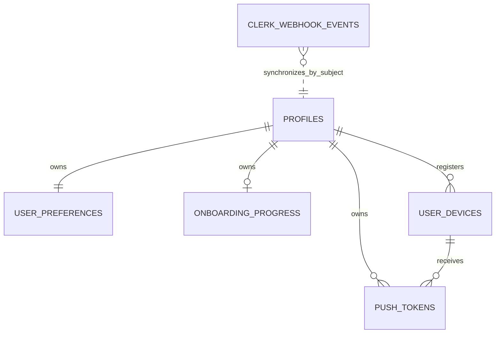

# Data Model: Authentication, Profiles, Preferences & Sessions

**Spec**: SPEC-BE-002
**Database**: Supabase PostgreSQL through ordered SQL migrations
**Identity key**: immutable Clerk `sub` as bounded `text`

## Ownership Register

| Kind | Object | Owner |
|---|---|---|
| Public table | `public.profiles` | SPEC-BE-002 |
| Public table | `public.user_preferences` | SPEC-BE-002 |
| Public table | `public.onboarding_progress` | SPEC-BE-002 |
| Public table | `public.user_devices` | SPEC-BE-002 |
| Public table | `public.push_tokens` | SPEC-BE-002 |
| Private table | `private.clerk_webhook_events` | SPEC-BE-002 |
| Function | `public.current_clerk_user_id()` | SPEC-BE-002 |
| Function | `private.assert_active_profile(text)` | SPEC-BE-002 |
| Trigger attachments | SPEC-BE-001 lifecycle trigger on mutable owned tables | SPEC-BE-002 attachment; helper remains SPEC-BE-001 |
| Job | `clerk.webhook.process` | SPEC-BE-002 |
| Published events | `profile.created`, `profile.updated`, `profile.deletion_requested`, `device.registered`, `device.revoked` | SPEC-BE-002 |

No view, RPC, new role, queue, cache table, session table, Supabase Auth user, or
idempotency table is introduced.

## Global Conventions

- All timestamps are `timestamptz` in UTC.
- UUID primary keys use `extensions.gen_random_uuid()` through the existing
  migration-role contract.
- Mutable rows use `updated_at timestamptz not null default now()` and
  `version bigint not null default 1 check (version > 0)`, with SPEC-BE-001's
  `private.set_updated_at_and_version()` trigger attached once.
- Customer identity is always the trimmed verified Clerk `sub`; it is never a UUID
  cast, email, phone, body field, query field, or client role value.
- Every public table enables and forces RLS. Database login roles used by the API
  and worker are non-owner and do not have `BYPASSRLS`.
- Foreign keys use `ON DELETE RESTRICT` unless the table contract explicitly says
  cascade. Physical profile deletion is not an application rollback path.
- DTO and database bounds are identical. Unknown request fields fail before SQL.
- Email, phone, device fingerprint, session ID, push token, webhook body, and
  secrets are absent from logs, metrics labels, outbox payloads, and errors.

## Relationship Diagram



The inbox-to-profile relation is logical only. A delivery can arrive before a
profile exists or can describe a Clerk user that is now absent.

## `public.profiles`

| Column | Type | Null | Default | Validation / ownership |
|---|---|---:|---|---|
| `id` | `text` | no | — | PK; trimmed length 1..128; immutable Clerk `sub` |
| `primary_email` | `text` | yes | `null` | normalized lowercase; length <=320; worker controlled |
| `phone_e164` | `text` | yes | `null` | `^\+[1-9][0-9]{7,14}$`; worker controlled |
| `display_name` | `text` | yes | `null` | trimmed length 1..100 when set; customer controlled |
| `locale` | `text` | no | `'ar'` | `ar` or `en`; customer controlled |
| `timezone` | `text` | no | `'Asia/Riyadh'` | length 1..64 and API-validated IANA identifier; customer controlled |
| `status` | `text` | no | `'active'` | `active`, `suspended`, `deletion_pending`, `deleted`; server controlled |
| `last_seen_at` | `timestamptz` | yes | `null` | throttled server observation; never client supplied |
| `deleted_at` | `timestamptz` | yes | `null` | set iff final status is `deleted`; SPEC-BE-003 transition |
| `created_at` | `timestamptz` | no | `now()` | immutable |
| `updated_at` | `timestamptz` | no | `now()` | trigger controlled |
| `version` | `bigint` | no | `1` | positive; trigger controlled |

Constraints and indexes:

- PK `profiles_pkey (id)`.
- Check `id = btrim(id)` and length 1..128.
- Check nullable email/phone/display-name bounds and formats.
- Check locale, status, timezone shape, positive version, and
  `(status = 'deleted') = (deleted_at is not null)`.
- Partial unique `profiles_primary_email_uq on lower(primary_email)` where not null.
- Partial unique `profiles_phone_e164_uq on (phone_e164)` where not null.
- `profiles_status_created_idx (status, created_at)` for reconciliation/lifecycle.

Lifecycle:

```text
Clerk current user found and profile absent -> active
active + confirmed Clerk user absence      -> deletion_pending
suspended/deletion_pending/deleted          -> never auto-reactivated by BE-002
deletion_pending -> deleted                 -> SPEC-BE-003 only
active <-> suspended                        -> SPEC-BE-003 only
```

On initial creation only, `display_name` may be seeded from a bounded current Clerk
name. Later Clerk synchronization updates only `primary_email` and `phone_e164`.

## `public.user_preferences`

| Column | Type | Null | Default | Validation / ownership |
|---|---|---:|---|---|
| `user_id` | `text` | no | — | PK/FK `profiles(id) ON DELETE RESTRICT` |
| `default_currency` | `char(3)` | no | `'SAR'` | uppercase ASCII shape; SPEC-BE-004 adds FK |
| `language` | `text` | no | `'ar'` | `ar` or `en` |
| `theme` | `text` | no | `'system'` | `light`, `dark`, `system` |
| `calendar` | `text` | no | `'gregorian'` | `gregorian`, `hijri` |
| `week_start` | `smallint` | no | `6` | 0..6 |
| `privacy_settings` | `jsonb` | no | `'{}'::jsonb` | bounded flat approved booleans only |
| `updated_at` | `timestamptz` | no | `now()` | trigger controlled |
| `version` | `bigint` | no | `1` | positive; trigger controlled |

Allowed privacy keys are exactly:

```text
hideBalances
reducedMotion
trackingPersonalization
assistantPersonalization
analyticsEnabled
```

The SQL check requires a JSON object, subtracts the allowed-key array and requires
the remainder to be `{}`, checks each present value with `jsonb_typeof(...) =
'boolean'`, and limits `pg_column_size` to 2 KiB. No JSON index is needed because
the only active lookup is by the PK.

Updates are full replacement and use one conditional statement:

```sql
update public.user_preferences
set ...
where user_id = $verified_sub and version = $expected_version
returning ...;
```

No preceding read decides concurrency. Zero returned rows map to `VERSION_CONFLICT`
after the active owner has already been established.

## `public.onboarding_progress`

| Column | Type | Null | Default | Validation / ownership |
|---|---|---:|---|---|
| `user_id` | `text` | no | — | PK/FK `profiles(id) ON DELETE RESTRICT` |
| `step` | `text` | no | `'welcome'` | current minimal cross-device step |
| `completed_steps` | `text[]` | no | `'{}'::text[]` | unique bounded approved identifiers |
| `completed_at` | `timestamptz` | yes | `null` | set only for completed projection |
| `updated_at` | `timestamptz` | no | `now()` | trigger controlled |
| `version` | `bigint` | no | `1` | positive; trigger controlled |

The approved step vocabulary is derived from the current Mobile contract and adds
the backend-only initial marker `welcome`:

```text
welcome
tracking_intro
permission_education
permission_request
keywords
preference
demo
platform_explanation
capture_options
optional_automation
manual_voice_demo
complete
```

Database checks enforce one-dimensional arrays, cardinality <=12, no null/blank
entry, every value in the vocabulary, and completion consistency:

- `step = 'complete'` iff `completed_at is not null`;
- completed state includes `complete` in `completed_steps`;
- an incomplete current `step` is not already in `completed_steps`.

The DTO normalizes `completedSteps` to the canonical vocabulary order and rejects
duplicates before SQL. A database helper/trigger is not added solely to test array
uniqueness. The API stores only this projection; Mobile platform path, skipped
steps, permission state, tracking preferences, PIN, biometrics, and navigation
state remain outside this table. No GIN index is created.

An identical normalized desired state returns the current resource without UPDATE
or version increment. Otherwise the write is conditional on `expectedVersion`.

## `public.user_devices`

| Column | Type | Null | Default | Validation / ownership |
|---|---|---:|---|---|
| `id` | `uuid` | no | `extensions.gen_random_uuid()` | PK |
| `user_id` | `text` | no | — | FK `profiles(id) ON DELETE RESTRICT` |
| `device_fingerprint` | `text` | no | — | `h1:` + 64 lowercase hex HMAC; never authority |
| `clerk_session_id` | `text` | yes | `null` | verified session link, length 1..255; never client selected |
| `platform` | `text` | no | — | `ios`, `android`, `web` |
| `app_version` | `text` | no | — | trimmed safe token length 1..32 |
| `device_name` | `text` | yes | `null` | trimmed safe label length 1..80 |
| `trusted_at` | `timestamptz` | yes | `null` | server controlled |
| `last_seen_at` | `timestamptz` | no | `now()` | server controlled |
| `revoked_at` | `timestamptz` | yes | `null` | server controlled |
| `created_at` | `timestamptz` | no | `now()` | immutable |
| `updated_at` | `timestamptz` | no | `now()` | trigger controlled |
| `version` | `bigint` | no | `1` | positive; trigger controlled |

Constraints and indexes:

- PK `(id)`.
- Unique `(user_id, device_fingerprint)` for natural registration repeatability.
- Unique `(id, user_id)` so `push_tokens` can prove same-owner association.
- Checks for fingerprint envelope, platform, app-version/name/session bounds,
  positive version, and `trusted_at <= revoked_at` only when both exist.
- Required lifecycle index `(user_id, revoked_at, last_seen_at desc)`.
- Cursor-covering index `(user_id, last_seen_at desc, id desc)` for the actual
  owner list order; this closes the contract/index mismatch found in research.
- Partial index `(clerk_session_id)` where not null for provider-revoke recovery.

The API HMACs the normalized raw fingerprint before SQL. Registration locks the
natural row, permits a revoked row to reactivate only when the verified current
Clerk session differs from the revoked linked session, and never accepts `user_id`,
`clerk_session_id`, `trusted_at`, `last_seen_at`, or `revoked_at` from the body.

## `public.push_tokens`

| Column | Type | Null | Default | Validation / ownership |
|---|---|---:|---|---|
| `id` | `uuid` | no | `extensions.gen_random_uuid()` | PK |
| `user_id` | `text` | no | — | FK `profiles(id) ON DELETE RESTRICT` |
| `device_id` | `uuid` | no | — | same-owner composite FK; delete cascades |
| `token_hash` | `text` | no | — | `h1:` + 64 lowercase hex HMAC |
| `token_ciphertext` | `text` | no | — | bounded versioned AES-256-GCM envelope |
| `provider` | `text` | no | — | `expo`, `apns`, `fcm` |
| `last_validated_at` | `timestamptz` | yes | `null` | worker/provider controlled |
| `revoked_at` | `timestamptz` | yes | `null` | server controlled |
| `created_at` | `timestamptz` | no | `now()` | immutable |
| `updated_at` | `timestamptz` | no | `now()` | trigger controlled |
| `version` | `bigint` | no | `1` | positive; trigger controlled |

Keys and indexes:

- PK `(id)`.
- FK `(user_id) -> profiles(id) ON DELETE RESTRICT`.
- Composite FK `(device_id,user_id) -> user_devices(id,user_id) ON DELETE CASCADE`.
- Unique `(provider,token_hash)`.
- `(user_id,revoked_at)` for owner revocation work.
- `(device_id,user_id)` for the composite FK and device delivery lookup.

Encryption envelope:

```text
v1.<key-id>.<base64url-iv>.<base64url-tag>.<base64url-ciphertext>
```

AES-256-GCM additional authenticated data binds `provider`, `user_id`, and
`device_id`. `token_hash` uses HMAC-SHA-256 under a different key. Registration
uses the unique provider/hash pair and changes it only when the existing row owner
matches; a cross-owner conflict returns `PUSH_TOKEN_CONFLICT`. The table has no
ordinary client SELECT grant at all.

## `private.clerk_webhook_events`

| Column | Type | Null | Default | Validation / ownership |
|---|---|---:|---|---|
| `id` | `uuid` | no | `extensions.gen_random_uuid()` | PK |
| `clerk_event_id` | `text` | no | — | verified signed `svix-id`, trimmed length 1..128 |
| `event_type` | `text` | no | — | supported `user.created`, `user.updated`, `user.deleted` |
| `signature_verified_at` | `timestamptz` | no | — | set after SDK verification |
| `payload_hash` | `text` | no | — | 64 lowercase hex SHA-256 of original raw bytes |
| `payload` | `jsonb` | no | — | bounded verified object; becomes `{}` after retention |
| `status` | `text` | no | `'received'` | `received`, `processing`, `processed`, `failed` |
| `attempt_count` | `integer` | no | `0` | 0..configured maximum |
| `processed_at` | `timestamptz` | yes | `null` | nonnull only for processed |
| `last_error_code` | `text` | yes | `null` | safe uppercase token length <=64 |
| `created_at` | `timestamptz` | no | `now()` | immutable durable receipt time |

Constraints and indexes:

- PK `(id)` and unique `(clerk_event_id)`.
- Checks for supported type, hash format, JSON object/size, status, attempt range,
  safe error format, and processed lifecycle consistency.
- `(status,created_at)` for claim/backlog/redaction work.
- `(event_type,processed_at)` for bounded reconciliation evidence.
- No GIN/payload index and no email/phone/subject extraction column.

The API role may insert only receipt fields and read only delivery ID/hash for
duplicate comparison. The worker may select and update only lifecycle/payload
redaction fields. There are no `anon`, `authenticated`, Mobile, Admin, or service
role grants. Provider identity fields and original hash are immutable.

Retention changes only `payload` to `{}` after seven complete days. Before
redacting a nonterminal event, the worker attempts normal processing/reconciliation;
it never destroys the only remaining recovery payload. Hash, type, timestamps,
attempts, status, and safe error remain.

## Functions

### `public.current_clerk_user_id()`

Contract:

```sql
returns text
language sql
stable
security invoker
set search_path = ''
```

It returns `nullif(btrim(auth.jwt() ->> 'sub'), '')`. Policies call it as
`(select public.current_clerk_user_id())` so PostgreSQL evaluates it once per
statement. It has minimum execute grants and never reads `auth.users`.

### `private.assert_active_profile(p_user_id text)`

This function is `SECURITY DEFINER` only because it must distinguish a missing or
inactive row hidden by RLS. It has a fixed empty `search_path`, rejects a blank
argument, requires the argument to equal the current verified subject, and returns
only for an `active` matching profile. It raises stable safe database conditions
for missing/inactive state. `PUBLIC`, `anon`, and `authenticated` execution is
revoked; only `masarifi_api` may execute it.

## RLS and Grant Matrix

| Principal | Profiles | Preferences | Onboarding | Devices | Push tokens | Webhook inbox |
|---|---|---|---|---|---|---|
| `anon` | none | none | none | none | none | none |
| `authenticated` Data API | safe owner SELECT only | safe owner SELECT only | safe owner SELECT only | safe owner SELECT only | none | none |
| `masarifi_api` | safe owner SELECT/allowed UPDATE; controlled last-seen | owner SELECT/INSERT/UPDATE | owner SELECT/INSERT/UPDATE | owner SELECT/INSERT/UPDATE | controlled INSERT/UPDATE only | receipt INSERT + ID/hash duplicate read |
| `masarifi_worker` | identity/status SELECT/INSERT/UPDATE | default SELECT/INSERT | default SELECT/INSERT | revoke-recovery SELECT/UPDATE | revoke/validation SELECT/UPDATE | lifecycle SELECT/UPDATE |
| Admin/browser | no direct role/grant | no direct role/grant | no direct role/grant | no direct role/grant | none | none |
| migration owner | migration/testing only | migration/testing only | migration/testing only | migration/testing only | migration/testing only | migration/testing only |

Every owner policy also requires the current caller's profile to be `active`.
Profiles use `id = current_subject AND status='active'`; dependent tables use
`user_id = current_subject` plus an indexed existence check for the active caller
profile. UPDATE policies repeat the predicate in both `USING` and `WITH CHECK`.
Direct `authenticated` writes are absent so PostgREST cannot bypass API
`expectedVersion`, DTO allowlists, or idempotency-header validation.

For direct `pg`, the repository performs all customer SQL inside one transaction:

```text
BEGIN
set_config('request.jwt.claims', verified minimal claims JSON, true)
SET LOCAL ROLE masarifi_api
assert active profile
parameterized owned query/queries
COMMIT (or ROLLBACK)
```

The production connection role must have permission to `SET ROLE masarifi_api`
but no table-owner, superuser, service-role, or BYPASSRLS capability.

## Atomic Operations

### Profile bootstrap/reconciliation

1. Validate the stored signed event and extract only the immutable subject.
2. Start a worker transaction, lock the inbox row, and insert a nonvisible
   `deletion_pending` profile shell with `ON CONFLICT DO NOTHING`.
3. Lock the profile row for that subject. A concurrent processor blocks on the
   unique insert/row lock and then observes the first committed result.
4. Perform one bounded current-user Clerk lookup while the per-subject row is
   locked; provider outage rolls back the shell/claim and is never deletion
   evidence.
5. If Clerk currently has the user, activate only the shell inserted by this
   transaction and synchronize provider-owned fields. Never reactivate a
   pre-existing inactive profile or overwrite a customer display name. If Clerk
   confirms absence, retain/move the profile to `deletion_pending`.
6. Insert missing preference and onboarding defaults only for an active current
   Clerk user, using `ON CONFLICT DO NOTHING`.
7. Enqueue the owned profile event through SPEC-BE-001's outbox helper.
8. Mark the inbox event processed and commit.

The per-subject row lock serializes concurrent delivery/reconciliation effects.
Fetching current Clerk state means stale payload order cannot regress current
identity or deletion state without adding a source watermark column.

### Profile/preferences/onboarding mutation

1. Authenticate and establish transaction-local RLS identity.
2. Assert active profile.
3. Normalize and validate an allowlisted DTO and bounded `Idempotency-Key`.
4. Run one `expectedVersion` conditional update; no SELECT-then-update.
5. Enqueue `profile.updated` where the profile itself changed.
6. Return the `RETURNING` projection and version.

### Device registration

1. Authenticate active subject and current verified Clerk session.
2. HMAC the normalized fingerprint; encrypt/hash any push token before SQL.
3. Lock/upsert `(user_id,device_fingerprint)`.
4. Reject same-session reactivation of a revoked row; allow a fresh session.
5. Insert/update a same-owner push token, rejecting cross-owner unique conflict.
6. Enqueue `device.registered` and commit all local effects together.

### Device revocation

1. Lock the owned device row, requiring recent verification for the current one.
2. Set `revoked_at` once and revoke linked push tokens in deterministic
   device-then-token order.
3. Enqueue `device.revoked` with provider outcome `pending` or `not_linked` and
   commit local denial first.
4. Revoke the linked Clerk session after commit. On success clear the stored
   session link; on failure return `PROVIDER_UNAVAILABLE`, retain the local
   revocation, and let retry/reconciliation scan revoked rows with a nonnull link.
5. An identical repeat returns `204`; no durable request replay claim is made.

### Webhook receipt and processing

Receipt verifies raw bytes first, then inserts. The worker claims a single row in
a transaction with `FOR UPDATE SKIP LOCKED`. The `processing` state exists only
inside that transaction; success/failure commits the final state, and process crash
rolls the claim and partial effects back. Failed rows below the attempt ceiling are
retried after bounded in-process backoff. No queue or lease columns are invented.

> ponytail: the worker holds one profile/inbox transaction across one bounded
> read-only Clerk lookup; add durable lease timestamps or a queue only after
> measured throughput/connection contention and an approved Master Plan change.

## Migration Order

Create each migration with `supabase migration new <descriptive-name>` after
SPEC-BE-001 is merged; do not invent or rewrite a historical timestamp.

The merged baseline owns migrations `20260827000100` through `20260827000400` and
pgTAP files `001` through `003`. The confirmed next files are migrations
`20260827000500` through `20260827001200` and pgTAP files
`004_identity_profiles_rls.test.sql` through `008_identity_admin_denial.test.sql`.
No reserved slot collides; never overwrite an occupied slot.

1. Assert SPEC-BE-001 schemas, roles, lifecycle helper, outbox helper, and current
   checksum ledger exist.
2. Create `profiles`, then `user_preferences` and `onboarding_progress`.
3. Create `user_devices`, including `(id,user_id)` uniqueness and cursor index.
4. Create `push_tokens` with the composite same-owner FK.
5. Create the private webhook inbox.
6. Create the two owned functions and attach the existing lifecycle trigger.
7. Revoke defaults; enable/force RLS; add explicit policies and grants.
8. Add pgTAP structure/constraint/grant/RLS evidence and update checksums.
9. Apply provider configuration and run bounded initial Clerk reconciliation.

All changes are additive. SPEC-BE-004 later adds the currency FK with its own
expand/backfill/validate sequence.

## Rollback and Recovery

- Roll application code back only to an N-1 image compatible with this additive
  schema; never drop or truncate identity tables to roll back.
- Fix schema defects with a new forward migration and update the checksum ledger.
- On Clerk/Supabase/JWKS outage, protected readiness fails closed; no Supabase Auth
  or legacy-template fallback exists.
- Rotate webhook/push/Clerk secrets in the provider/runtime store, never through SQL.
- Reconcile inbox counts, Clerk subjects, profile lifecycle, revoked devices,
  remaining session links, and push revocations before reopening traffic.
- Preserve webhook hashes and processing evidence after payload redaction.
