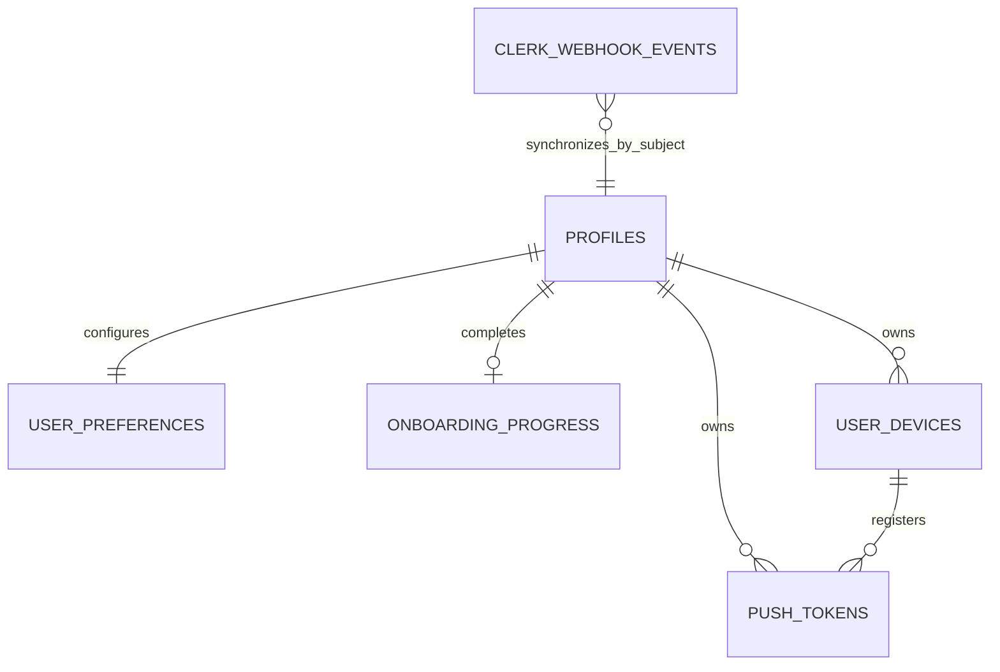

# Backend Feature Specification: Authentication, Profiles, Preferences & Sessions

**Phase / Spec**: Phase 02 / SPEC-BE-002 of 014
**Working Branch**: `main`
**Feature Directory**: `apps/api/specs/002-auth-profiles-preferences-sessions`
**Base Revision**: `d17d140e0eaf0270895c7fbe1dc25d84e2d9bb0f` (`origin/main`)
**Created**: 2026-08-27
**Status**: Governance transition to `main` pending; implementation not started
**Input**: "Read the complete BACKEND_MASTER_PLAN.md and specify SPEC-BE-002 — Authentication, Profiles, Preferences & Sessions."

## Objective and Scope

Replace simulated customer and administrator identity with one Clerk application
while storing only Masarifi-owned profile, preference, onboarding, device, push,
and identity-synchronization state. Clerk is the sole authentication authority;
Masarifi owns product profile state and enforces active-profile access after
authentication. Supabase Auth users are neither created nor mirrored for sign-in.

This Spec establishes the trust boundary from a verified Clerk session to a
Masarifi profile, owner-scoped database access, user-facing profile and preference
contracts, minimal cross-device onboarding progress, registered-device evidence,
push-token protection, Clerk webhook ingestion, and replay-safe profile
synchronization.

This Spec does not own administrator roles or permissions, account-deletion
workflow, product-domain authorization, audit/security-event tables, client
production cutover, or any local password, OTP secret, MFA secret, OAuth token,
Supabase Auth identity, or legacy Clerk Supabase JWT template.

## Dependencies and Repository Baseline

- **Required prior Spec**: SPEC-BE-001 owns the runnable API/worker platform,
  canonical migrations, shared version trigger, secrets validation, API/error
  conventions, outbox primitive, Docker runtime, and CI gates consumed here.
- **Current baseline state**: SPEC-BE-001 is merged into `origin/main` at revision
  `d17d140e0eaf0270895c7fbe1dc25d84e2d9bb0f`. The merged API/worker, migrations,
  tests, Docker, and CI foundation is the implementation baseline. SPEC-BE-002
  artifacts must be integrated into `main` before source implementation begins.
- **Authentication authority**: One Clerk Development application named
  `Masarifi Development` serves Mobile and Admin. Required sign-in methods are
  Phone OTP and Google only. Password, Apple, Facebook, and other providers are
  excluded.
- **Phone scope**: Supported country calling codes are Egypt `+20`, Saudi Arabia
  `+966`, and United Arab Emirates `+971`. Provider-side SMS restriction must be
  effective and verified before production readiness; a Clerk tier/support
  limitation is a release blocker, not permission to broaden the country list.
- **Native application identity**: Android package and iOS bundle ID are both
  `com.masarifi.mobile`. The custom URL scheme is `masarifi`, and the approved
  Mobile OAuth callback is `masarifi://oauth-callback`.
- **Supabase integration**: Clerk native Supabase Third-Party Auth is required,
  using asymmetric session JWTs and the Clerk instance domain. The deprecated
  Clerk Supabase JWT Template must not be created or used.
- **Current Mobile facts**: Mobile exposes an `AuthService` capability with Phone
  OTP, Google, session restore, and sign-out; accepted phone codes are already
  `+20`, `+966`, and `+971`. Production auth is currently unavailable outside an
  isolated mock/demo adapter. Onboarding, preferences, and session projections
  are currently persisted locally.
- **Current Admin facts**: Admin uses a simulated role and mocked user, device,
  and session routes. Those screens consume masked projections. SPEC-BE-003 owns
  real Admin permission checks and Admin user/device/session endpoints.
- **Governing documents**: `apps/api/.specify/memory/constitution.md` version
  1.1.0 and `docs/Back end/BACKEND_MASTER_PLAN.md` are mandatory.
- **Current provider guidance**: Supabase supports Clerk as a first-class
  third-party authentication provider, and both Supabase and Clerk recommend the
  native integration instead of the deprecated shared-secret JWT template.

## Owned Resources

SPEC-BE-002 is the sole owner of the following resources:

| Resource type | Owned resources |
|---|---|
| Public tables | `public.profiles`, `public.user_preferences`, `public.onboarding_progress`, `public.user_devices`, `public.push_tokens` |
| Private tables | `private.clerk_webhook_events` |
| Functions | `public.current_clerk_user_id()`, `private.assert_active_profile(user_id)` |
| Views | None |
| Trigger attachments | Version/lifecycle trigger attachments on mutable owned tables, consuming `private.set_updated_at_and_version()` from SPEC-BE-001 |
| Customer APIs | `GET/PATCH /api/v1/me`, `GET/PUT /api/v1/me/preferences`, `GET/PUT /api/v1/me/onboarding`, `GET /api/v1/me/devices`, `POST /api/v1/me/devices/register`, `DELETE /api/v1/me/devices/:id` |
| Provider ingress | `POST /webhooks/clerk` |
| Jobs | `clerk.webhook.process`, including bounded seven-day payload redaction and reconciliation mode |
| Events | `profile.created`, `profile.updated`, `profile.deletion_requested`, `device.registered`, `device.revoked` |
| External configuration contract | One Clerk application, Phone OTP/Google configuration, Native Applications, Mobile redirect allowlist, Clerk native Supabase integration, and Supabase Clerk third-party-auth registration |
| Secret/configuration names | `CLERK_PUBLISHABLE_KEY`, `CLERK_SECRET_KEY`, `CLERK_INSTANCE_DOMAIN`, `CLERK_AUTHORIZED_PARTIES`, and later `CLERK_WEBHOOK_SIGNING_SECRET` |

There is no Masarifi session table in this Spec. Clerk remains the session source
of truth; `user_devices.clerk_session_id` stores only the minimum link needed for
device/session evidence and revocation. SPEC-BE-003 owns Admin authorization,
privileged profile status changes, Admin session/device contracts, audit, privacy,
and account-deletion lifecycle. SPEC-BE-014 owns Mobile/Admin production adapter
cutover and removal of mocks.

## User Scenarios and Testing

### User Story 1 - Authenticate Through One Trusted Identity (Priority: P1)

As a Masarifi customer or administrator, I need Phone OTP or Google sign-in to
produce one trusted Clerk identity that the backend recognizes consistently,
without a second Supabase identity.

**Why this priority**: Every owner-scoped resource and later authorization rule
depends on a single immutable identity subject.

**Independent Test**: Authenticate two Phone OTP test users and one Google test
user through the same Clerk Development application, call an authenticated
Masarifi contract with each token, and verify that the backend derives a distinct
nonempty Clerk `sub` without creating any Supabase Auth user.

**Acceptance Scenarios**:

1. **Given** a valid Phone OTP Clerk session from an allowed country, **When** the
   backend receives its session JWT, **Then** the token is accepted only after
   issuer, configured-audience, present-authorized-party, signature, key, time,
   role, subject, and session checks. A verified native request may omit `azp`.
2. **Given** a valid Google Clerk session, **When** the same backend boundary is
   called, **Then** it resolves the same immutable Clerk subject model used by
   Phone OTP and does not create a provider-specific Masarifi identity.
3. **Given** an invalid, expired, premature, incorrectly issued, incorrectly
   addressed, unsigned, or unknown-key token, **When** any protected contract is
   called, **Then** access fails closed with a safe stable error and no profile
   or account-existence hint.
4. **Given** a valid Clerk subject without a usable active profile, **When** a
   product contract is called, **Then** the request is denied or enters the
   bounded profile-reconciliation path; it never proceeds as an anonymous or
   different user.

### User Story 2 - Maintain Profile and Preferences Across Devices (Priority: P1)

As an authenticated customer, I need to read and update my safe profile fields
and full preference set with conflict detection so my account state is consistent
across devices without allowing identity or status tampering.

**Why this priority**: Profile ownership and safe mutable fields are the base for
all later customer resources.

**Independent Test**: Read `/me` and preferences as the owner, update each with
the current version, retry with the stale version, and repeat as a second user.

**Acceptance Scenarios**:

1. **Given** an active owner, **When** `/api/v1/me` is read, **Then** the response
   contains only the approved profile projection and masks email and phone.
2. **Given** an active owner and current `expectedVersion`, **When** display name,
   locale, or timezone is patched, **Then** only supplied safe fields change and
   the version advances exactly once.
3. **Given** a stale `expectedVersion`, **When** a profile or preference update is
   attempted, **Then** it is rejected with `VERSION_CONFLICT` and the stored state
   is unchanged.
4. **Given** a complete valid preference object, **When** it is put, **Then** the
   prior preference value is replaced atomically; omitted required fields and
   unknown fields are rejected.
5. **Given** a second authenticated user, **When** they try to read or mutate the
   first user's rows through API or direct approved database access, **Then** zero
   cross-user data is returned or changed.

### User Story 3 - Resume Minimal Onboarding Progress (Priority: P1)

As an authenticated Mobile user, I need the minimal cross-device onboarding
projection to resume at a known step and record completion without transferring
platform-specific permission or secret state.

**Why this priority**: Authentication must lead deterministically either to
onboarding or the ready application shell.

**Independent Test**: Create, resume, advance, complete, and retry onboarding
updates with current and stale versions while retaining platform-only state on
the device.

**Acceptance Scenarios**:

1. **Given** a new profile, **When** onboarding is first read, **Then** a
   deterministic `welcome` projection exists or is returned without duplicate
   rows.
2. **Given** a valid ordered progress update, **When** it is saved, **Then** the
   current step and unique completed-step list are replaced atomically and the
   version advances.
3. **Given** `complete=true`, **When** progress is saved, **Then** completion time
   is set once and later retries are idempotent for the same resulting state.
4. **Given** platform-specific SMS permission, skipped-step, PIN, biometric, or
   tracking data, **When** the Mobile adapter synchronizes onboarding, **Then**
   only the approved minimal projection is sent or stored by this Spec.

### User Story 4 - Register and Revoke Devices Safely (Priority: P1)

As an authenticated customer, I need to see my registered devices, register the
current device and push token, and revoke a device so stale sessions cannot keep
receiving push messages.

**Why this priority**: Device evidence and revocation are security boundaries,
not display-only settings.

**Independent Test**: Register two devices for one user, list them, register the
same fingerprint again, add/rotate a push token, revoke one device, retry the
revoke, and repeat all reads/mutations as a non-owner.

**Acceptance Scenarios**:

1. **Given** an active authenticated session, **When** a valid device is
   registered, **Then** the owner/fingerprint pair is atomically created or
   refreshed without a duplicate device row.
2. **Given** a valid push token, **When** it is registered, **Then** ordinary
   responses expose neither plaintext nor ciphertext, and uniqueness is enforced
   by provider plus nonreversible token hash.
3. **Given** a token already bound to another user's device, **When** registration
   is attempted, **Then** the backend does not silently reassign it and records a
   safe security signal for the later SPEC-BE-003 workflow.
4. **Given** a device owned by the caller, **When** it is revoked with an
   idempotency key, **Then** the device and its push tokens are revoked, the linked
   Clerk session is revoked where supported, and duplicate identical requests
   return the same safe outcome.
5. **Given** the current device, **When** it is revoked, **Then** recent
   authentication is required and subsequent protected work requires a fresh
   Clerk session.
6. **Given** a revoked device, **When** it attempts to register a push token using
   the revoked session evidence, **Then** the request fails closed.

### User Story 5 - Synchronize Clerk Changes Reliably (Priority: P1)

As an operator, I need signed Clerk user events to be durably accepted once and
processed safely despite retry, replay, delay, loss, or out-of-order delivery.

**Why this priority**: Identity provider events are untrusted external input and
cannot be allowed to corrupt product profiles.

**Independent Test**: Send valid, invalid, duplicate, replayed, delayed, and
out-of-order `user.created`, `user.updated`, and `user.deleted` fixtures, inject a
worker failure, then run reconciliation by Clerk subject.

**Acceptance Scenarios**:

1. **Given** a valid signed supported event within the replay window, **When** the
   webhook endpoint receives its raw body, **Then** it verifies before durable
   insert and returns `202` only after the unique inbox record exists.
2. **Given** an invalid signature, stale timestamp, oversized body, unsupported
   type, malformed schema, or replay outside policy, **When** received, **Then** no
   trusted inbox record or profile mutation is created.
3. **Given** the same Clerk event ID more than once, **When** it is retried, **Then**
   processing is idempotent and no duplicate profile or event effect occurs.
4. **Given** an older update after a newer update, **When** the worker processes
   both, **Then** per-subject serialization plus a current Clerk Admin API read
   converges on provider truth and prevents regression.
5. **Given** webhook loss or terminal processing failure, **When** reconciliation
   runs, **Then** profiles are compared and repaired by immutable Clerk `sub`,
   with counts and hashes but no credential content recorded.
6. **Given** a webhook payload older than seven days, **When** the bounded
   retention pass runs, **Then** raw payload content is redacted while event ID,
   type, verification time, payload hash, status, and processing evidence remain.

### User Story 6 - Preserve Admin Contract Boundaries (Priority: P2)

As an Admin feature owner, I need profile/device/session evidence to be reusable
without allowing the Admin client to query tables directly or inherit authority
from simulated roles.

**Why this priority**: SPEC-BE-003 depends on these resources but must remain the
only owner of administrator permissions and privileged routes.

**Independent Test**: Compare the current Admin masked user/device/session mocks
with the owned data projections, then prove that no Admin role has direct table
grants and no SPEC-BE-003 route is introduced here.

**Acceptance Scenarios**:

1. **Given** a valid Admin Clerk session, **When** it directly queries an owned
   table without a SPEC-BE-003 permission-protected API, **Then** access is denied.
2. **Given** later SPEC-BE-003 adapters, **When** they consume these resources,
   **Then** email, phone, token, and device information is masked or minimized by
   their permission contract.
3. **Given** the current simulated Admin role, **When** this Spec is implemented,
   **Then** it grants no backend authority and remains a mock until cutover.

### Edge Cases

- A Clerk JWT has a valid signature but an empty `sub`, missing required role,
  unexpected issuer, unexpected authorized party, unknown `kid`, invalid `nbf`,
  or expired `exp`; authentication fails closed.
- JWKS refresh fails during key rotation. The Clerk SDK may reuse only keys it
  still considers valid; unknown/expired keys fail closed, and no unverified or
  custom-cache fallback is allowed.
- A profile exists with `suspended`, `deletion_pending`, or `deleted` status. JWT
  authentication may succeed, but domain handling is denied before data access.
- A Clerk subject is reused with changed email or phone. Synchronization updates
  server-controlled identity fields by `sub`; it never changes `profiles.id` or
  matches by email/phone.
- Clerk reports a deleted user before an earlier create/update is delivered. The
  deletion evidence wins when newer, and reconciliation must not reactivate the
  profile from stale input.
- Two workers inspect the same received webhook event. A transaction-scoped row
  lock with `FOR UPDATE SKIP LOCKED` permits only one effect; a crash rolls the
  claim and partial database changes back for safe retry.
- Two requests update the same version. Exactly one succeeds and the other gets a
  deterministic version conflict.
- A preferences request contains an invalid currency shape, unknown privacy key,
  non-object JSON, invalid week start, or unsupported locale/theme/calendar. The
  complete replacement is rejected without partial change.
- Profile locale and preference language differ. Profile locale is the account
  communication/default locale; preference language is the product UI choice.
  A new preference row is seeded from profile locale, but later values may differ.
- Onboarding completed steps contain duplicates, empty values, unbounded values,
  or a `step` incompatible with completion state. The request is rejected.
- A device fingerprint is blank, unstable, oversized, or supplied for another
  user. User identity always comes from the verified token, never the request.
- A device registration races with device revocation. Revocation wins for the
  existing session; registration requires a fresh Clerk session to reactivate.
- A push provider rotates a token. The new provider/hash pair is stored, the old
  token is revoked, and no plaintext token appears in logs or responses.
- A current-device revoke cannot reach Clerk. Local device/token revocation is
  retained, the request returns a safe partial/provider-unavailable result, and a
  bounded retry/reconciliation path prevents silent reactivation.
- Clerk or Supabase third-party-auth configuration is missing or invalid. Startup
  or readiness fails before protected traffic; the system never falls back to
  Supabase Auth or the legacy JWT template.
- The Clerk SMS country allowlist cannot be enforced on the current development
  tier. Test use remains controlled, and production readiness is blocked until
  provider-side enforcement is verified.

## Database Design

### Owned Table: `public.profiles`

| Column | Type | Null | Default | Constraints and meaning |
|---|---|---:|---|---|
| `id` | `text` | no | none | Primary key; immutable nonempty Clerk `sub` |
| `primary_email` | `text` | yes | `null` | Normalized identity email synchronized from Clerk; server controlled |
| `phone_e164` | `text` | yes | `null` | Normalized E.164 phone synchronized from Clerk; server controlled |
| `display_name` | `text` | yes | `null` | Bounded customer-controlled display name |
| `locale` | `text` | no | `'ar'` | `ar` or `en`; account communication/default locale |
| `timezone` | `text` | no | `'Asia/Riyadh'` | Bounded validated IANA timezone identifier |
| `status` | `text` | no | `'active'` | `active`, `suspended`, `deletion_pending`, or `deleted`; server controlled |
| `last_seen_at` | `timestamptz` | yes | `null` | Server-observed authenticated activity time |
| `deleted_at` | `timestamptz` | yes | `null` | Set only for deleted lifecycle state |
| `created_at` | `timestamptz` | no | `now()` | Creation time in UTC |
| `updated_at` | `timestamptz` | no | `now()` | Trigger controlled |
| `version` | `bigint` | no | `1` | Positive trigger-controlled optimistic version |

Keys, constraints, and indexes:

- Primary key `(id)` with a nonblank bounded-subject check.
- Partial unique index on `lower(primary_email)` where email is not null.
- Partial unique index on `phone_e164` where phone is not null.
- Index `(status, created_at)` for bounded status/reconciliation work.
- Identity fields, status, deletion fields, timestamps, and version are excluded
  from customer mutation allowlists.

### Owned Table: `public.user_preferences`

| Column | Type | Null | Default | Constraints and meaning |
|---|---|---:|---|---|
| `user_id` | `text` | no | none | Primary key and FK to `profiles(id)` with delete restrict |
| `default_currency` | `char(3)` | no | `'SAR'` | Uppercase three-letter shape in this phase |
| `language` | `text` | no | `'ar'` | `ar` or `en`; product UI language |
| `theme` | `text` | no | `'system'` | `light`, `dark`, or `system` |
| `calendar` | `text` | no | `'gregorian'` | `gregorian` or `hijri` |
| `week_start` | `smallint` | no | `6` | Integer from `0` through `6` |
| `privacy_settings` | `jsonb` | no | `'{}'` | Object containing only approved bounded privacy booleans |
| `updated_at` | `timestamptz` | no | `now()` | Trigger controlled |
| `version` | `bigint` | no | `1` | Positive trigger-controlled optimistic version |

`privacy_settings` may contain `hideBalances`, `reducedMotion`,
`trackingPersonalization`, `assistantPersonalization`, and `analyticsEnabled`,
each as a boolean. Unknown keys, nested objects, arrays, and non-boolean values
are rejected. SPEC-BE-004 later adds the final `default_currency` foreign key to
`public.currencies(code)` after its seed/backfill.

### Owned Table: `public.onboarding_progress`

| Column | Type | Null | Default | Constraints and meaning |
|---|---|---:|---|---|
| `user_id` | `text` | no | none | Primary key and FK to `profiles(id)` with delete restrict |
| `step` | `text` | no | `'welcome'` | One of `welcome`, `tracking_intro`, `permission_education`, `permission_request`, `keywords`, `preference`, `demo`, `platform_explanation`, `capture_options`, `optional_automation`, `manual_voice_demo`, or `complete` |
| `completed_steps` | `text[]` | no | `'{}'` | Unique ordered subset of the same approved vocabulary, maximum 12 entries |
| `completed_at` | `timestamptz` | yes | `null` | Completion time in UTC |
| `updated_at` | `timestamptz` | no | `now()` | Trigger controlled |
| `version` | `bigint` | no | `1` | Positive trigger-controlled optimistic version |

No GIN index is created unless measured queries prove it is needed. Platform
path, skipped steps, SMS permission evidence, PIN/biometric state, tracking
rules, and other platform-specific onboarding data remain outside this table.

### Owned Table: `public.user_devices`

| Column | Type | Null | Default | Constraints and meaning |
|---|---|---:|---|---|
| `id` | `uuid` | no | `gen_random_uuid()` | Primary key |
| `user_id` | `text` | no | none | FK to `profiles(id)` with delete restrict |
| `device_fingerprint` | `text` | no | none | Bounded normalized opaque device identifier; never an authority source |
| `clerk_session_id` | `text` | yes | `null` | Minimum verified Clerk session link when available |
| `platform` | `text` | no | none | `ios`, `android`, or `web` |
| `app_version` | `text` | no | none | Bounded normalized application version |
| `device_name` | `text` | yes | `null` | Bounded safe display label |
| `trusted_at` | `timestamptz` | yes | `null` | Server-controlled trust time |
| `last_seen_at` | `timestamptz` | no | `now()` | Server-observed activity time |
| `revoked_at` | `timestamptz` | yes | `null` | Server-controlled revocation time |
| `created_at` | `timestamptz` | no | `now()` | Creation time in UTC |
| `updated_at` | `timestamptz` | no | `now()` | Trigger controlled |
| `version` | `bigint` | no | `1` | Positive trigger-controlled version |

Keys and indexes:

- Unique `(user_id, device_fingerprint)`.
- Index `(user_id, revoked_at, last_seen_at desc)` for owner device listing.
- Index `(user_id, last_seen_at desc, id desc)` for the documented cursor order.
- Partial index on `clerk_session_id` where it is not null.
- A composite uniqueness/relationship constraint sufficient for `push_tokens`
  to prove that `device_id` and `user_id` refer to the same owner.

### Owned Table: `public.push_tokens`

| Column | Type | Null | Default | Constraints and meaning |
|---|---|---:|---|---|
| `id` | `uuid` | no | `gen_random_uuid()` | Primary key |
| `user_id` | `text` | no | none | FK to `profiles(id)` with delete restrict |
| `device_id` | `uuid` | no | none | FK to `user_devices(id)` on delete cascade; same owner required |
| `token_hash` | `text` | no | none | Stable nonreversible uniqueness/lookup digest |
| `token_ciphertext` | `text` | no | none | Encrypted delivery token; backend/worker only |
| `provider` | `text` | no | none | `expo`, `apns`, or `fcm` |
| `last_validated_at` | `timestamptz` | yes | `null` | Provider validation time |
| `revoked_at` | `timestamptz` | yes | `null` | Revocation time |
| `created_at` | `timestamptz` | no | `now()` | Creation time in UTC |
| `updated_at` | `timestamptz` | no | `now()` | Trigger controlled |
| `version` | `bigint` | no | `1` | Positive trigger-controlled version |

Keys and indexes:

- Unique `(provider, token_hash)`.
- Index `(user_id, revoked_at)` for bounded owner/revocation work.
- Index `(device_id)` for FK/cascade and delivery lookup.
- Ordinary selects and every customer/Admin DTO exclude `token_ciphertext`.

### Owned Table: `private.clerk_webhook_events`

| Column | Type | Null | Default | Constraints and meaning |
|---|---|---:|---|---|
| `id` | `uuid` | no | `gen_random_uuid()` | Primary key |
| `clerk_event_id` | `text` | no | none | Unique bounded signed delivery ID from the verified `svix-id` header; it is not `data.id` |
| `event_type` | `text` | no | none | `user.created`, `user.updated`, or `user.deleted` |
| `signature_verified_at` | `timestamptz` | no | none | Time verification completed before insertion |
| `payload_hash` | `text` | no | none | Stable digest for replay/conflict evidence |
| `payload` | `jsonb` | no | none | Validated private provider payload; redacted after seven days |
| `status` | `text` | no | `'received'` | `received`, `processing`, `processed`, or `failed` |
| `attempt_count` | `integer` | no | `0` | Nonnegative processing attempts |
| `processed_at` | `timestamptz` | yes | `null` | Successful terminal processing time |
| `last_error_code` | `text` | yes | `null` | Stable safe code, never exception/provider text |
| `created_at` | `timestamptz` | no | `now()` | Durable receipt time |

Keys and indexes:

- Unique `(clerk_event_id)` for durable duplicate/replay prevention. An identical
  conflict returns the same `202`; the same ID with another payload hash fails
  closed as `WEBHOOK_EVENT_CONFLICT`.
- Index `(status, created_at)` for bounded worker claims and backlog metrics.
- Index `(event_type, processed_at)` for reconciliation/retention evidence.
- Provider identity fields, payload, and payload hash are immutable after insert.
  Only processing status, attempts, safe error, processed time, and the bounded
  seven-day payload redaction transition may change.

### Relationships and ERD

`CLERK_WEBHOOK_EVENTS` has a logical subject relationship only; no FK is created
from private raw-provider evidence to `profiles` because an event may precede
profile creation or represent a deleted/missing subject.

### RLS, Grants, and Authorization

- Enable and force RLS on every owned `public` table. The private webhook table
  has no `anon`, `authenticated`, customer, or Admin client grant.
- `public.current_clerk_user_id()` derives a nonempty text subject from the
  verified third-party JWT `sub`; it returns null for absent/empty identity and
  never uses a Supabase Auth user UUID.
- `profiles` owner SELECT is limited to `id = current_clerk_user_id()`. Owner
  UPDATE permits only display name, locale, and timezone through API allowlists;
  RLS `USING` and `WITH CHECK` preserve the same immutable owner ID.
- Preferences, onboarding, devices, and push-token safe projections permit only
  rows whose `user_id = current_clerk_user_id()`. Every UPDATE policy includes
  both `USING` and `WITH CHECK`.
- Push-token ciphertext has no client-selectable projection or column grant.
- User identity is never accepted from a path, query, body, header, Clerk public
  metadata, or simulated role when the verified token subject is available.
- Admin clients receive no direct table access. SPEC-BE-003 must use explicit
  backend permissions and masked DTOs for privileged reads/actions.
- Runtime/migration/worker privileges are the minimum required by their owned
  function or job. Default table/function privileges are revoked before explicit
  grants.
- Positive and negative pgTAP/RLS evidence must cover owner, non-owner,
  anonymous, authenticated-without-subject, inactive profile, API runtime,
  worker, and over-privileged service paths for every applicable operation.

## API Contracts

All timestamps use ISO 8601 UTC. Every protected contract requires a valid Clerk
session JWT and an active profile, uses the shared request ID/error envelope, and
rejects unknown request properties. Mutable contracts return the resulting
version and reject stale `expectedVersion`.

| Method | Path | Auth | Request | Success response | Errors |
|---|---|---|---|---|---|
| `GET` | `/api/v1/me` | Clerk JWT + active profile | No body | `200 {id,displayName,primaryEmailMasked,phoneMasked,locale,timezone,status,version}` | `401 AUTH_TOKEN_INVALID`, `403 PROFILE_INACTIVE`, `503 PROFILE_SYNC_UNAVAILABLE` |
| `PATCH` | `/api/v1/me` | Clerk JWT + active owner | Bounded `Idempotency-Key`; `{displayName?:string|null,locale?:'ar'|'en',timezone?:IanaZone,expectedVersion}` | Updated `/me` projection | `400 VALIDATION_ERROR`, `409 VERSION_CONFLICT` |
| `GET` | `/api/v1/me/preferences` | Clerk JWT + active owner | No body | `200 {defaultCurrency,language,theme,calendar,weekStart,privacySettings,version}` | Shared auth/profile errors |
| `PUT` | `/api/v1/me/preferences` | Clerk JWT + active owner | Bounded `Idempotency-Key`; complete preference object plus `expectedVersion` | Complete updated preference object | `400 VALIDATION_ERROR`, `409 VERSION_CONFLICT` |
| `GET` | `/api/v1/me/onboarding` | Clerk JWT + active owner | No body | `200 {step,completedSteps,completedAt,version}` | Shared auth/profile errors |
| `PUT` | `/api/v1/me/onboarding` | Clerk JWT + active owner | Bounded `Idempotency-Key`; `{step,completedSteps,complete,expectedVersion}` | Updated onboarding projection | `400 VALIDATION_ERROR`, `409 VERSION_CONFLICT` |
| `GET` | `/api/v1/me/devices` | Clerk JWT + active owner | Bounded cursor and limit `1..100` | `{items:[{id,platform,appVersion,deviceName,trusted,lastSeenAt,current,revokedAt,version}],nextCursor}` | `400 INVALID_CURSOR`, shared auth/profile errors |
| `POST` | `/api/v1/me/devices/register` | Clerk JWT + active owner | Bounded `Idempotency-Key`; `{deviceFingerprint,platform,appVersion,deviceName?,pushToken?,pushProvider?}` | `200/201 {deviceId,registeredAt,version}` | `400 VALIDATION_ERROR`, `409 PUSH_TOKEN_CONFLICT`, `503 PROVIDER_UNAVAILABLE` |
| `DELETE` | `/api/v1/me/devices/:id` | Clerk JWT + active owner; recent auth for current device | `Idempotency-Key`; no body | `204`, including an identical repeated revoke | `403 RECENT_AUTH_REQUIRED`, `404 DEVICE_NOT_FOUND`, `503 PROVIDER_UNAVAILABLE` |
| `POST` | `/webhooks/clerk` | Verified Clerk webhook signature, timestamp, and raw body | Supported signed event, bounded body | `202 {accepted:true}` after durable unique inbox insert or an identical duplicate; `204` for a valid unsupported type | `400 INVALID_WEBHOOK`, `401 WEBHOOK_SIGNATURE_INVALID`, `409 WEBHOOK_EVENT_CONFLICT`, `413 BODY_TOO_LARGE`, `429 RATE_LIMITED`, `503 INBOX_UNAVAILABLE` |

Additional contract rules:

- `PATCH /me` requires at least one mutable field and does not accept identity,
  status, last-seen, deletion, timestamp, owner, or version fields as mutations.
- Every customer mutation accepts and validates the bounded shared
  `Idempotency-Key` header. Durable request/response replay and hash-mismatch
  storage belongs to SPEC-BE-006 and is not created here. Device registration is
  naturally repeatable by owner/fingerprint, device revocation is repeatable by
  resulting state, and Clerk webhook idempotency is anchored to the signed unique
  delivery ID from `svix-id` and payload hash. A mismatched request-hash contract
  is not promised until SPEC-BE-006 owns the durable replay store.
- `PUT /preferences` is a full replacement. The backend does not merge omitted
  values with previous values.
- Device list ordering is deterministic by `lastSeenAt desc, id desc`. The
  `current` flag is derived from verified Clerk session evidence, not client input.
- Device registration is an atomic owner/fingerprint upsert. Push registration
  succeeds or fails without leaving a cross-owner or plaintext token state.
- Device DELETE is a soft security revocation. It does not physically delete the
  device evidence row.
- Webhook `202` acknowledges durable receipt, or an identical already-durable
  delivery, not successful asynchronous profile processing. A valid signed but
  unsupported event returns `204` and never enters the inbox or processor.

## Functions, Views, and Triggers

### `public.current_clerk_user_id()`

- Returns the trimmed nonempty `sub` from the already verified Clerk third-party
  JWT, or null when it is unavailable.
- Does not query or depend on `auth.users`, does not cast the subject to UUID, and
  does not accept caller-supplied identity.
- Is stable for a statement, safe for RLS use, and has minimum execute grants.

### `private.assert_active_profile(user_id)`

- Accepts only a nonempty verified subject from trusted backend/database paths.
- Returns normally only for a matching `active` profile.
- Raises a stable safe forbidden condition for `suspended`,
  `deletion_pending`, or `deleted`; missing profiles enter the explicit
  synchronization/reconciliation error path rather than bypassing the check.
- Uses fixed `search_path`, minimum privileges, no dynamic SQL, and no public or
  direct client execute grant.

### Trigger Attachments

- Attach SPEC-BE-001's `private.set_updated_at_and_version()` to owned mutable
  tables that contain lifecycle columns.
- Callers cannot set `updated_at` or `version`; one successful logical update
  increments version once.
- Webhook event identity/payload fields remain immutable; only the documented
  processing and redaction lifecycle fields may be changed by the worker path.

No view is introduced. Safe projections are enforced through explicit API DTOs,
column allowlists, grants, and RLS rather than a speculative view layer.

## Queues, Jobs, and Events

### Job `clerk.webhook.process`

- Claims a bounded disjoint batch of `received` or retry-eligible failed events,
  marks processing atomically, and increments attempt evidence.
- Supports only `user.created`, `user.updated`, and `user.deleted`.
- Validates the stored normalized event again before effect, identifies profiles
  only by Clerk `sub`, and uses atomic upsert/update semantics.
- Treats the delivery as a synchronization signal and reads current Clerk Admin
  API state before applying identity fields, so an older delivery cannot regress
  newer provider state and a missing current Clerk user becomes deletion evidence.
- Is idempotent by `clerk_event_id`, payload hash, and resulting profile state.
- On retryable failure, records a safe code and bounded backoff. On exhaustion,
  retains the inbox row, raises an actionable alert, and remains reconcilable.
- Provides a bounded reconciliation mode against the Clerk Admin API by subject,
  recording counts/hashes and safe error codes, never credentials or raw tokens.
- Redacts raw payloads older than seven days in bounded batches while retaining
  immutable event and processing evidence.

### Published Event Contracts

| Event | Producer | Required safe payload |
|---|---|---|
| `profile.created` | Clerk synchronization | profile ID, source event ID, occurred time, correlation ID |
| `profile.updated` | Profile API or Clerk synchronization | profile ID, resulting version, changed-field allowlist, source/correlation ID |
| `profile.deletion_requested` | Clerk deletion synchronization | profile ID, source event ID, observed time; no deletion execution claim |
| `device.registered` | Device registration | profile ID, device ID, platform, resulting version, correlation ID |
| `device.revoked` | Device revocation | profile ID, device ID, revocation time, safe provider outcome, correlation ID |

Events contain identifiers and safe bounded metadata only. They never include
email, phone, push token, webhook payload, JWT, OTP, OAuth token, provider secret,
device fingerprint, or unnecessary PII.

## Business Rules

- Clerk is the sole identity and session authority for Mobile and Admin.
- `profiles.id` is the immutable Clerk `sub`; matching or merging by email or
  phone is forbidden.
- No Supabase Auth user is created, mirrored, or used for Masarifi sign-in.
- The Clerk native Supabase integration is required. The deprecated Clerk
  Supabase JWT template and shared Supabase JWT secret approach are forbidden.
- Only Phone OTP and Google are enabled. Password, Apple, Facebook, and other
  sign-in providers are outside the approved application configuration.
- Phone OTP is restricted to `+20`, `+966`, and `+971`; provider inability to
  enforce the restriction blocks production readiness.
- No password, OTP value, OTP attempt secret, MFA secret, OAuth access/refresh
  token, raw JWT, or Clerk credential is stored in Masarifi tables or logs.
- Identity, profile status, deletion, lifecycle, and token ciphertext fields are
  server controlled.
- Suspended, deletion-pending, and deleted profiles fail closed after valid JWT
  authentication and before domain handler execution.
- Profile and preference updates require optimistic version evidence; last-write-
  wins is not used.
- Every customer mutation requires a bounded idempotency key. This Spec uses its
  owned natural keys, versions, and resulting states without creating the durable
  request-replay store owned by SPEC-BE-006.
- Preference updates replace the complete preference resource atomically.
- A new preference row defaults from approved constants and initial profile
  locale. Later profile locale and preference language are distinct contracts.
- Onboarding storage is a minimal cross-device projection; device-specific
  permission/security/tracking state remains local or belongs to later Specs.
- Device fingerprint identifies a registration record but never authenticates or
  authorizes a request.
- Revoking a device revokes its push tokens immediately and its linked Clerk
  session where supported. Failure to reach Clerk remains visible and retryable.
- A revoked device cannot add a push token until a fresh Clerk session is proven.
- Push tokens are encrypted for delivery and hashed for uniqueness. Plaintext is
  accepted only at the bounded registration trust boundary and then discarded.
- Webhook effects are at least once and idempotent. Duplicate, replayed, delayed,
  and out-of-order delivery are normal tested conditions.
- Clerk webhook loss is recoverable through resumable reconciliation by subject.
- Account-deletion execution and privileged status administration belong to
  SPEC-BE-003; this Spec only reflects Clerk deletion/status evidence.

## Security and Privacy Requirements

### JWT and Session Boundary

- Use Clerk's supported backend authenticator to verify issuer, asymmetric
  signature, `kid`, `exp`, `nbf`, required authenticated role, nonempty `sub`, and
  nonempty session ID before accepting identity. Validate configured audience when
  one exists. Validate `azp` against `CLERK_AUTHORIZED_PARTIES` when it is present;
  an absent `azp` is valid for an otherwise verified native Authorization-header
  request and never derives from the OAuth callback URI.
- Retrieve signing keys only through Clerk's supported issuer/JWKS contract, use
  the SDK's rotation-aware cache behavior, refresh/fail closed on unknown keys,
  and test the documented Supabase provider key-refresh delay. Do not build a
  second custom JWKS cache around deprecated no-op TTL options.
- Never use unverified decoded JWT claims, Clerk public/user metadata, client role
  headers, or simulated Admin state for authorization.
- Do not log JWTs, authorization headers, cookies, session IDs, OTPs, subjects in
  high-cardinality metric labels, or token-verification payloads.

### Webhook Boundary

- Preserve raw request bytes for signature verification and reject parsing before
  successful signature/timestamp verification.
- Validate signing secret presence at startup/readiness, signature, timestamp,
  replay window, unique event ID, body size, content type, event type, and bounded
  event schema before durable trust.
- Use constant-time signature comparison through the approved Clerk verification
  mechanism; never implement an unaudited custom signature scheme.
- Rate-limit by safe provider/network evidence without trusting spoofable headers.
- Store raw payload only in the private schema for seven days and redact it in
  bounded work. Logs, traces, alerts, fixtures, and responses contain no raw event.

### Data and Secret Isolation

- Backend-only: `CLERK_SECRET_KEY` and `CLERK_WEBHOOK_SIGNING_SECRET`.
- Publishable client variables may contain only the Clerk publishable key:
  `EXPO_PUBLIC_CLERK_PUBLISHABLE_KEY` and
  `NEXT_PUBLIC_CLERK_PUBLISHABLE_KEY` during their owning cutover work.
- `CLERK_PUBLISHABLE_KEY`, `CLERK_INSTANCE_DOMAIN`, and the validated safe subset
  of authorized-party configuration may be used where their runtime contract
  requires them; secret values never appear in Git, images, Compose, migrations,
  test fixtures, screenshots, chat, or logs.
- Push-token encryption keys remain backend/worker runtime secrets. Hashes are not
  treated as plaintext but are still private operational data.
- Apply deny-by-default grants, forced RLS, owner predicates, API property
  allowlists, bounded inputs, safe errors, and minimum response projections.

### OWASP and Release Blockers

- Trace applicable OWASP ASVS 5.0.0 Level 2 controls and Level 3 identity/privacy
  controls, OWASP API Security Top 10:2023 authentication/BOLA/property/resource
  limits, OWASP Top 10:2025 configuration/supply-chain/fail-safe controls, and
  MASVS 2.1.0 token/storage/deep-link requirements.
- Release is blocked by accepted invalid/replayed webhook, cross-user access,
  missing RLS negative evidence, usable suspended/deleted access, legacy JWT
  template use, Supabase Auth identity creation, plaintext push/JWT/OTP exposure,
  unallowlisted redirect, broadened phone/provider scope, or exploitable
  Critical/High security finding.

## Performance and Caching Requirements

- Indexed owner profile and preference lookups must remain at or below 50 ms P95
  database time under production-like data.
- `GET /api/v1/me` and preference/onboarding operations must remain at or below
  250 ms P95, 500 ms P99, and 50 KB compressed response size.
- Device listing is cursor bounded to 100 rows and must not use unbounded or N+1
  profile/session/token queries.
- Webhook ingress performs only bounded verification plus one durable inbox
  insertion before returning `202`; provider profile synchronization is
  asynchronous.
- Webhook worker claims, reconciliation pages, retry attempts/backoff, and
  retention redaction are bounded and resumable; no new queue is introduced.
- Clerk SDK JWKS handling is issuer-scoped and rotation-aware and is never shared
  across untrusted issuers. Cache or provider failure cannot authenticate a token.
- Profile/preferences may use version/ETag and Mobile local projection caching.
  Inactive status, current session/device evidence, webhook replay state, and
  authorization decisions are not shared-cached across users.
- Redis is not introduced. A new distributed cache requires measured evidence
  and Master Plan approval.
- Performance evidence includes representative owner/non-owner RLS plans,
  profile status checks, device list ordering, webhook backlog processing, and
  payload redaction without sequential scans on active paths.

## Mobile and Admin Integration

- Mobile's current `AuthService` contract maps Phone OTP, Google, session restore,
  and local/all sign-out to Clerk. Authenticated session `userId` maps to Clerk
  `sub`; OTP values and provider tokens never enter app logs or backend storage.
- Mobile uses Android package and iOS bundle `com.masarifi.mobile`, custom scheme
  `masarifi`, and allowlisted callback `masarifi://oauth-callback`.
- Clerk session material remains in the approved secure native token cache.
  SQLite/local state may retain only safe profile/onboarding/display projections,
  not JWTs, OTPs, webhook data, provider secrets, or push-token ciphertext.
- Current Mobile country validation `+20/+966/+971` remains aligned with Clerk
  provider enforcement. Backend never broadens that scope from client input.
- Mobile's richer platform-specific onboarding, PIN/biometric lock, SMS
  permission, tracking preference, and pending navigation state remain local;
  only the minimal owned onboarding projection synchronizes here.
- Current Mobile preference fields not represented by this Spec's approved
  preference contract remain local or await their owning domain Spec; they are
  not hidden inside unbounded JSON.
- Demo mode remains an explicitly isolated synthetic adapter. It cannot silently
  become production authentication or access live customer data.
- Admin continues using mocks until its owning cutover. SPEC-BE-003 maps the
  existing masked user/device/session projections to permission-protected APIs;
  this Spec exposes no `/api/v1/admin` route and changes no simulated role.
- Admin's current `USR-*`, `DEV-*`, and `SES-*` identifiers, `SA/AE` country
  restriction, and `example.test` masking are synthetic mock contracts, not
  persisted identity keys. SPEC-BE-003/014 must adapt those projections to Clerk
  subjects and the approved country scope without changing this Spec's PKs.
- Two Phone OTP users are required for owner/non-owner testing, plus one Google
  user. Test credentials and OTPs are never committed or printed.

## Functional Requirements

- **FR-001**: One Clerk application named `Masarifi Development` MUST be the sole
  authentication authority for Mobile and Admin in the development environment.
- **FR-002**: The Clerk application MUST enable Phone OTP and Google only and MUST
  NOT enable password, Apple, Facebook, or another provider.
- **FR-003**: Phone OTP MUST be restricted to `+20`, `+966`, and `+971`, and
  production readiness MUST fail until provider-side enforcement is verified.
- **FR-004**: Native Applications MUST include Android and iOS identity
  `com.masarifi.mobile`, and Mobile SSO redirect allowlisting MUST include only
  the approved `masarifi://oauth-callback` contract for this flow.
- **FR-005**: Clerk native Supabase Third-Party Auth MUST be enabled using the
  Clerk instance domain and asymmetric session JWTs.
- **FR-006**: The deprecated Clerk Supabase JWT Template and shared Supabase JWT
  secret integration MUST NOT be created or used.
- **FR-007**: Masarifi MUST NOT create, mirror, or authenticate through Supabase
  Auth users.
- **FR-008**: Protected requests MUST use Clerk's supported authenticator to verify
  issuer, signature, `kid`, `exp`, `nbf`, authenticated role, nonempty `sub`, and
  nonempty session ID; configured audience and present `azp` MUST also validate.
  A native request MAY omit `azp`, and the OAuth callback MUST NOT be treated as an
  authorized party.
- **FR-009**: Clerk SDK JWKS retrieval/caching MUST honor rotation, refresh or fail
  closed for unknown keys, and MUST NOT be replaced by an unaudited custom cache.
- **FR-010**: The backend MUST derive user identity only from verified Clerk
  `sub`; email, phone, request fields, and client metadata MUST NOT establish
  identity or authority.
- **FR-011**: `profiles.id` MUST remain the immutable Clerk subject and profile
  synchronization MUST upsert only by that subject.
- **FR-012**: `public.profiles` MUST match the complete table, constraint, index,
  lifecycle, and server-controlled-field contract in this specification.
- **FR-013**: `public.user_preferences` MUST match the complete contract and MUST
  receive the SPEC-BE-004 currency FK only in SPEC-BE-004.
- **FR-014**: `public.onboarding_progress` MUST store only the minimal bounded
  cross-device projection and MUST NOT absorb platform security/permission state.
- **FR-015**: `public.user_devices`, `public.push_tokens`, and
  `private.clerk_webhook_events` MUST match their complete contracts.
- **FR-016**: Every owned public table MUST enable and force RLS with owner,
  non-owner, anonymous, inactive-profile, runtime, and worker evidence.
- **FR-017**: `public.current_clerk_user_id()` MUST return the verified text
  subject or null and MUST NOT depend on a Supabase Auth user UUID.
- **FR-018**: `private.assert_active_profile` MUST deny suspended,
  deletion-pending, deleted, and unusable missing profiles before domain handling.
- **FR-019**: Admin clients MUST have no direct grants to owned tables; privileged
  Admin authorization and routes MUST remain in SPEC-BE-003.
- **FR-020**: `GET /api/v1/me` MUST return only the approved masked profile
  projection for the active owner.
- **FR-021**: `PATCH /api/v1/me` MUST accept only display name, locale, timezone,
  and `expectedVersion`, and MUST reject mass assignment and stale versions.
- **FR-022**: `GET/PUT /api/v1/me/preferences` MUST expose and atomically replace
  the complete approved preference resource with version conflict protection.
- **FR-023**: `GET/PUT /api/v1/me/onboarding` MUST expose and replace the minimal
  progress projection with version conflict and completion consistency checks.
- **FR-024**: `GET /api/v1/me/devices` MUST return only caller-owned safe device
  projections in deterministic bounded cursor order.
- **FR-025**: Device registration MUST atomically create or refresh by
  `(user_id, device_fingerprint)` using identity from the verified token.
- **FR-026**: Push registration MUST enforce same-owner device association,
  provider/hash uniqueness, encrypted storage, and zero plaintext/ciphertext
  exposure in ordinary responses and logs.
- **FR-027**: Cross-owner push-token reassignment MUST fail closed and MUST NOT be
  silently resolved by upsert.
- **FR-028**: Device revocation MUST be idempotent, require recent auth for the
  current device, revoke linked push tokens immediately, and revoke/retry the
  Clerk session where supported.
- **FR-029**: A revoked device MUST NOT register push until a fresh verified Clerk
  session exists.
- **FR-030**: `POST /webhooks/clerk` MUST verify raw body, signature, timestamp,
  replay window, unique event ID, content type, size, and supported schema before
  durable insertion.
- **FR-031**: Webhook ingress MUST return `202` only after the unique inbox event
  is durable and MUST perform profile effects asynchronously.
- **FR-032**: Webhook processing MUST support only `user.created`, `user.updated`,
  and `user.deleted`, remain idempotent, and prevent out-of-order regression.
- **FR-033**: Failed webhook effects MUST remain retryable/reconcilable with safe
  attempts and error codes; no source event may be silently dropped.
- **FR-034**: Raw Clerk payload MUST be private and redacted after seven days in
  bounded work while hash and processing evidence remain.
- **FR-035**: Reconciliation MUST be resumable by immutable Clerk subject and
  record safe counts/hashes without credentials or raw tokens.
- **FR-036**: No password, OTP, MFA secret, OAuth token, raw JWT, Clerk secret,
  webhook secret, or plaintext push token MAY be persisted or logged.
- **FR-037**: Backend secret values MUST exist only in approved runtime secret
  storage and MUST NOT appear in Git, images, Compose, migrations, fixtures,
  screenshots, client bundles, chat, test output, or logs.
- **FR-038**: Mobile and Admin source/mocks MUST remain unchanged by this backend
  Spec; production cutover remains SPEC-BE-014.
- **FR-039**: The system MUST emit only safe structured identity/webhook/device
  metrics and logs with bounded labels and correlation IDs.
- **FR-040**: Profile lookup and `/me` contracts MUST satisfy the stated P95/P99,
  payload, query-plan, bounded-pagination, and no-N+1 requirements.
- **FR-041**: Migrations MUST be ordered, immutable, checksum-verifiable,
  least-privilege, additive, and the only schema source of truth.
- **FR-042**: Rollback MUST preserve profile/device/webhook evidence and use the
  previous compatible image plus forward corrective SQL rather than destructive
  identity teardown.
- **FR-043**: Implementation MUST provide two Phone OTP test identities and one
  Google test identity without committing or printing credentials, OTPs, or keys.
- **FR-044**: Every required security, RLS, webhook, migration, performance,
  recovery, and client-contract claim MUST have fresh named evidence before DoD.
- **FR-045**: Every customer mutation MUST accept and validate the bounded shared
  `Idempotency-Key` header, while durable request/response replay and hash-mismatch
  storage MUST remain owned by SPEC-BE-006; repeated device revoke MUST remain
  safe through the resulting revoked state.

## Tests and Verification Evidence

The following evidence is required during implementation; listing it here does
not claim it has run during this specification step.

### Authentication and Contract Tests

- Valid Phone OTP and Google sessions from the same Clerk instance.
- Wrong issuer, configured audience, present authorized party, role, signature,
  key, subject, session, expiry, not-before, pending state, malformed token, and
  algorithm-confusion negatives; a verified native request without `azp` passes.
- Clerk SDK JWKS reuse, unknown `kid`, rotation overlap, documented Supabase
  refresh delay, provider outage, and fail-closed recovery.
- `/me`, preferences, onboarding, and device request/response/error/OpenAPI
  snapshots, unknown-property rejection, body limits, masking, and correlation.
- Version success/conflict/concurrency, bounded idempotency-header validation and
  propagation, repeated device revoke, and complete-preference replacement.

### Database and RLS Tests

- pgTAP for every column, type, nullability, default, PK/FK, check, unique/partial
  index, trigger attachment, immutable field, fixed search path, and grant.
- Owner, second Phone owner, Google owner, anonymous, authenticated missing-sub,
  inactive profile, API runtime, worker, service, and Admin direct-access matrix.
- Profile identity/status field protection; preference privacy shape; onboarding
  completion/duplicate-step rules; same-owner device/token relationship.
- Device registration race, fingerprint uniqueness, token hash uniqueness,
  cross-user token conflict, token rotation, revoke/re-register, and cascade.

### Webhook and Reconciliation Tests

- Valid signature, invalid signature, stale/future timestamp, replay, duplicate
  event ID, conflicting payload hash, unsupported type, malformed/oversized body,
  rate limit, and unavailable inbox.
- Created/updated/deleted success, duplicate processing, worker crash/retry,
  concurrent claim, out-of-order events, stale create after delete, terminal
  failure alert, and no partial profile regression.
- Reconciliation create/update/delete drift, pagination/resume, provider outage,
  counts/hashes, and no credential/raw-token logging.
- Seven-day payload redaction boundary, bounded batches, retained hashes/evidence,
  and no active-backlog scan regression.

### Mobile/Admin and Security Tests

- Contract parity with Mobile `AuthService`, supported phone codes, session
  restore/sign-out states, minimal onboarding projection, and preferences mapping.
- Two Phone users prove owner/non-owner separation; one Google user proves
  provider-independent subject handling.
- Admin masked profile/device/session projection mapping and zero direct table
  grants; simulated roles provide no backend permission.
- Mobile deep-link/callback allowlist, secure token storage boundary, demo adapter
  isolation, no JWT/OTP/provider secret/push ciphertext in local database or logs.
- OWASP ASVS/API/Top 10/MASVS traceability, secret scanning, dependency/SAST/image
  gates, safe errors, CORS/resource limits, and zero exploitable Critical/High.

### Performance and Recovery Tests

- Profile/preferences/onboarding owner lookup P95, `/me` P95/P99/payload, device
  cursor, owner/non-owner RLS plan, and no-N+1 evidence on production-like data.
- Webhook burst/backlog, worker throughput, retries, provider slowdown/outage,
  payload redaction, reconciliation resume, and bounded memory/connection use.
- Previous-image compatibility, failed migration, forward corrective migration,
  lost webhook recovery, JWKS rotation/outage, and Clerk session-revoke recovery.

## Migration and Rollback Strategy

Implementation migration order:

1. Confirm SPEC-BE-001 approved schemas, roles, migration checksums, shared version
   helper, API/worker runtime, and outbox primitive are present.
2. Create `public.profiles` first with constraints and indexes.
3. Create `public.user_preferences` and `public.onboarding_progress`, including
   deterministic default-row creation for new profiles.
4. Create `public.user_devices` and `public.push_tokens` with same-owner FK,
   unique constraints, and indexes.
5. Create `private.clerk_webhook_events` with immutable identity/payload contract,
   processing lifecycle, and indexes.
6. Create owned functions, attach SPEC-BE-001 lifecycle triggers, enable/force
   RLS, revoke defaults, and add minimum grants/policies.
7. Add pgTAP/RLS/contract evidence and verify ordered clean-state application.
8. Configure Clerk/Supabase integration through approved provider procedures;
   durable database state remains migration-owned, while provider dashboard state
   is captured by a redacted configuration checklist/runbook.
9. Run initial resumable Clerk reconciliation by subject and record only safe
   counts, hashes, checkpoints, and error codes.

`default_currency` initially has an uppercase three-letter shape check. SPEC-BE-004
later adds its FK as `NOT VALID`, seeds/backfills currencies, then validates it.

Rollback rules:

- Roll application code back only to a previous image compatible with the
  additive identity schema.
- Preserve profiles, preferences, onboarding, devices, tokens, webhook hashes,
  and event-processing evidence; do not delete identities to roll back code.
- Revoke/rotate compromised backend or webhook secrets through provider/runtime
  secret procedures, never through a committed migration value.
- Correct schema defects with a new forward migration. Historical migrations and
  provider event evidence are not rewritten.
- If provider integration fails, keep protected traffic unready rather than
  falling back to Supabase Auth or a legacy JWT template.
- Reconcile Clerk subjects, profile status, device/token revocation, and webhook
  counts before reopening traffic after recovery.

## Observability and Operations

### Structured Logs

- Log UTC time, service/process, release version, request/correlation ID, route or
  job name, safe auth/webhook/device result code, duration, and attempt number.
- Never log JWT, authorization/cookie header, OTP, phone/email, raw Clerk subject
  where a safer correlation is sufficient, raw webhook, push token/hash/cipher,
  device fingerprint, provider response, secret, or credential.

### Metrics

- JWT verification failures by bounded safe reason; JWKS refresh/age/unknown-key;
  authenticated requests; inactive-profile denials.
- `/me`, preference, onboarding, and device request latency/error/conflict counts.
- Webhook accepted/rejected by safe reason, inbox depth/oldest age, processing
  attempts/failures/latency, duplicate/replay count, reconciliation drift/lag,
  and payload-redaction age/backlog.
- Device registration/revocation, linked-session revoke outcome, active/revoked
  device count, push registration/revocation/validation outcome with no token label.
- Metrics use bounded route/status/reason labels and never user/session/event IDs.

### Alerts and Runbooks

- Alert on sustained JWT/JWKS failures, inactive-profile anomalies, webhook
  signature failures, replay spikes, inbox oldest age/backlog growth, terminal
  processing failure, reconciliation drift, payload-retention breach, provider
  revoke failure, and cross-owner token conflict.
- Runbooks cover Clerk/Supabase native integration validation, JWKS rotation and
  outage, webhook signing-secret rotation, replay/signature incident response,
  lost-webhook reconciliation, out-of-order/deletion recovery, device/session
  revocation retry, push-token exposure response, and forward migration repair.
- Every alert/runbook names owner, threshold/window, severity, diagnostic query,
  safe evidence, mitigation, escalation, and closure/reconciliation procedure.

## Assumptions

- The approved Clerk Development instance remains non-production until all
  provider configuration, allowlists, secrets, tests, and production-domain
  requirements pass.
- Clerk session tokens include the `authenticated` role required by Supabase
  Third-Party Auth after native integration is enabled.
- Supabase's `auth` schema remains installed as platform infrastructure because
  it cannot currently be disabled, but Masarifi does not use its users for sign-in.
- Key rotation may take bounded time to propagate between Clerk and Supabase;
  readiness/runbooks account for this without accepting an unknown key.
- Profile locale is the account communication/default locale; preference language
  is the product UI preference. Initial values align but later values may differ.
- A supported backend encryption facility and runtime secret store are available
  for push-token protection; the concrete mechanism is selected in planning.
- Clerk Admin API can reconcile users and revoke sessions within documented
  provider limits; failures remain retryable and observable.
- Account deletion initiated in Clerk is reflected as profile lifecycle evidence;
  SPEC-BE-003 decides and executes Masarifi retention/deletion policy.
- SPEC-BE-006 later supplies the durable shared idempotency request/response store.
  This Spec accepts the header and provides domain-natural repeatability where
  documented without introducing a competing idempotency table.

## Out of Scope

- Password login, Apple, Facebook, additional social providers, local OTP/MFA
  storage, passkeys, or a second Clerk application.
- Supabase Auth user creation/mirroring, Supabase password/OTP sign-in, legacy
  Clerk Supabase JWT Template, or shared symmetric Supabase JWT secret.
- Admin roles, permissions, support access, profile status management, security
  events, immutable audit, privacy export, deletion workflow, and incidents:
  SPEC-BE-003.
- Currency catalog/FK seed and reference data: SPEC-BE-004.
- Accounts, transactions, financial authorization, sync/idempotency storage, and
  every other product domain: SPEC-BE-004 through SPEC-BE-013.
- Mobile/Admin live adapter implementation, mock removal, production cutover,
  client environment wiring, and release orchestration: SPEC-BE-014.
- Mobile platform-specific onboarding permissions, PIN/biometric secrets,
  tracking rules, and local navigation state.
- Admin `/api/v1/admin/users`, device, session, suspension, reactivation,
  verification, bulk action, or force-logout routes.
- A durable Masarifi session table. Clerk owns sessions; only minimal verified
  session linkage is stored on devices.
- Physical profile deletion as an application rollback action.

## Acceptance Criteria

- **AC-001**: One Clerk Development application authenticates Mobile and Admin;
  only Phone OTP and Google are enabled, and Phone OTP is effectively restricted
  to `+20`, `+966`, and `+971`.
- **AC-002**: Android/iOS native identities and `masarifi://oauth-callback` are
  allowlisted and tested without accepting an unapproved redirect.
- **AC-003**: Clerk native Supabase Third-Party Auth accepts asymmetric Clerk
  session JWTs; no legacy JWT template, Supabase Auth user, or alternate identity
  path exists.
- **AC-004**: Valid Phone and Google sessions resolve immutable Clerk subjects;
  invalid issuer/configured-audience/present-`azp`/signature/key/time/subject/
  session/role/rotation cases fail closed, while verified native requests may omit
  `azp`.
- **AC-005**: Every owned table, constraint, index, lifecycle rule, function,
  trigger attachment, RLS policy, and grant passes positive/negative pgTAP.
- **AC-006**: Two Phone users and one Google user prove owner/non-owner isolation,
  and no Admin client has direct table access.
- **AC-007**: `/me`, preferences, onboarding, and device contracts pass OpenAPI,
  validation, masking, idempotency, optimistic-version, pagination, and
  error-envelope tests.
- **AC-008**: Device registration/revocation, current-device recent auth, linked
  session retry, push encryption/hash uniqueness, cross-owner conflict, and
  revoked-device failure behavior pass without plaintext token exposure.
- **AC-009**: Valid/invalid webhook signature, replay, duplicate, out-of-order,
  retry, deletion, loss/reconciliation, and seven-day redaction tests pass without
  profile regression or duplicate effect.
- **AC-010**: Suspended, deletion-pending, deleted, missing, and stale-profile
  states fail closed after authentication and before domain handling.
- **AC-011**: Profile lookup remains at or below 50 ms P95 database time; `/me`
  remains at or below 250 ms P95, 500 ms P99, and 50 KB on production-like data.
- **AC-012**: Structured metrics, alerts, redacted logs, Clerk/JWKS/webhook/device
  runbooks, reconciliation, and rollback evidence exist with no secret or PII leak.
- **AC-013**: Ordered additive migrations and previous-image/forward-fix recovery
  preserve every profile, device, token-revocation, webhook hash, and processing
  record required for reconciliation.
- **AC-014**: Mobile/Admin contract mapping is documented, current mocks/source
  remain unchanged, and no SPEC-BE-003 Admin route or authorization is implemented.
- **AC-015**: OWASP/MASVS traceability is reviewed and no exploitable
  Critical/High, secret leak, cross-user access, unsigned/replayed webhook, or
  unverified production configuration remains.

## Success Criteria

- **SC-001**: 100% of the three required test identities authenticate through one
  identity authority and resolve a stable unique customer subject.
- **SC-002**: 100% of tested protected requests with invalid or unusable identity
  evidence are denied before customer data is read or changed.
- **SC-003**: 100% of owner/non-owner test combinations return zero cross-user
  records and produce zero cross-user mutations.
- **SC-004**: 100% of duplicate and out-of-order webhook fixtures produce at most
  one correct profile effect and remain recoverable after injected failure.
- **SC-005**: Customers can read and update profile, preferences, onboarding, and
  device state within the stated response budgets, with deterministic conflict
  feedback instead of silent overwrites.
- **SC-006**: 100% of revoked-device tests stop future push registration for the
  revoked session and expose no plaintext/ciphertext token to clients or logs.
- **SC-007**: A release reviewer can trace every owned table, function, endpoint,
  job, event, provider setting, secret name, test, alert, and rollback action to
  one SPEC-BE-002 requirement and acceptance criterion.
- **SC-008**: Zero Supabase Auth identities, password/OTP/MFA secrets, OAuth
  tokens, raw JWTs, raw webhook logs, or legacy JWT templates are introduced.

## Definition of Done

SPEC-BE-002 is complete only when all applicable items below have fresh evidence:

- [ ] `spec.md`, `plan.md`, and `tasks.md` are complete, mutually consistent,
      analyzed, and approved on synchronized `main` after SPEC-BE-001.
- [ ] Only resources in the SPEC-BE-002 ownership register are implemented.
- [ ] Clerk application, Phone/Google scope, country restriction, Native Apps,
      redirect allowlist, native Supabase integration, instance-domain link, and
      backend runtime configuration are validated without exposing secrets.
- [ ] No Supabase Auth identity or deprecated Clerk Supabase JWT Template exists.
- [ ] All owned migrations, tables, constraints, indexes, RLS, grants, functions,
      trigger attachments, APIs, webhook/job/event contracts, and reconciliation
      behavior satisfy every functional requirement.
- [ ] Unit, contract, integration, E2E, pgTAP/RLS, security, concurrency,
      performance, provider-failure, migration, recovery, and rollback tests pass.
- [ ] Two Phone OTP users and one Google user prove provider handling and complete
      owner/non-owner access isolation without credential/OTP output.
- [ ] JWT/JWKS negatives, webhook signature/replay/order/retry/loss/redaction,
      inactive profile, device/session revoke, and push-token protection pass.
- [ ] OpenAPI and Mobile/Admin contract mapping pass; Mobile/Admin source and
      mocks remain unchanged.
- [ ] P95/P99, payload, query-plan, bounded-pagination, backlog, reconciliation,
      and no-N+1 evidence meets the stated thresholds.
- [ ] Structured logs, metrics, alerts, dashboards/evidence references, and
      Clerk/JWKS/webhook/device/reconciliation runbooks are safe and operational.
- [ ] OWASP ASVS/API/Top 10/MASVS traceability is complete and no release-blocking
      finding, secret leak, invalid webhook acceptance, or cross-user access remains.
- [ ] Previous-image, failed-migration, forward-fix, JWKS/provider outage,
      webhook-loss reconciliation, and device-session revoke recovery are proven.
- [ ] Acceptance criteria AC-001 through AC-015 and success criteria SC-001
      through SC-008 are reviewed and pass.
- [ ] After all local pre-push gates pass, the verified Spec is committed and
      pushed directly to `main`; remote failures are fixed forward and completion
      requires all local and remote evidence.

Verification listed in this document is required implementation evidence, not a
claim that any Clerk configuration, backend implementation, migration, or test
execution occurred during this specification-only step.
