# Masarifi Backend Master Plan

Status: Planning and documentation only
Target branch: `codex/backend`
Canonical implementation sequence: 14 backend Specs
Backend state at publication: `apps/api` is an uninitialized NestJS placeholder

## 1. Purpose

This document is the single backend blueprint for Masarifi. It translates the
current Mobile and Admin behavior, contracts, mocks, and product documentation
into an implementation-ready Supabase and NestJS plan without changing either
client.

This plan preserves the previously agreed database, financial-integrity,
security, Docker, OpenRouter, Stripe, performance, caching, observability,
testing, migration, backup, recovery, and client-cutover requirements. They are
regrouped into exactly 14 Specs; they are not reduced.

## 2. Current-State Facts and Boundaries

- Mobile is an Expo Router application with SQLite-backed offline behavior,
  service/repository contracts, extensive mocks, and tests. SQLite is a local
  cache and projection, not the server schema.
- Admin is a Next.js application with `/api/v1/admin` repository contracts,
  Zod schemas, MSW handlers, fixtures, role/permission screens, and tests.
- `apps/api` contains only a README describing a future NestJS modular monolith.
- `supabase` contains placeholders only; there are no canonical migrations,
  RLS policies, functions, seeds, or database tests yet.
- Clerk is the authentication authority for both customers and administrators.
- Supabase Postgres is the financial source of truth. OpenRouter is the AI
  gateway. Stripe is the initial billing provider.
- Existing Mobile and Admin contracts are the primary behavior reference when
  older documentation conflicts with running code.

Out of scope for this plan:

- Implementing backend code, migrations, database objects, or infrastructure.
- Modifying Mobile or Admin.
- Building Android SMS capture that the current native application cannot yet
  provide. The backend accepts normalized tracking events only.
- Cross-currency transfers until clients provide source amount, destination
  amount, rate, and fee semantics.
- Redis, BullMQ, microservices, Prisma, or Edge Functions without measured need.
- New product features that do not exist in current Mobile/Admin behavior.

## 3. Architecture Decisions

### 3.1 Runtime Architecture

```text
Mobile (Expo) --------------------+
                                  |
Admin (Next.js) ------------------+--> NestJS /api/v1
                                  |       |-- Domain modules
Clerk session JWT ----------------+       |-- OpenAPI contracts
                                          |-- API process
                                          |-- Worker process
                                          |-- OpenRouter gateway
                                          |-- Stripe and email ingress/egress
                                          |
                                          +--> Supabase Postgres
                                          |       |-- SQL migrations
                                          |       |-- RLS and RPC
                                          |       |-- Outbox and queues
                                          |
                                          +--> Supabase Storage
                                          +--> Supabase Realtime (targeted only)
```

- NestJS is an independently managed package in `apps/api`; a repository-wide
  workspace conversion is not a backend prerequisite.
- SQL migrations are the only database schema and migration source. Prisma is
  not introduced.
- The API and worker are separate process entry points built from the same
  immutable image.
- Mobile and Admin access business operations through the API. Direct Supabase
  access is limited to explicitly approved RLS-protected use cases such as
  Realtime notification invalidation.
- Realtime is not a synchronization protocol. Mobile sync uses versioned API
  cursors and mutation envelopes.
- Postgres Outbox, Supabase Queues/`pgmq`, and Cron are the initial asynchronous
  primitives. Redis is not part of the initial architecture.

### 3.2 Docker and Environments

- Use one multi-stage Dockerfile with dependency, build, and minimal production
  runtime stages.
- Pin a supported Node LTS base image by digest during implementation.
- Production runs as a non-root user, contains no development dependencies,
  contains no source secrets, exposes only required ports, and uses an
  immutable commit-SHA/release tag.
- The same runtime image starts either `backend-api` or `worker` using separate
  commands.
- `/health/live` checks process health without dependencies.
- `/health/ready` checks required database and queue connectivity.
- `SIGTERM` stops new work and permits up to 30 seconds for graceful completion.
- Migrations run as a one-off deployment job before traffic moves to the new
  release; API replicas never race migrations on startup.
- Secrets are injected at runtime from the deployment secret store. Dockerfiles,
  Compose files, images, source control, logs, Mobile, and Admin must contain no
  Clerk, Supabase service-role, OpenRouter, Stripe, email, or database secret.
- Local Compose starts API and worker only. The official Supabase CLI stack is
  reused and is not duplicated inside custom containers.
- Testing uses an isolated container profile and disposable database state.
- Production does not inherit development Compose settings.
- CI produces a software bill of materials and scans dependencies and images.
  Exploitable Critical or High findings block release.

### 3.3 Storage

Private Supabase buckets:

- `support-attachments`: support uploads; validated, scanned, and retained by
  ticket policy.
- `report-exports`: generated exports; short-lived signed access and automatic
  expiry.
- `voice-temp`: temporary voice media; deleted after processing or retention
  timeout.

All object keys are generated server-side. Buckets are private, user ownership
is enforced, signed URLs are short-lived, and upload size, MIME type, magic
bytes, and malware status are validated before release from quarantine.

## 4. Public Contracts and Shared Rules

### 4.1 API Contract

- Base path: `/api/v1`; Admin operations remain under `/api/v1/admin`.
- OpenAPI is generated from runtime DTOs and checked for drift in CI.
- Standard response metadata includes `requestId` and, for mutable resources,
  `version`.
- Standard errors include stable `code`, safe `message`, `requestId`, and
  field-level validation details where appropriate. Stack traces, SQL details,
  secrets, provider payloads, and account-existence hints are never returned.
- Collection endpoints have bounded filters and pagination. Mobile defaults to
  25 rows and permits at most 100. Admin defaults to 50 and permits at most 200.
  Search permits at most 50 results.
- Cursor pagination is mandatory for append-heavy data: transactions, audit
  events, notifications, imports, jobs, messages, and deliveries.
- Every mutation accepts `Idempotency-Key`. Financial/resource updates also
  accept `expectedVersion`.
- Correlation IDs propagate through API, database, outbox, worker, OpenRouter,
  Stripe, email, and logs.
- Inputs use explicit allowlists. DTO binding must not permit mass assignment.
- Large reports, exports, campaigns, imports, and expensive AI work return
  `202 Accepted` and a job resource rather than holding an HTTP request open.

### 4.2 Canonical Types

```ts
type ClerkUserId = string;
type ResourceId = string; // UUID at runtime
type CurrencyCode = string; // ISO 4217, validated against currencies

interface Money {
  amountMinor: number; // integer and JavaScript-safe range
  currency: CurrencyCode;
}

interface VersionedMutation {
  operationId: string;
  expectedVersion?: number;
}
```

- Postgres stores money as `BIGINT` minor units and a currency code. `REAL`,
  `FLOAT`, and binary floating-point arithmetic are forbidden for money.
- API adapters reject amounts outside JavaScript's safe integer range. Moving
  money amounts to decimal strings is a future versioned contract if larger
  values become necessary.
- Timestamps are UTC `timestamptz`; client locale controls display only.

## 5. Canonical Database Architecture

This chapter is the complete database design authority. Individual Specs own
the implementation of their assigned tables, but cannot introduce an
undocumented table or weaken a constraint/RLS rule without updating this master
plan first.

### 5.1 Schemas and Global Columns

- `public`: customer and product domain tables protected by RLS.
- `private`: raw provider data, internal processing state, and operational data
  with no direct client grants.
- `audit`: append-only audit/security history with no client write grants.
- `vault`: deployment-approved database secrets only when a database function
  genuinely requires them. Application/provider secrets normally remain in the
  backend secret manager.
- Supabase's `auth` schema remains installed but is not Masarifi's sign-in
  authority; Clerk third-party JWTs are used.

Unless a row is documented as immutable or uses a natural key, mutable domain
tables include `id uuid primary key`, `created_at timestamptz`,
`updated_at timestamptz`, and `version bigint not null default 1`. User-owned
tables include `user_id text references public.profiles(id)`. Soft-deletable
resources include `deleted_at timestamptz`. Provider JSON is retained only in
explicit snapshot/raw columns; JSONB is not a substitute for relational design.

### 5.2 Complete Logical ERD

#### Identity, Access, and Security

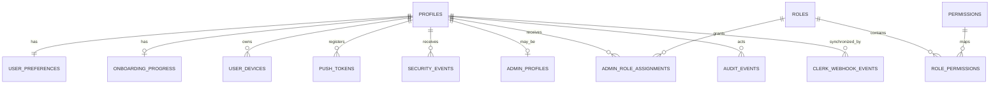

#### Finance and Planning

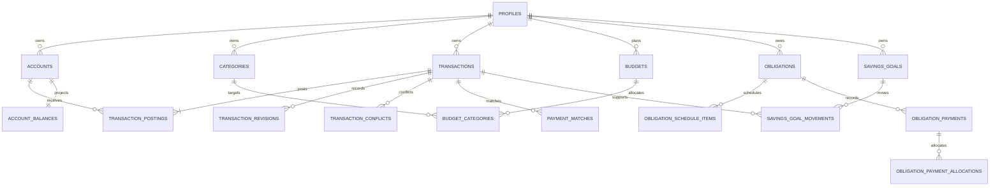

#### Tracking, Voice, Reports, and AI

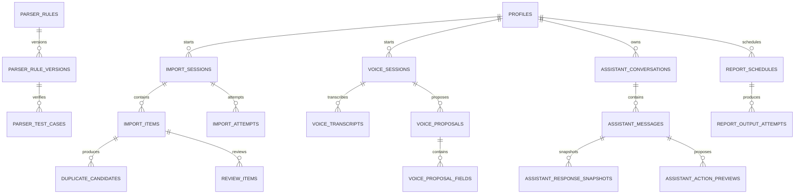

#### Engagement, Billing, Privacy, and Operations

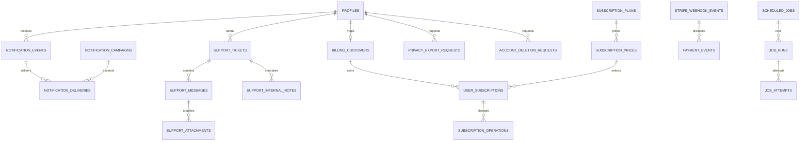

### 5.3 Complete Table Catalog

The columns below are table-specific and are combined with the global columns
defined in 5.1. `UQ` means unique and `FK` means foreign key.

#### Foundation, Identity, and Access

| Table | Required table-specific columns and constraints | Owner |
|---|---|---|
| `currencies` | `code char(3) PK`, `name`, `minor_unit smallint`, `enabled`; check minor unit 0..4 | 004 |
| `supported_countries` | `code char(2) PK`, `name`, `default_currency FK`, `enabled` | 004 |
| `profiles` | `id text PK` equal to Clerk `sub`, `primary_email`, `phone_e164`, `display_name`, `locale`, `timezone`, `status`, `last_seen_at`, `deleted_at` | 002 |
| `user_preferences` | `user_id PK/FK`, `default_currency`, `language`, `theme`, `calendar`, `week_start`, `privacy_settings jsonb` with schema check | 002 |
| `onboarding_progress` | `user_id PK/FK`, `step`, `completed_steps text[]`, `completed_at` | 002 |
| `user_devices` | `user_id`, `device_fingerprint`, `platform`, `app_version`, `trusted_at`, `revoked_at`, UQ user/fingerprint | 002 |
| `push_tokens` | `user_id`, `device_id FK`, `token_hash`, `provider`, `last_validated_at`, `revoked_at`, UQ provider/token hash | 002 |
| `security_events` | `user_id`, `event_type`, `severity`, `ip_hash`, `user_agent`, `metadata jsonb`, `occurred_at`, immutable | 003 |
| `clerk_webhook_events` | `clerk_event_id UQ`, `event_type`, `signature_verified_at`, `payload_hash`, `status`, `attempt_count`, `processed_at`, no raw secret | 002 |
| `admin_profiles` | `user_id PK/FK`, `status`, `department`, `last_admin_login_at` | 003 |
| `roles` | `key UQ`, `name`, `description`, `system_role`, `enabled` | 003 |
| `permissions` | `key UQ`, `resource`, `action`, `description` | 003 |
| `role_permissions` | `role_id FK`, `permission_id FK`, PK role/permission | 003 |
| `admin_role_assignments` | `user_id FK`, `role_id FK`, `assigned_by`, `starts_at`, `ends_at`, `revoked_at`, UQ active user/role | 003 |
| `admin_invitations` | `email`, `role_id FK`, `token_hash UQ`, `invited_by`, `expires_at`, `accepted_at`, `revoked_at` | 003 |
| `idempotency_keys` | `actor_id`, `scope`, `key_hash`, `request_hash`, `response_status`, `response_body jsonb`, `locked_until`, `expires_at`, UQ actor/scope/key | 006 |
| `outbox_events` | `aggregate_type`, `aggregate_id`, `event_type`, `payload jsonb`, `available_at`, `published_at`, `attempt_count`, `last_error_code` | 001 |
| `audit_events` | `actor_id`, `actor_type`, `action`, `resource_type`, `resource_id`, `before_hash`, `after_hash`, `reason`, `request_id`, `occurred_at`, immutable | 003 |

#### Reference Data and Core Finance

| Table | Required table-specific columns and constraints | Owner |
|---|---|---|
| `categories` | nullable `user_id`, `parent_id FK self`, `kind`, `name`, `icon`, `color`, `system_key`, `sort_order`, `active`; UQ system key or user/name/kind | 004 |
| `accounts` | `user_id`, `name`, `type`, `currency_code FK`, `institution_name`, `last_four`, `status`, `sort_order`, `include_in_totals`, `opened_at`, `closed_at` | 004 |
| `transactions` | `user_id`, `kind`, `status`, `currency_code`, `category_id FK`, `merchant`, `note`, `occurred_at`, `source`, `external_ref`, `reverses_transaction_id FK`, `deleted_at`; no mutable balance field | 005 |
| `transaction_postings` | `transaction_id FK`, `account_id FK`, `amount_minor bigint`, `clearing_state`, `posting_role`, `occurred_at`; nonzero amount and immutable after commit | 005 |
| `transaction_revisions` | `transaction_id FK`, `revision_no`, `actor_id`, `reason`, `before_snapshot jsonb`, `after_snapshot jsonb`, UQ transaction/revision | 005 |
| `transaction_conflicts` | `transaction_id FK`, `client_mutation_id FK`, `server_version`, `client_version`, `conflict_fields text[]`, `status`, `resolution`, `resolved_by`, `resolved_at` | 006 |
| `account_balances` | `account_id PK/FK`, `confirmed_minor bigint`, `pending_minor bigint`, `ledger_version`, `reconciled_at` | 005 |
| `exchange_rates` | `base_currency FK`, `quote_currency FK`, `rate numeric`, `effective_at`, `provider`, `provider_ref`, UQ pair/effective/provider; rate greater than zero | 004 |
| `client_sync_state` | `user_id`, `device_id FK`, `domain`, `last_cursor`, `last_synced_at`, UQ user/device/domain | 006 |
| `client_mutations` | `user_id`, `device_id`, `operation_id`, `domain`, `resource_id`, `base_version`, `payload_hash`, `status`, `result_ref`, `error_code`, UQ user/operation | 006 |

#### Financial Planning

| Table | Required table-specific columns and constraints | Owner |
|---|---|---|
| `salary_profiles` | `user_id`, `name`, `amount_minor`, `currency_code`, `frequency`, `expected_day`, `account_id FK`, `active` | 007 |
| `salary_receipts` | `salary_profile_id FK`, `transaction_id FK`, `expected_at`, `received_at`, `amount_minor`, `status`, UQ profile/expected date | 007 |
| `budgets` | `user_id`, `name`, `currency_code`, `period_start`, `period_end`, `total_minor`, `status`; valid period and nonnegative total | 007 |
| `budget_categories` | `budget_id FK`, `category_id FK`, `limit_minor`, `rollover_minor`, UQ budget/category | 007 |
| `obligations` | `user_id`, `name`, `type`, `currency_code`, `principal_minor`, `frequency`, `start_date`, `end_date`, `status`, `default_account_id` | 007 |
| `obligation_schedule_items` | `obligation_id FK`, `due_at`, `amount_minor`, `status`, `sequence_no`, UQ obligation/sequence | 007 |
| `obligation_payments` | `obligation_id FK`, `transaction_id FK`, `paid_at`, `amount_minor`, `payment_method`, `status` | 007 |
| `obligation_payment_allocations` | `payment_id FK`, `schedule_item_id FK`, `amount_minor`, UQ payment/schedule item | 007 |
| `payment_matches` | `transaction_id FK`, `obligation_id FK`, `schedule_item_id FK`, `confidence`, `status`, `reviewed_by`, `reviewed_at` | 007 |
| `savings_goals` | `user_id`, `name`, `currency_code`, `target_minor`, `target_date`, `status`, `linked_account_id` | 007 |
| `savings_goal_movements` | `goal_id FK`, `transaction_id FK`, `amount_minor`, `occurred_at`, `kind`; signed amount, immutable after confirmation | 007 |

#### Tracking, Imports, and Parsing

| Table | Required table-specific columns and constraints | Owner |
|---|---|---|
| `tracking_preferences` | `user_id PK/FK`, `enabled`, `review_required`, `duplicate_window_seconds`, `source_retention_days` | 008 |
| `user_keyword_rules` | `user_id`, `keyword`, `match_type`, `category_id`, `enabled`, UQ user/keyword/match type | 008 |
| `user_sender_rules` | `user_id`, `sender_pattern`, `institution_id`, `enabled`, UQ user/pattern | 008 |
| `import_sessions` | `user_id`, `source_type`, `source_name`, `status`, `item_count`, `accepted_count`, `rejected_count`, `started_at`, `completed_at` | 008 |
| `import_items` | `session_id FK`, `source_item_key`, `normalized_hash`, `occurred_at`, `amount_minor`, `currency_code`, `merchant`, `status`, `transaction_id`, UQ session/source key | 008 |
| `import_attempts` | `session_id FK`, `attempt_no`, `worker_id`, `status`, `started_at`, `completed_at`, `error_code`, UQ session/attempt | 008 |
| `raw_ingestion_payloads` | `session_id FK`, `item_id FK`, `storage_ref`, `payload_hash`, `content_type`, `expires_at`; private and retention-bound | 008 |
| `review_items` | `user_id`, `import_item_id FK`, `reason`, `proposed_values jsonb`, `status`, `reviewed_at`, `reviewed_by` | 008 |
| `duplicate_candidates` | `user_id`, `left_item_id`, `right_transaction_id`, `score`, `reasons text[]`, `status`; UQ candidate pair | 008 |
| `tracking_history` | `user_id`, `source_type`, `source_ref`, `outcome`, `transaction_id`, `occurred_at` | 008 |
| `tracking_feedback` | `user_id`, `history_id FK`, `feedback_type`, `corrected_category_id`, `comment` | 008 |
| `financial_institutions` | `country_code FK`, `name`, `code UQ`, `active` | 008 |
| `institution_senders` | `institution_id FK`, `sender_pattern`, `priority`, `active`, UQ institution/pattern | 008 |
| `parser_rules` | `institution_id FK`, `name`, `source_type`, `active_version_id`, `status` | 008 |
| `parser_rule_versions` | `parser_rule_id FK`, `version_no`, `definition jsonb`, `created_by`, `published_at`, UQ rule/version | 008 |
| `parser_test_cases` | `parser_version_id FK`, `input_fixture`, `expected_output jsonb`, `enabled` | 008 |
| `merchant_rules` | nullable `user_id`, `pattern`, `normalized_merchant`, `priority`, `active` | 008 |
| `category_rules` | nullable `user_id`, `pattern`, `category_id FK`, `priority`, `active` | 008 |
| `unsupported_formats` | `session_id FK`, `content_hash`, `reason`, `sample_redacted`, `status`, `reviewed_at` | 008 |

#### Voice and OpenRouter AI

| Table | Required table-specific columns and constraints | Owner |
|---|---|---|
| `voice_sessions` | `user_id`, `locale`, `storage_ref`, `status`, `duration_ms`, `expires_at`, `confirmed_at` | 009 |
| `voice_transcripts` | `session_id FK`, `provider`, `model`, `text_redacted`, `confidence`, `language`, `created_at`; original audio not embedded | 009 |
| `voice_proposals` | `session_id FK`, `schema_version`, `proposal_type`, `payload jsonb`, `status`, `expires_at`, `confirmed_at`, `executed_transaction_id` | 009 |
| `voice_proposal_fields` | `proposal_id FK`, `field_name`, `value_json`, `confidence`, `source_span`, UQ proposal/field | 009 |
| `voice_category_preferences` | `user_id`, `merchant_pattern`, `category_id FK`, `confidence`, UQ user/pattern | 009 |
| `assistant_consents` | `user_id`, `policy_version`, `granted_at`, `revoked_at`, UQ user/policy version | 009 |
| `assistant_conversations` | `user_id`, `title`, `status`, `last_message_at` | 009 |
| `assistant_messages` | `conversation_id FK`, `role`, `content_redacted`, `prompt_version_id`, `created_at` | 009 |
| `assistant_response_snapshots` | `message_id FK`, `schema_version`, `evidence_refs jsonb`, `model`, `provider`, `created_at` | 009 |
| `assistant_action_previews` | `message_id FK`, `action_type`, `payload jsonb`, `status`, `expires_at`, `confirmed_at`, `executed_resource_id` | 009 |
| `assistant_feedback` | `user_id`, `message_id FK`, `rating`, `reason`, `created_at` | 009 |
| `ai_providers` | `key UQ`, `display_name`, `approved`, `zdr_capable`, `training_policy`, `retention_reviewed_at` | 009 |
| `ai_models` | `provider_id FK`, `model_id UQ`, `capabilities text[]`, `approved`, `max_context`, `structured_output`, `cost_policy jsonb` | 009 |
| `ai_feature_routes` | `workload UQ`, `primary_model_id FK`, `fallback_model_ids uuid[]`, `provider_allowlist text[]`, `zdr_required`, `max_price jsonb`, `limits jsonb`, `version` | 009 |
| `ai_prompt_versions` | `workload`, `version_no`, `template`, `schema_version`, `status`, `approved_by`, `published_at`, UQ workload/version | 009 |
| `ai_prompt_test_cases` | `prompt_version_id FK`, `fixture_redacted`, `expected_rules jsonb`, `enabled` | 009 |
| `ai_usage_events` | `user_id`, `workload`, `model`, `provider`, `input_tokens`, `output_tokens`, `estimated_cost`, `latency_ms`, `fallback_used`, `request_id`, no raw prompt | 009 |
| `ai_failure_events` | `user_id`, `workload`, `model`, `provider`, `failure_code`, `schema_failure`, `request_id`, no raw prompt | 009 |
| `ai_response_reports` | `user_id`, `message_id`, `report_type`, `reason`, `status`, `reviewed_at` | 009 |
| `ai_safety_rules` | `key UQ`, `workload`, `rule_type`, `configuration jsonb`, `enabled`, `version` | 009 |

#### Reports and Notifications

| Table | Required table-specific columns and constraints | Owner |
|---|---|---|
| `report_schedules` | `user_id`, `report_type`, `frequency`, `timezone`, `next_run_at`, `delivery_channel`, `recipient`, `enabled` | 010 |
| `report_output_attempts` | nullable `schedule_id`, `user_id`, `report_type`, `period_start`, `period_end`, `ledger_version`, `snapshot jsonb`, `storage_ref`, `delivery_status`, `provider_message_id`, `error_code`, `expires_at` | 010 |
| `notification_events` | `user_id`, `type`, `title`, `body_safe`, `data jsonb`, `read_at`, `acted_at`, `expires_at` | 011 |
| `notification_preferences` | `user_id`, `channel`, `event_type`, `enabled`, `quiet_hours jsonb`, UQ user/channel/event | 011 |
| `notification_templates` | `key`, `locale`, `channel`, `version`, `subject`, `body`, `status`, UQ key/locale/channel/version | 011 |
| `notification_campaigns` | `name`, `audience_definition jsonb`, `template_id FK`, `status`, `scheduled_at`, `created_by` | 011 |
| `notification_deliveries` | nullable `event_id`, nullable `campaign_id`, `user_id`, `channel`, `provider`, `status`, `attempt_count`, `provider_ref`, `delivered_at`, `error_code` | 011 |

#### Stripe Billing

| Table | Required table-specific columns and constraints | Owner |
|---|---|---|
| `subscription_plans` | `key UQ`, `name`, `features jsonb`, `status`, `sort_order` | 012 |
| `subscription_prices` | `plan_id FK`, `provider`, `provider_price_id UQ`, `currency_code`, `amount_minor`, `interval`, `active` | 012 |
| `billing_customers` | `user_id PK/FK`, `provider`, `provider_customer_id UQ`, `created_at` | 012 |
| `user_subscriptions` | `user_id`, `price_id FK`, `provider_subscription_id UQ`, `status`, `current_period_start`, `current_period_end`, `cancel_at_period_end` | 012 |
| `subscription_operations` | `subscription_id FK`, `operation_id UQ`, `type`, `requested_by`, `status`, `effective_at`, `error_code` | 012 |
| `stripe_webhook_events` | `provider_event_id UQ`, `event_type`, `payload_hash`, `signature_verified_at`, `status`, `attempt_count`, `processed_at` | 012 |
| `payment_events` | `user_id`, `subscription_id`, `provider_event_id`, `type`, `amount_minor`, `currency_code`, `status`, `occurred_at` | 012 |
| `payment_failures` | `payment_event_id FK`, `failure_code`, `decline_category`, `retryable`, `next_retry_at`, `resolved_at` | 012 |
| `promotional_codes` | `code_hash UQ`, `discount_type`, `discount_value`, `starts_at`, `ends_at`, `max_redemptions`, `active` | 012 |
| `promotion_redemptions` | `promotion_id FK`, `user_id`, `subscription_id`, `redeemed_at`, UQ promotion/user | 012 |
| `billing_reconciliations` | `period_start`, `period_end`, `provider_count`, `local_count`, `difference_count`, `status`, `completed_at` | 012 |

#### Support, Content, Privacy, and Operations

| Table | Required table-specific columns and constraints | Owner |
|---|---|---|
| `support_categories` | `key UQ`, `name`, `sort_order`, `active` | 011 |
| `support_tickets` | `user_id`, `category_id FK`, `subject`, `status`, `priority`, `assigned_admin_id`, `last_message_at`, `closed_at` | 011 |
| `support_messages` | `ticket_id FK`, `sender_id`, `sender_type`, `body`, `created_at` | 011 |
| `support_internal_notes` | `ticket_id FK`, `admin_id`, `body`, `created_at`; never customer-readable | 011 |
| `support_attachments` | `message_id FK`, `storage_ref`, `filename_safe`, `content_type`, `size_bytes`, `scan_status` | 011 |
| `feedback_items` | `user_id`, `type`, `subject`, `body`, `status`, `assigned_admin_id` | 011 |
| `abuse_reports` | `reporter_id`, `resource_type`, `resource_id`, `reason`, `status`, `reviewed_by` | 011 |
| `content_items` | `key UQ`, `type`, `status`, `published_at`, `created_by` | 011 |
| `content_translations` | `content_id FK`, `locale`, `title`, `body`, UQ content/locale | 011 |
| `support_access_requests` | `user_id`, `requested_by`, `purpose`, `scope jsonb`, `status`, `expires_at`, `approved_by` | 003 |
| `support_access_grants` | `request_id FK`, `admin_id`, `scope jsonb`, `starts_at`, `ends_at`, `revoked_at` | 003 |
| `security_incidents` | `title`, `severity`, `status`, `detected_at`, `owner_id`, `contained_at`, `resolved_at` | 003 |
| `security_incident_timeline` | `incident_id FK`, `actor_id`, `event_type`, `details_redacted`, `occurred_at` | 003 |
| `privacy_export_requests` | `user_id`, `status`, `requested_at`, `verified_at`, `storage_ref`, `expires_at`, `completed_at` | 003 |
| `account_deletion_requests` | `user_id`, `status`, `requested_at`, `verified_at`, `cooling_off_ends_at`, `completed_at`, `retention_result jsonb` | 003 |
| `retention_policies` | `resource_type UQ`, `retention_days`, `deletion_mode`, `legal_basis`, `enabled` | 003 |
| `retention_holds` | `resource_type`, `resource_id`, `reason`, `starts_at`, `ends_at`, `created_by` | 003 |
| `scheduled_jobs` | `key UQ`, `job_type`, `schedule`, `enabled`, `timeout_seconds`, `max_attempts`, `configuration jsonb` | 013 |
| `job_runs` | `scheduled_job_id`, `job_type`, `status`, `queued_at`, `started_at`, `completed_at`, `correlation_id` | 013 |
| `job_attempts` | `job_run_id FK`, `attempt_no`, `worker_id`, `status`, `started_at`, `completed_at`, `error_code`, UQ run/attempt | 013 |
| `provider_health_checks` | `provider`, `check_type`, `status`, `latency_ms`, `checked_at`, `error_code` | 013 |
| `system_incidents` | `title`, `severity`, `status`, `started_at`, `resolved_at`, `public_summary` | 013 |
| `system_settings` | `key UQ`, `value jsonb`, `sensitivity`, `version`, `updated_by`; no application secrets | 013 |
| `feature_flags` | `key UQ`, `description`, `default_enabled`, `status`, `version` | 013 |
| `feature_flag_rules` | `flag_id FK`, `priority`, `audience jsonb`, `enabled`, UQ flag/priority | 013 |
| `maintenance_windows` | `starts_at`, `ends_at`, `scope`, `message`, `status`; valid positive interval | 013 |

### 5.4 Required Database Functions and Views

Security-definer functions use a fixed `search_path`, explicit ownership and
permission checks, minimum grants, bounded inputs, and audit/outbox writes.

Required transactional functions/RPCs:

- `current_clerk_user_id()` returns the verified JWT `sub`.
- `claim_idempotency_key()` atomically claims or replays an operation.
- `post_transaction()` validates and commits header, postings, balance
  projection, revision, audit, and outbox records atomically.
- `transfer_funds()` locks accounts in deterministic order and creates source,
  destination, and optional fee postings atomically.
- `reverse_transaction()` creates a linked reversal and prevents duplicate
  active full reversals.
- `soft_delete_transaction()` and `restore_transaction()` adjust projections
  atomically using expected versions and undo expiry.
- `reconcile_account_balance()` compares postings with the balance projection
  and records discrepancies without silently correcting unexplained differences.

Required views:

- `v_account_balance_summary`
- `v_monthly_financial_summary`
- `v_category_spending_summary`
- `v_salary_cycle_summary`
- `v_budget_utilization`
- `v_obligation_status`

Materialized views are not created speculatively. A measured expensive
aggregation may be materialized only with an owner, refresh trigger/schedule,
maximum staleness, source ledger version, invalidation rule, and reconciliation
test.

### 5.5 Financial Integrity Invariants

- `transaction_postings` is the historical financial source of truth.
- `account_balances` is a transactionally maintained projection for fast reads.
- Opening balance is a transaction/posting, not a mutable account field.
- A same-currency transfer is one transaction with source and destination
  postings and an optional fee posting.
- Confirmed transaction postings sum to the transaction's required accounting
  effect and may not be physically edited or deleted.
- Refunds and reversals are linked transactions.
- Soft delete and restore create revisions and adjust projections atomically.
- Every money mutation is idempotent, version-aware, audited, and emits an
  outbox event in the same database transaction.
- Locks are acquired in deterministic account order to reduce deadlocks.
- Financial conflicts require explicit review; Last Write Wins is forbidden.
- Historical reports read postings or versioned aggregates, never an unsafe
  stale cache.

### 5.6 Index and Query-Plan Strategy

Every high-frequency query is documented with its filter, sort, cardinality,
expected index, and query-plan evidence. Initial mandatory indexes include:

- Transactions: `(user_id, occurred_at desc, id desc)`; active partial variant;
  `(user_id, account/category filters through postings, occurred_at desc)` as
  proven by query shape; `(reverses_transaction_id)`.
- Postings: `(account_id, occurred_at desc, id desc)` and `(transaction_id)`.
- Planning: budget period, obligation due/status, savings goal/status indexes.
- Sync: UQ `(user_id, operation_id)` and `(user_id, device_id, domain)`.
- Imports: session/status, normalized hash, review status, sender/parser lookup.
- Notifications/messages/audit/jobs: owner/status/time cursor indexes.
- Billing: provider customer/subscription/event identifiers are unique.
- Reports: user/type/period and schedule/next-run indexes.

Rules:

- Foreign-key columns used by joins/deletes are indexed.
- Composite index order follows equality filters, range filters, then sort.
- Partial indexes are preferred for active/pending/unread/non-deleted subsets
  when selectivity justifies them.
- N+1 queries and unbounded collection queries are release blockers.
- Important ledger, dashboard, reporting, sync, search, and Admin table queries
  retain `EXPLAIN (ANALYZE, BUFFERS)` evidence against production-like data.
- Initial slow-query threshold is 250 ms and is adjusted using production P95.

### 5.7 RLS and Privileges

- All user-owned tables enable and force RLS.
- Ownership compares `user_id` with `auth.jwt()->>'sub'`.
- System categories/reference data are authenticated-readable and server-managed.
- Clients cannot directly write postings, balances, audit records, provider
  events, job state, internal notes, raw ingestion payloads, or billing events.
- The API uses the user's Clerk JWT for owner-scoped Supabase work so RLS remains
  active.
- Service-role access is isolated to narrowly scoped worker, provider, and
  authorized Admin operations and is never shipped to clients.
- Admin UI calls the API only. Database RBAC and exact permission checks are
  enforced server-side and audited.
- Support access is purpose-bound, approved, time-limited, scoped, revocable,
  and audited.
- Default grants are revoked before explicit grants are added.
- Cross-user and cross-role negative RLS tests are mandatory for every policy.

## 6. Security and Privacy Baseline

Security verification targets:

- OWASP ASVS 5.0.0 Level 2 for the complete backend.
- Applicable ASVS Level 3 controls for financial mutations, Admin access,
  Stripe, privacy export/deletion, and controlled support access.
- OWASP API Security Top 10:2023 for every endpoint.
- OWASP Top 10:2025 for application, configuration, supply-chain, integrity,
  logging, and exceptional-condition risks.
- OWASP MASVS 2.1.0 for Mobile authentication, storage, cryptography, network,
  privacy, and platform integration.

Required controls:

- Deny-by-default authorization; object, property, and function authorization
  on every request.
- Clerk JWT validation covers asymmetric signature, `kid`, issuer, audience,
  expiration, not-before, and required claims. Key rotation is supported.
- Sensitive actions require recent authentication or MFA.
- Authentication/recovery responses do not reveal account existence.
- Strict server-side validation, output encoding, parameterized SQL, and safe
  file handling.
- Explicit CORS allowlist. Credentialed wildcard CORS is forbidden.
- HTTPS only; secure headers; Admin cookies use `Secure`, `HttpOnly`, and
  appropriate `SameSite`; state-changing cookie flows use CSRF/origin defense.
- Request body, upload, decompression, pagination, query complexity, timeout,
  and concurrency limits.
- Separate abuse/rate limits for authentication, financial mutations, imports,
  reports, AI, support access, privacy, Stripe operations, and campaigns.
- SSRF protection: no arbitrary server fetches; destination allowlists, scheme
  restrictions, redirect limits, DNS/IP validation, and private-network denial.
- Webhooks validate raw-body signatures, timestamps/replay windows, event
  uniqueness, schema, and idempotency before side effects.
- Secrets use the deployment secret store, rotate, and never enter logs,
  database settings, client bundles, images, or source control.
- Logs redact tokens, secrets, raw prompts, provider payloads, unnecessary PII,
  full account identifiers, and sensitive transaction descriptions.
- Errors fail closed and never expose stack traces or internal details.
- Dependency lockfiles, SAST, secret scanning, dependency/image scanning, and a
  CycloneDX SBOM run in CI.
- Security events and immutable audit events have alerts and documented incident
  ownership. Logging without actionable alerting is insufficient.
- Sensitive Mobile financial data is encrypted with a platform-protected key;
  Clerk tokens stay in SecureStore and never SQLite, AsyncStorage, logs, or
  analytics.
- Root/jailbreak signals may inform risk decisions but are not an authorization
  boundary. TLS platform verification must never be disabled.
- Privacy follows data minimization, purpose limitation, transparent consent,
  user export/control, retention expiry, and verified deletion/anonymization.

Release is forbidden when any of the following is true:

- An exploitable Critical or High security finding remains open.
- A user can access another user's object or financial data.
- An Admin operation works without its exact database permission.
- A financial mutation can duplicate, partially commit, or silently overwrite.
- Service-role or provider secrets can reach a client.
- RLS is absent or lacks negative tests on a user-owned table.
- An unsigned/replayed Clerk, Stripe, or configured provider webhook is accepted.
- Tokens, secrets, PII, raw AI content, or stack traces appear in logs/errors.
- Production enables mocks, debug routes, default credentials, unsafe CORS, or
  permissive feature flags.
- Backup restore, ledger reconciliation, alerts, and incident response lack
  verified evidence.

## 7. OpenRouter AI Policy

All AI flows use:

```text
Mobile/Admin -> Backend AI Service -> OpenRouter -> approved model/provider
```

- `OPENROUTER_API_KEY` exists only in backend secret storage. Use separate
  environment keys, expiry/rotation, and OpenRouter spending limits.
- OpenRouter-specific code is isolated behind the backend AI gateway and cannot
  enter deterministic finance modules.
- Clients cannot choose a model/provider or send arbitrary routing parameters.
- Model IDs, provider allowlists, fallbacks, ZDR, maximum price, token limits,
  and latency preferences are versioned configuration.
- Production financial traffic uses `data_collection: deny`, input/output
  logging disabled, no-training providers, and `zdr: true` where supported.
- Provider retention terms are reviewed and recorded before approval. A
  fallback cannot weaken ZDR, privacy, residency, schema, or safety requirements.
- AI input/output is untrusted. Prompt injection cannot access SQL, RLS bypasses,
  internal APIs, secrets, service-role credentials, or privileged tools.
- AI never directly creates, updates, transfers, reverses, refunds, or deletes a
  financial record.
- AI actions follow `draft -> validated -> user_confirmed -> executed`.
  Deterministic validation and authorization are rerun at execution time.
- Structured application results use versioned JSON Schema, OpenRouter
  structured output where supported, and independent backend validation.
- Invalid/incomplete output retries at most once under the same approved policy,
  then fails safely.
- Minimum necessary data is sent. Clerk IDs, account identifiers, credentials,
  internal metadata, and unrelated transactions are removed or replaced with
  request-scoped aliases.
- User financial data is never used for model training without explicit consent
  and an approved privacy policy.

Initial configuration candidates, subject to benchmark and privacy approval:

| Workload | Primary model | Approved fallback |
|---|---|---|
| Voice transcription/extraction | `openai/gpt-audio-mini` | none initially |
| Transaction classification | `google/gemini-2.5-flash-lite` | `anthropic/claude-4.5-haiku` |
| Financial assistant | `openai/gpt-5.2` | `anthropic/claude-sonnet-5` |
| Report summarization | `google/gemini-2.5-flash-lite` | `anthropic/claude-4.5-haiku` |
| Financial insights | `openai/gpt-5.2` | `anthropic/claude-sonnet-5` |
| Admin/support AI | `anthropic/claude-4.5-haiku` | `google/gemini-2.5-flash-lite` |

Initial limits:

| Workload | Maximum input | Maximum output |
|---|---:|---:|
| Voice extraction | 120 seconds audio | 512 tokens |
| Classification | 2,000 tokens | 256 tokens |
| Assistant | 8,000 tokens | 1,000 tokens |
| Report summary | 16,000 tokens | 1,500 tokens |
| Financial insights | 8,000 tokens | 1,000 tokens |
| Admin/support | 6,000 tokens | 1,000 tokens |

Quotas derive from subscription entitlements. Missing quota configuration denies
the AI request. Spending alerts trigger at 70, 85, and 95 percent; nonessential
AI stops at 100 percent. Observability records workload, model, provider, token
counts, estimated cost, latency, fallback, schema failures, and error codes, but
not raw sensitive prompts or responses. OpenRouter outages never affect core
financial operations.

## 8. Performance, Caching, and Speed

### 8.1 Caching Matrix

| Data | Cache key and scope | TTL | Invalidation and safety |
|---|---|---:|---|
| Categories | `ref:categories:{locale}:{version}` | 24 hours | Publish event; authenticated reference data only |
| Public configuration | `config:{environment}:{version}` | 5 minutes | Configuration update; excludes secrets/security decisions |
| Exchange-rate metadata | `fx:{base}:{quote}:{effectiveDate}` | Provider freshness | New rate event; historical rate remains immutable |
| User dashboard | `user:{clerkSub}:dashboard:{period}:{ledgerVersion}` | 30-60 seconds | Ledger/planning event; never cross-user |
| Report aggregate | `user:{clerkSub}:report:{type}:{period}:{ledgerVersion}` | 5 minutes | Ledger/report event; source version included |
| Admin reference list | `admin:{permissionHash}:{resource}:{version}` | 5 minutes | RBAC/resource event; never caches authorization itself |

Never use stale shared caching for raw transactions/postings, authorization
decisions, support grants, secrets/tokens, webhook payloads, idempotency state,
privacy exports, unconfirmed balances, or mutable Stripe operation state.

- Every cache documents key, scope, TTL, invalidation, owner, staleness, fallback,
  metrics, and security implications.
- User cache keys always include verified Clerk `sub`; Admin entries include a
  permission-version hash.
- Cache failure falls back to the database and cannot grant access or alter money.
- Start with HTTP validators, Mobile local cache, Postgres projections, and small
  per-process reference caches.
- PostgreSQL owns durable idempotency, outbox, advisory locks, and job state.
- Add Redis only after measurements prove a need for cross-replica cache, strict
  distributed rate limiting unavailable at the gateway, queue coordination,
  distributed locks, or expensive computed results that Postgres cannot meet.

### 8.2 Mobile and Admin Efficiency

- One primary request should render each initial Mobile screen. Provide Home,
  account, dashboard, report, notification, and planning summaries.
- Mobile sync is incremental: cursor checkpoints, mutation acknowledgements,
  tombstones, delta payloads, ETags, background refresh, and bounded batches.
- Do not resend unchanged reference or financial records.
- Local categories/configuration may remain for 24 hours. Financial projections
  remain until invalidated/resynchronized and display synchronization state.
- Optimistic UI is limited to reversible nonfinancial state. Transfers, refunds,
  reversals, obligation payments, and other money mutations await confirmation.
- Admin tables use server-side pagination, sorting, filtering, and search. Loading
  an entire dataset into the browser is forbidden.
- Large exports/reports/imports/campaigns run as jobs and stream data rather than
  loading the complete dataset into API memory.

### 8.3 Initial Performance Budgets

Measured from API ingress to response in production-like conditions:

| Operation | P95 | P99 | Maximum compressed payload |
|---|---:|---:|---:|
| Mobile Home summary | 400 ms | 800 ms | 250 KB |
| Transaction list | 300 ms | 600 ms | 200 KB |
| Account details | 300 ms | 600 ms | 150 KB |
| Create transaction | 350 ms | 800 ms | 50 KB |
| Create transfer | 500 ms | 1 second | 50 KB |
| Search | 400 ms | 800 ms | 150 KB |
| Cached report summary | 800 ms | 1.5 seconds | 300 KB |
| Admin table page | 500 ms | 1 second | 300 KB |
| Async job acceptance | 300 ms | 600 ms | 50 KB |

- Indexed OLTP database query P95: 50 ms.
- Critical mutation total database time P95: 150 ms.
- Interactive API hard timeout: 10 seconds.
- OLTP statement timeout: 2 seconds.
- Non-AI provider connection/total timeout: 3/10 seconds.
- AI timeouts are workload-specific and isolated by circuit breaker; interactive
  AI hard limit starts at 60 seconds and background summaries at 120 seconds.
- Reference-cache hit target: at least 95 percent after warm-up.
- Aggregate-cache hit target: at least 80 percent after warm-up.
- Interactive reports that exceed budget move to background jobs.

### 8.4 Observability

Monitor and alert on endpoint P50/P95/P99, database duration, query plans, slow
queries, payload size, cache hit/miss/eviction/invalidation, queue wait and job
duration, worker retry/failure, API errors, provider latency/errors, OpenRouter
tokens/cost/fallbacks, Stripe reconciliation, Mobile sync duration/count/bytes,
and ledger reconciliation differences.

Latency, slow-query, error-rate, queue-backlog, provider, spending, security, and
reconciliation alerts must exist before production. Logs are structured JSON to
stdout and use request/correlation IDs without sensitive content.

## 9. Backup, Recovery, Reconciliation, and Rollback

- Production target for source-of-truth database data: RPO at most 15 minutes;
  RTO at most 2 hours. The selected Supabase plan and deployment must satisfy it.
- Enable encrypted automated backups and point-in-time recovery appropriate to
  the target RPO.
- User uploads require versioned backup/restore coverage. Generated reports may
  be regenerated and have their retention policy documented separately.
- Restore drills run at least quarterly into an isolated environment and verify
  schema, row counts, RLS, ledger balances, critical files, and application read
  paths. Evidence includes elapsed RTO and achieved RPO.
- Reconciliation jobs compare postings to account balances, Stripe to local
  subscriptions/payments, scheduled work to job runs, and Storage metadata to
  expected objects. Differences alert and require explicit resolution.
- Disaster recovery documents owners, credentials, dependency order, DNS/traffic
  movement, database and Storage restore, provider revalidation, smoke tests,
  reconciliation, customer communication, and return-to-primary steps.
- Deployments preserve N-1 application/database compatibility through an
  expand-migrate-contract sequence.
- Application rollback uses the previous immutable image. Database rollback
  prefers a forward corrective migration; destructive reversal requires a
  pre-change backup, tested script, owner approval, and reconciliation.
- Worker jobs and webhooks remain idempotent across deploy/rollback boundaries.

## 10. Testing Strategy

- Supabase CLI plus pgTAP: migration order, constraints, functions, triggers,
  grants, RLS positive/negative matrix, seed determinism, and reconciliation.
- NestJS unit tests: domain validation, state machines, permissions, mapping,
  parser behavior, AI schema handling, and error classification.
- Contract tests: Mobile service interfaces and Admin OpenAPI/Zod parity.
- Integration/E2E: local Supabase, Clerk JWT verification fixtures, Storage,
  queues/workers, signed Clerk/Stripe webhooks, email delivery adapter, and
  OpenRouter stub contracts.
- Ledger tables: opening balance, income/expense, transfer, fee, refund, reversal,
  edit, soft delete, undo, duplicate operation, invalid currency/category,
  reconciliation, and report consistency.
- Concurrency: duplicate idempotency keys, simultaneous transfers, deterministic
  locks, expected-version conflicts, webhook replay, and worker retry.
- Security: OWASP traceability, BOLA/BFLA/property authorization, mass assignment,
  injection, SSRF, CORS/CSRF, rate limits, file uploads, secret leakage, unsafe
  errors, dependency/image scans, and prompt injection.
- AI evaluation: Arabic/English accuracy, structured-output reliability,
  hallucination/invalid fields, privacy redaction, ZDR/provider allowlist,
  fallback equivalence, prompt injection, cost, latency, and outage isolation.
- Performance: load, peak, stress, recovery, database/query-plan, large-user data,
  concurrent money mutations, report/export, Mobile initial/delta sync, queue
  backlog, worker recovery, cold cache, and invalidation storm tests.
- Disaster recovery: backup restore, N-1 application rollback, migration failure,
  provider outage, queue replay, and reconciliation.

A regression over a critical P95/P99 budget by more than 20 percent, an unbounded
query/scan, a failed financial concurrency/reconciliation test, or failed
security/recovery evidence blocks production unless an owner records a bounded,
time-limited risk acceptance.

## 11. Migration and Cutover Rules

- Migrations are immutable, ordered, checksum-verified SQL files.
- Separate structure, reference seed, RLS, function, and test migrations where it
  improves review; do not create a second migration system.
- Use expand-migrate-contract for renames and breaking changes. Backfill in
  bounded resumable batches with progress and reconciliation.
- Destructive operations require dependency inventory, backup, restore proof,
  explicit approval, and a compatible deployed application version.
- Seeds are idempotent and limited to deterministic reference/demo/test data.
- No production customer fixture data is created by migrations.
- Mobile SQLite is preserved. Server migration uploads through versioned,
  idempotent mutation envelopes and never wipes the device database.
- Money conflicts enter review rather than Last Write Wins.
- Admin MSW groups switch domain by domain behind an explicit provider selection.
  Production is fail-closed when mock configuration is invalid and never silently
  falls back to MSW.
- Shadow reads compare ledger balances, dashboards, reports, and analytics before
  each write cutover.
- Remove production mock imports only after contract parity, E2E, observability,
  reconciliation, and rollback checks pass. Explicit demo/test mode remains.

## 12. Mobile/Admin Mock-to-Backend Mapping

| Current source/behavior | Canonical backend destination | Spec | Cutover proof |
|---|---|---:|---|
| Mobile auth service, app-shell storage, secure preferences | Clerk session verification, profiles/preferences/devices | 002 | Auth/onboarding/session contract tests |
| Mobile core finance seeds/service/repository and demo data | Accounts, categories, ledger, sync APIs | 004-006 | Ledger parity and offline E2E |
| Financial-planning seeds/service/repository | Planning APIs and projections | 007 | Budget/obligation/goal parity |
| Automatic-tracking fixtures/service/keywords | Ingestion, parser, duplicate, review APIs | 008 | Fixture corpus and parser tests |
| Voice fixtures/analyzer | Voice session and OpenRouter proposal APIs | 009 | Schema/evaluation/confirmation tests |
| Assistant mock service | Assistant conversation, evidence, and action-preview APIs | 009 | Safety, privacy, proposal tests |
| Reports service/repository | Reports, schedules, exports, email attempts | 010 | Snapshot and delivery parity |
| Notification mock/platform | Notification event/preference/action APIs | 011 | Push/in-app contract tests |
| Subscription/settings mocks | Stripe-backed plan, subscription, entitlement APIs | 012 | Webhook and entitlement tests |
| Support service and hardcoded articles | Support/content APIs | 011 | Ticket/message/content parity |
| Admin foundation/search/navigation/attention mocks | Federated API/reference configuration; no speculative tables | 003, 013 | OpenAPI and permission parity |
| Admin overview analytics mocks | Ledger/report projections | 010 | Shadow aggregate comparison |
| Admin users/devices/access mocks | Profiles, devices, RBAC, support access | 002-003 | Exact permission matrix |
| Admin billing fixtures/handlers | Stripe billing and reconciliation | 012 | Webhook/reconciliation E2E |
| Admin import/parser handlers | Import, parser, review, rule APIs | 008 | Corpus and workflow parity |
| Admin AI-management handlers | AI routes/prompts/usage/safety APIs | 009 | Allowlist and audit evidence |
| Admin communication mocks | Notifications, support, content APIs | 011 | Delivery and role tests |
| Admin security/privacy mocks | Audit, incidents, export/deletion, retention | 003 | RLS, MFA, audit, privacy E2E |
| Admin health/jobs mocks | Health, jobs, providers, incidents | 013 | Worker/alert/health tests |
| Admin governance/settings mocks | Settings, flags, maintenance | 013 | Audit and fail-safe flag tests |

Client adapters preserve current service/repository signatures where practical.
The backend normalizes inconsistent legacy IDs and money shapes at the adapter
boundary. Old local `REAL` amounts are converted and validated as integer minor
units before upload. Drafts, PIN/biometric secrets, temporary view state, and
device-only preferences remain local unless a current cross-device contract
explicitly requires them.

## 13. Detailed 14-Phase Technical Blueprints

Each implementation phase is exactly one Spec. The global architecture and
constraints in Sections 1-12 apply to every phase; the details below remove the
remaining implementation choices. No resource may move between Specs without a
master-plan change and contract review.

### 13.1 Blueprint Notation and Exclusive Ownership

Schema notation used below:

- `M` expands to `id uuid primary key default gen_random_uuid()`,
  `created_at timestamptz not null default now()`,
  `updated_at timestamptz not null default now()`, and
  `version bigint not null default 1 check (version > 0)`.
- `I` expands to `id uuid primary key default gen_random_uuid()` and
  `created_at timestamptz not null default now()` for immutable rows.
- `U` expands to `user_id text not null references public.profiles(id) on
  delete restrict`.
- `?` marks nullable columns. Columns without `?` are `not null`.
- Every mutable table uses the shared `private.set_updated_at_and_version()`
  trigger unless its row lists a different lifecycle.
- Text status/type columns use the listed check values. PostgreSQL enums are not
  used so expand-migrate-contract deployments can add states safely.

Exclusive resource ownership:

| Spec | API namespace | Functions/views | Jobs | Published event namespace |
|---|---|---|---|---|
| 001 | `/health`, `/api/v1/meta` | platform timestamps/outbox | `outbox.dispatch`, `migration.apply` | `platform.*`, `outbox.*` |
| 002 | `/api/v1/me`, `/webhooks/clerk` | identity helpers | `clerk.webhook.process` | `profile.*`, `device.*` |
| 003 | `/api/v1/admin/access`, `/audit`, `/security`, `/privacy` | RBAC/support/privacy | privacy, deletion, retention jobs | `admin.*`, `security.*`, `privacy.*` |
| 004 | `/api/v1/reference`, `/categories`, `/accounts`, `/exchange-rates` | reference/account reads | reference seed/rate refresh | `category.*`, `account.*`, `exchange-rate.*` |
| 005 | `/api/v1/transactions`, `/transfers` | ledger mutation/reconciliation | `ledger.reconcile` | `transaction.*`, `balance.*`, `transfer.*` |
| 006 | `/api/v1/sync`, `/conflicts` | idempotency/sync | idempotency/sync cleanup | `sync.*`, `conflict.*` |
| 007 | `/api/v1/salary`, `/budgets`, `/obligations`, `/savings-goals` | planning projections | schedule, match, reminder jobs | `planning.*` |
| 008 | `/api/v1/tracking`, `/imports`; Admin parser/import routes | parser/dedupe | import/parser/dedupe/purge jobs | `import.*`, `tracking.*`, `parser.*` |
| 009 | `/api/v1/voice`, `/assistant`; Admin AI routes | AI proposal/safety | voice/AI/evaluation jobs | `voice.*`, `assistant.*`, `ai.*` |
| 010 | `/api/v1/reports`, `/exports`; Admin analytics routes | analytics views | report/export/email/expiry jobs | `report.*`, `export.*` |
| 011 | `/api/v1/notifications`, `/support`, `/content`; Admin communication routes | notification/support reads | delivery/campaign/scan jobs | `notification.*`, `support.*`, `content.*` |
| 012 | `/api/v1/billing`, `/webhooks/stripe`; Admin billing routes | entitlement reads | Stripe/retry/reconcile jobs | `billing.*`, `subscription.*`, `payment.*` |
| 013 | `/api/v1/admin/operations`, `/settings`, `/feature-flags` | operational reads | health/backup/DR/maintenance jobs | `operations.*`, `incident.*`, `configuration.*` |
| 014 | no new server namespace | no database object | no new job | no new event |

### Phase 01 - SPEC-BE-001: Backend, Docker & Supabase Foundation

#### Objective and Scope

Create the runnable backend platform without implementing product domains. This
phase owns NestJS structure, Supabase local configuration, SQL migration/pgTAP
layout, API/worker entry points, outbox delivery, Docker images, Compose, health,
OpenAPI, validation/error envelopes, runtime secrets, CI security checks, and
deployment migration execution.

#### Dependencies

- No backend Spec dependency.
- Reads repository Node/TypeScript conventions but does not convert the repository
  into a workspace.
- Requires provisioned Clerk/Supabase/OpenRouter/Stripe values only as environment
  names; live provider behavior belongs to later Specs.

#### Owned Database Tables

| Table | Complete columns | Keys, constraints, indexes, defaults |
|---|---|---|
| `private.outbox_events` | `I`; `aggregate_type text`; `aggregate_id uuid?`; `event_type text`; `payload jsonb`; `available_at timestamptz=now()`; `published_at timestamptz?`; `attempt_count integer=0`; `last_error_code text?`; `locked_by text?`; `locked_until timestamptz?` | PK `id`; checks `attempt_count>=0`, `jsonb_typeof(payload)='object'`; indexes `(published_at,available_at)` partial where unpublished, `(aggregate_type,aggregate_id,created_at)`, `(locked_until)` partial where unpublished |

No other Spec may write the outbox row directly. Domain mutations call the
owned helper in the same database transaction.

#### Dedicated ERD

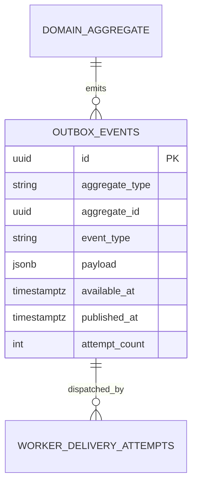

`WORKER_DELIVERY_ATTEMPTS` is a queue/runtime concept, not a database table;
durable operational attempts are introduced by Spec 013.

#### RLS and Authorization

- Revoke `anon` and `authenticated` access to `private` schema.
- Only migration owner may alter objects.
- API user-JWT connections cannot select/insert/update outbox rows.
- Worker runtime role may claim/update unpublished rows but may not alter payload,
  aggregate identity, or event type after insertion.
- Health liveness is public but contains only status/version. Readiness is exposed
  only on the container network or protected operations route.

#### APIs and Contracts

| Method and path | Auth | Request | Response |
|---|---|---|---|
| `GET /health/live` | none | none | `200 {status:'ok',version:string,startedAt:ISODate}` |
| `GET /health/ready` | internal | none | `200 {status:'ready',checks:{database:'up',queue:'up'}}`; `503` with safe failed check names |
| `GET /api/v1/meta` | Clerk JWT | headers `X-Request-Id?` | `{apiVersion:'v1',serverTime:ISODate,minMobileVersion:string?,minAdminVersion:string?}` |

All other endpoints inherit the global error envelope, request ID, JSON body
limit, content-type check, DTO whitelist, timeout, and OpenAPI conventions.

#### Functions, Triggers, and Views

- `private.set_updated_at_and_version()` is a `before update` trigger function;
  it sets `updated_at=now()` and `version=old.version+1`; clients cannot set either.
- `private.enqueue_outbox_event(type,aggregate_type,aggregate_id,payload)` validates
  the event name/payload object and inserts one row. Execute is granted only to
  owned domain functions/API role.
- `private.claim_outbox_batch(worker_id,limit,lease_seconds)` uses `for update skip
  locked`, maximum batch 100, and returns leased unpublished rows.
- No public view is introduced.

#### Queues, Jobs, and Events

- `outbox.dispatch`: continuously claims batches, publishes to Supabase Queue,
  marks success, and retries exponential backoff with jitter. After configured
  attempts it raises an operations incident; it never drops the row.
- `migration.apply`: one-off deployment container; locks a migration advisory key,
  verifies checksums/order, applies pending SQL, runs smoke checks, and exits.
- Owned events are `platform.started`, `platform.ready`, `outbox.published`, and
  `outbox.delivery_failed`. They contain IDs and safe metadata only.

#### Business and Failure Rules

- API does not start accepting traffic until configuration validation succeeds.
- Worker may start without an AI/Stripe key until its owned domain is enabled,
  but enabled provider features fail readiness when required secrets are absent.
- Outbox delivery is at least once; consumers are idempotent.
- An unknown configuration key, migration checksum change, or schema ahead of
  application compatibility fails closed.

#### Security Requirements

- Multi-stage image, non-root UID, no shell/package manager in final image where
  the selected base supports it, read-only root filesystem, runtime-only secrets,
  and only the API port exposed.
- CI: typecheck, lint/check, unit tests, pgTAP, secret scan, SAST, dependency scan,
  SBOM, image scan, and signature/provenance for released image.
- CORS allowlist, secure headers, body limits, safe exception filter, request ID,
  and production debug/Swagger access policy are configured centrally.

#### Performance and Caching

- No Redis. No product cache.
- Outbox claim query must remain below 50 ms P95 at 1 million rows using the
  unpublished partial index and archived/purged published history policy.
- Health endpoints perform no expensive checks; readiness dependency checks use
  a one-second timeout and a short in-process result cache of at most five seconds.

#### Mobile, Admin, and Mock Integration

- Mobile/Admin receive only shared API base URL, Clerk publishable values, and
  safe client configuration; no provider/server secret.
- Existing clients remain on mocks. `GET /api/v1/meta` is optional until Spec 014.
- No mock is removed in this phase.

#### Tests

- Container build/run as non-root, read-only filesystem, SIGTERM drain, liveness,
  readiness failure/recovery, missing-secret failure, and no-dev-dependency check.
- Migration order/checksum/advisory-lock tests against disposable Supabase.
- Outbox enqueue, concurrent claim, lease expiry, retry, duplicate delivery, and
  failed-delivery alert tests.
- OpenAPI snapshot and standard validation/error/security-header contract tests.

#### Migration and Rollback

- First migration creates required extensions/schemas/roles/helper functions and
  `private.outbox_events`; second applies grants; third adds pgTAP assertions.
- Rollback is previous image plus forward corrective SQL. Initial teardown SQL is
  test-environment only and cannot run against production.

#### Observability

Metrics: process uptime, event-loop lag, memory/CPU, HTTP latency/errors, readiness
state, database pool saturation, outbox depth/oldest age/attempts, worker lease,
and migration duration/status. Logs include request/correlation IDs and redact
configuration values.

#### Acceptance Criteria and Definition of Done

- Reproducible API/worker images pass all scans and runtime constraints.
- Local Compose plus official Supabase stack starts from a clean clone.
- Health, OpenAPI, migrations, outbox, worker retry, and graceful shutdown tests
  pass in CI.
- Environment/runbook, owned resources, security evidence, metrics/alerts, and
  rollback procedure are complete. No product table or endpoint is added.

### Phase 02 - SPEC-BE-002: Authentication, Profiles, Preferences & Sessions

#### Objective and Scope

Replace simulated identity with one Clerk application for Mobile and Admin while
persisting only Masarifi profile, preference, onboarding, device, push, and
webhook synchronization data. Clerk authenticates; the database owns product
profile state. Supabase Auth users are not mirrored or used for sign-in.

#### Dependencies

- Spec 001 platform, migrations, secrets, API conventions, and worker.
- Clerk native Supabase third-party integration and asymmetric session JWTs.
- Spec 003 consumes profiles and device/session evidence but owns authorization.

#### Owned Database Tables

| Table | Complete columns | Keys, constraints, indexes, defaults |
|---|---|---|
| `public.profiles` | `id text PK`; `primary_email text?`; `phone_e164 text?`; `display_name text?`; `locale text='ar'`; `timezone text='Asia/Riyadh'`; `status text='active'`; `last_seen_at timestamptz?`; `deleted_at timestamptz?`; `created_at timestamptz=now()`; `updated_at timestamptz=now()`; `version bigint=1` | checks id nonempty, locale `ar/en`, status `active/suspended/deletion_pending/deleted`, version>0; unique partial indexes `lower(primary_email)` and `phone_e164` where not null; `(status,created_at)` |
| `public.user_preferences` | `user_id text PK/FK profiles`; `default_currency char(3)='SAR'`; `language text='ar'`; `theme text='system'`; `calendar text='gregorian'`; `week_start smallint=6`; `privacy_settings jsonb='{}'`; `updated_at`; `version=1` | uppercase ISO-like currency check in this phase; final FK to `currencies(code)` is installed by Spec 004 after its seed; checks language `ar/en`, theme `light/dark/system`, calendar `gregorian/hijri`, week 0..6, JSON object; no separate id |
| `public.onboarding_progress` | `user_id text PK/FK profiles`; `step text='welcome'`; `completed_steps text[]='{}'`; `completed_at timestamptz?`; `updated_at`; `version=1` | nonempty step; GIN completed steps only if measured; no nullable user |
| `public.user_devices` | `M+U`; `device_fingerprint text`; `clerk_session_id text?`; `platform text`; `app_version text`; `device_name text?`; `trusted_at timestamptz?`; `last_seen_at timestamptz=now()`; `revoked_at timestamptz?` | platform `ios/android/web`; UQ `(user_id,device_fingerprint)`; indexes `(user_id,revoked_at,last_seen_at desc)`, partial `clerk_session_id` where not null |
| `public.push_tokens` | `M+U`; `device_id uuid FK user_devices on delete cascade`; `token_hash text`; `token_ciphertext text`; `provider text`; `last_validated_at timestamptz?`; `revoked_at timestamptz?` | provider `expo/apns/fcm`; UQ `(provider,token_hash)`; indexes `(user_id,revoked_at)`, `(device_id)`; ciphertext never returned to ordinary reads |
| `private.clerk_webhook_events` | `I`; `clerk_event_id text UQ`; `event_type text`; `signature_verified_at timestamptz`; `payload_hash text`; `payload jsonb`; `status text='received'`; `attempt_count int=0`; `processed_at timestamptz?`; `last_error_code text?` | status `received/processing/processed/failed`; attempts>=0; indexes `(status,created_at)`, `(event_type,processed_at)`; payload retention 7 days then redacted |

#### Dedicated ERD

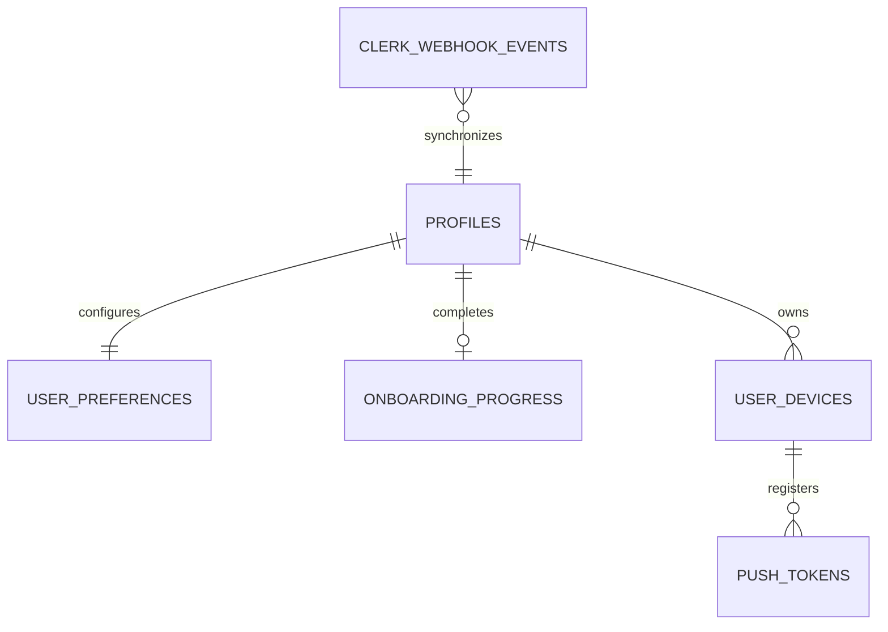

#### RLS and Authorization

- `profiles`: user selects/updates safe fields where `id=current_clerk_user_id()`;
  status, identity fields, deletion, and version are server-controlled.
- Preferences/onboarding/devices/tokens: owner access only. Token ciphertext is
  excluded from client-selectable views/DTOs.
- Admin has no direct table access; Spec 003 API permission checks govern reads.
- Webhook table has no client grants. Webhook endpoint verifies Clerk signature
  and timestamp before insert.
- Suspended/deleted profile status is checked after JWT authentication and before
  domain handler execution.

#### APIs and Contracts

| Method and path | Request | Success response |
|---|---|---|
| `GET /api/v1/me` | Clerk JWT | `{id,displayName,primaryEmailMasked,phoneMasked,locale,timezone,status,version}` |
| `PATCH /api/v1/me` | `{displayName?:string|null,locale?:'ar'|'en',timezone?:IanaZone,expectedVersion}` | updated profile contract |
| `GET /api/v1/me/preferences` | none | `{defaultCurrency,language,theme,calendar,weekStart,privacySettings,version}` |
| `PUT /api/v1/me/preferences` | complete preference object plus `expectedVersion` | updated preference object |
| `GET /api/v1/me/onboarding` | none | `{step,completedSteps,completedAt,version}` |
| `PUT /api/v1/me/onboarding` | `{step,completedSteps,complete:boolean,expectedVersion}` | onboarding contract |
| `GET /api/v1/me/devices` | cursor/page | `{items:[{id,platform,appVersion,deviceName,trusted,lastSeenAt,current,revokedAt}],nextCursor}` |
| `POST /api/v1/me/devices/register` | `{deviceFingerprint,platform,appVersion,deviceName?,pushToken?,pushProvider?}` | `{deviceId,registeredAt}` |
| `DELETE /api/v1/me/devices/:id` | `Idempotency-Key`; recent auth when revoking current device | `204`; revokes token and linked session where supported |
| `POST /webhooks/clerk` | raw signed Clerk event | `202 {accepted:true}` after verification and durable inbox insert |

#### Functions, Triggers, Jobs, and Events

- `public.current_clerk_user_id()` returns nonempty `auth.jwt()->>'sub'` or null.
- `private.assert_active_profile(user_id)` raises stable forbidden error for
  suspended/deleted users.
- Profile/preferences/devices use version trigger; webhook inbox is immutable
  except status/attempt processing fields.
- `clerk.webhook.process` owns `user.created`, `user.updated`, and `user.deleted`
  synchronization. It upserts by `sub`, never email, and is replay safe.
- Events: `profile.created`, `profile.updated`, `profile.deletion_requested`,
  `device.registered`, `device.revoked`. Payloads contain profile/device IDs only.

#### Business Rules

- Clerk is identity truth; `profiles.id` never changes and no local password,
  OTP, MFA secret, or OAuth token is stored.
- Webhook loss is recoverable by idempotent reconciliation against Clerk Admin
  API; webhook order is handled using Clerk event timestamp/version evidence.
- Preference updates are full replacement to prevent ambiguous merge semantics.
- Revoked devices cannot register push tokens until a fresh Clerk session exists.
- Account deletion lifecycle is owned by Spec 003; this Spec only reflects status.

#### Security, Performance, and Caching

- JWT verifies issuer, audience, signature, `kid`, `exp`, `nbf`, and required
  `sub`; JWKS cache honors rotation and fails closed after bounded stale period.
- Webhook raw body, signature, timestamp/replay window, event ID, body limit, and
  schema are validated. Raw payload is private and short-retained.
- Profile/preferences may use ETag/version and Mobile local cache. Session/device
  and status checks are not shared-cached across users.
- Profile lookup P95 <=50 ms DB; `/me` P95 <=250 ms and <=50 KB.

#### Mobile and Admin Integration / Replaced Mocks

- Mobile auth service, app-shell storage, secure preferences, onboarding, profile,
  session/device, and push-registration mocks switch to these contracts.
- Clerk token stays in SecureStore. SQLite stores profile display projection only,
  not tokens or webhook/provider data.
- Admin user/device screens consume permission-protected adapters introduced by
  Spec 003, reading these same resources.
- Demo mode uses a clearly isolated synthetic adapter and never silently becomes
  production auth.

#### Tests

- JWT claim/signature/issuer/audience/expiry/rotation negatives.
- Clerk webhook valid/invalid signature, replay, out-of-order update, duplicate,
  retry, deletion, and redaction tests.
- RLS owner/nonowner/service tests for every table/operation.
- Version conflict, preference replacement, onboarding completion, device revoke,
  push-token uniqueness, and suspended-profile E2E.
- Mobile contract tests against current interfaces and Admin masked-data tests.

#### Migration, Rollback, and Observability

- Create profiles first, then dependent tables, RLS, functions, triggers, grants,
  pgTAP, and deterministic default preference seed function. Because `currencies`
  is owned by Spec 004, this phase first enforces the uppercase three-letter shape;
  Spec 004 adds the final FK as `NOT VALID` and validates it after its seed/backfill.
- Initial Clerk reconciliation imports profiles by immutable `sub`; it is resumable
  and records counts/hashes, not credentials.
- Rollback keeps additive identity columns/tables while previous image runs; no
  profile row is deleted to roll back an application release.
- Metrics: JWT failures by safe reason, active/suspended denials, webhook age/
  retries/failures, profile-sync lag, device registration/revocation, and `/me`
  latency. Alert on webhook backlog and signature failures.

#### Acceptance Criteria and Definition of Done

- Mobile and Admin authenticate with one Clerk instance and valid session tokens.
- RLS derives ownership from Clerk `sub`; webhook replay/order cannot corrupt a
  profile; revoked/suspended access fails closed.
- All APIs/contracts, migrations, RLS matrix, tests, alerts, sync/recovery runbook,
  mock mapping, and rollback evidence pass. No Supabase Auth identity is created.

### Phase 03 - SPEC-BE-003: Admin RBAC, RLS, Audit & Security Foundation

#### Objective and Scope

Establish all privileged authorization, auditable administration, controlled
support access, security incidents, privacy export/deletion, and retention. This
Spec defines policy; domain Specs call its permission/audit interfaces and may not
invent separate Admin authorization.

#### Dependencies

- Specs 001-002, especially `profiles`, active-profile checks, outbox, worker,
  Storage, and Clerk recent-auth/MFA evidence.
- Domain Specs provide export/delete handlers for their owned data through the
  privacy orchestration contract defined here.

#### Owned Database Tables

| Table | Complete columns | Keys, constraints, indexes, defaults |
|---|---|---|
| `public.security_events` | `I`; `user_id text? FK profiles`; `event_type text`; `severity text`; `ip_hash text?`; `user_agent text?`; `metadata jsonb='{}'`; `occurred_at timestamptz=now()` | severity `info/low/medium/high/critical`; JSON object; indexes `(user_id,occurred_at desc)`, `(severity,occurred_at desc)` |
| `public.admin_profiles` | `user_id text PK/FK profiles`; `status text='active'`; `department text?`; `last_admin_login_at timestamptz?`; `created_at`; `updated_at`; `version=1` | status `invited/active/suspended/revoked`; index `(status,user_id)` |
| `public.roles` | `M`; `key text UQ`; `name text`; `description text?`; `system_role boolean=false`; `enabled boolean=true` | key lowercase pattern; partial index enabled roles |
| `public.permissions` | `M`; `key text UQ`; `resource text`; `action text`; `description text?` | UQ `(resource,action)`; lowercase key/resource/action |
| `public.role_permissions` | `role_id uuid FK roles cascade`; `permission_id uuid FK permissions cascade`; `created_at=now()` | composite PK `(role_id,permission_id)`; index permission_id |
| `public.admin_role_assignments` | `M`; `user_id text FK admin_profiles`; `role_id uuid FK roles`; `assigned_by text FK admin_profiles`; `starts_at timestamptz=now()`; `ends_at timestamptz?`; `revoked_at timestamptz?`; `reason text` | end>start; partial UQ active `(user_id,role_id)`; indexes user/time, role/time |
| `public.admin_invitations` | `M`; `email text`; `role_id uuid FK roles`; `token_hash text UQ`; `invited_by text FK admin_profiles`; `expires_at timestamptz`; `accepted_at timestamptz?`; `revoked_at timestamptz?` | expiry>created; unique active lower(email); never store plaintext token |
| `audit.audit_events` | `I`; `actor_id text?`; `actor_type text`; `action text`; `resource_type text`; `resource_id text?`; `before_hash text?`; `after_hash text?`; `reason text?`; `request_id text`; `metadata jsonb='{}'`; `occurred_at=now()` | immutable; actor type `user/admin/system/provider`; indexes resource/time, actor/time, action/time, request_id |
| `private.support_access_requests` | `M`; `user_id text FK profiles`; `requested_by text FK admin_profiles`; `purpose text`; `scope jsonb`; `status text='pending'`; `expires_at timestamptz`; `approved_by text?`; `decided_at timestamptz?` | status `pending/approved/denied/expired/revoked`; expiry bounded <=24h; indexes user/status, requester/time |
| `private.support_access_grants` | `I`; `request_id uuid FK support_access_requests`; `admin_id text FK admin_profiles`; `scope jsonb`; `starts_at timestamptz`; `ends_at timestamptz`; `revoked_at timestamptz?` | ends>starts and <=24h; one active grant/request; indexes admin/time, request |
| `private.security_incidents` | `M`; `title text`; `severity text`; `status text='open'`; `detected_at timestamptz`; `owner_id text? FK admin_profiles`; `contained_at timestamptz?`; `resolved_at timestamptz?`; `summary_redacted text?` | severity standard; status `open/investigating/contained/resolved`; indexes status/severity/time |
| `private.security_incident_timeline` | `I`; `incident_id uuid FK security_incidents cascade`; `actor_id text?`; `event_type text`; `details_redacted text`; `occurred_at=now()` | immutable; index incident/time |
| `private.privacy_export_requests` | `M+U`; `status text='requested'`; `requested_at=now()`; `verified_at timestamptz?`; `storage_ref text?`; `expires_at timestamptz?`; `completed_at timestamptz?`; `error_code text?` | status `requested/verified/processing/ready/expired/failed`; one active/user partial; indexes status/time |
| `private.account_deletion_requests` | `M+U`; `status text='requested'`; `requested_at=now()`; `verified_at timestamptz?`; `cooling_off_ends_at timestamptz`; `completed_at timestamptz?`; `retention_result jsonb='{}'`; `error_code text?` | status `requested/verified/cancelled/processing/completed/failed`; one active/user; cooling end>=request |
| `private.retention_policies` | `M`; `resource_type text UQ`; `retention_days int`; `deletion_mode text`; `legal_basis text`; `enabled boolean=true` | days>=0; mode `delete/anonymize/archive`; enabled index |
| `private.retention_holds` | `M`; `resource_type text FK retention_policies(resource_type)`; `resource_id text`; `reason text`; `starts_at timestamptz=now()`; `ends_at timestamptz?`; `created_by text FK admin_profiles` | end>start; active UQ resource; index ends_at |

#### Dedicated ERD

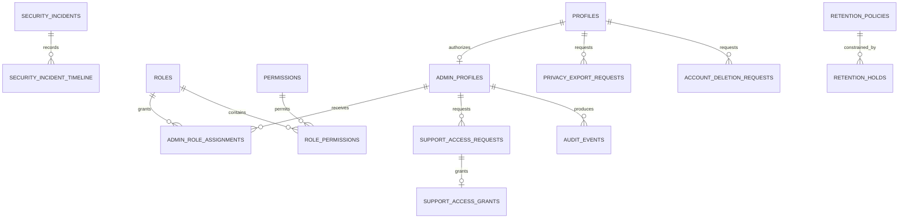

#### RLS and Authorization

- Customers read only their own security events, privacy/deletion requests, and
  support-access request status; no direct writes except request creation through
  guarded API functions.
- Admin tables are API-only. Every route requires active `admin_profiles`, exact
  permission, and recent MFA for role, privacy, support, retention, or incident
  actions.
- Role assignment never trusts Clerk metadata or client headers.
- Audit/timeline rows are append-only; update/delete grants are absent.
- Support grant checks admin, target user, resource type, operation, purpose,
  current time, and revocation for every accessed object.

#### APIs and Contracts

| Route group | Required permission and request | Response |
|---|---|---|
| `GET /api/v1/admin/access/roles` | `access.roles.read`; cursor/filter | role items with permission keys/version |
| `POST /api/v1/admin/access/roles` | `access.roles.write`; `{key,name,description?,permissionKeys[]}` | created role |
| `PATCH /api/v1/admin/access/roles/:id` | same + `{expectedVersion,...}` | updated role |
| `POST /api/v1/admin/access/invitations` | `access.invites.write`, recent MFA; `{email,roleId,expiresInHours}` | masked invitation status, never token |
| `POST /api/v1/admin/access/assignments` | `access.assignments.write`, recent MFA; `{userId,roleId,startsAt?,endsAt?,reason}` | assignment |
| `DELETE /api/v1/admin/access/assignments/:id` | same; `{reason,expectedVersion}` | `204` |
| `GET /api/v1/admin/audit/events` | `audit.read`; bounded filters/cursor | redacted audit page |
| `POST /api/v1/admin/support-access/requests` | `support.access.request`; `{userId,purpose,resourceScopes[],durationMinutes}` | pending request |
| `POST /api/v1/admin/support-access/requests/:id/decision` | `support.access.approve`, recent MFA; `{decision,reason,expectedVersion}` | grant/denial |
| `GET/POST/PATCH /api/v1/admin/security/incidents...` | `security.incidents.*`; validated incident/timeline contracts | incident/timeline resources |
| `POST /api/v1/me/privacy/exports` | recent auth; `Idempotency-Key` | `202 {requestId,status}` |
| `GET /api/v1/me/privacy/exports/:id` | owner | status and short-lived download only when ready |
| `POST /api/v1/me/deletion-requests` | recent auth; `{confirmation,reason?}` | request/cooling-off date |
| `DELETE /api/v1/me/deletion-requests/:id` | owner before processing | `204` cancellation |
| Admin privacy/retention routes | `privacy.*` or `retention.*`, recent MFA | bounded status/actions, no export body in list |

#### Functions, Triggers, Queues, Jobs, and Events

- `private.admin_has_permission(admin_id,permission_key,at)` resolves active
  assignments/roles/permissions and returns boolean; no client execute grant.
- `private.assert_admin_permission(permission_key)` and
  `private.assert_support_grant(user_id,resource,action)` are called before data
  access.
- `audit.append_event(...)` inserts immutable audit row in the caller transaction.
- Jobs: `privacy.export.generate`, `account.deletion.execute`,
  `retention.apply`, `support-grants.expire`, and `security-alert.dispatch`.
- Events: `admin.role_assigned/revoked`, `support_access.requested/granted/revoked`,
  `security.incident_opened`, `privacy.export_ready/expired`,
  `privacy.deletion_requested/completed`.

#### Business Rules

- System roles/permissions cannot be deleted; disabling requires no active
  assignment or an atomic replacement.
- No administrator approves their own support-access request or role elevation.
- Support grants max 24 hours and contain explicit resource/action scopes.
- Privacy exports are immutable point-in-time packages, private, encrypted in
  transit/at rest, signed-URL accessed, and automatically expired.
- Deletion observes cooling-off and retention holds; retained records are
  minimized/anonymized and the result is recorded without sensitive payload.

#### Security, Performance, and Caching

- Meet ASVS Level 2 and applicable Level 3 controls; maintain OWASP traceability.
- Permission and support-grant decisions are not shared-cached. A request-scoped
  memo is allowed; any future distributed cache must include role-version and
  fail closed.
- Audit/security lists use cursor indexes and redact PII. No unbounded export.
- Permission check DB P95 <=25 ms; Admin list P95 <=500 ms.

#### Mobile/Admin Integration and Replaced Mocks

- Mobile security/privacy/session settings use owner endpoints; export recipient
  verification becomes recent-auth plus actual delivery, not syntax-only UI.
- Admin users/devices/access, security/audit/privacy, controlled-support, and
  role/permission fixtures/handlers switch to these APIs.
- Existing seven role concepts and current permission keys are imported into
  deterministic seeds, normalized, and checked for drift; client-controlled
  `sessionStorage` roles and role headers are removed only in Spec 014.

#### Tests, Migration, Rollback, and Observability

- Seed/permission drift, active-time assignment, no-self-approval, MFA, RLS,
  BOLA/BFLA, support scope/time/revocation, immutable audit, incident lifecycle,
  export/deletion/hold, signed URL, and retention tests.
- Create RBAC tables before policy helpers; seed roles/permissions idempotently;
  enable Admin APIs only after an initial super-admin assignment is verified by
  an owner-approved bootstrap procedure.
- Rollback never drops audit/privacy/security history. Previous image remains
  compatible with additive permissions; revoke newly exposed routes first.
- Metrics/alerts: denied permissions, role changes, support grants/accesses,
  audit append failures, MFA failures, exports/deletions age/failure, incident
  severity, retention backlog, and suspicious enumeration.

#### Acceptance Criteria and Definition of Done

- Exact permission matrix and all negative authorization/RLS tests pass.
- Every privileged action has immutable actor/reason/resource/request evidence.
- Support/privacy/retention workflows are verified, bounded, recoverable, and
  alerted. Admin mocks map one-to-one to contracts and no client assertion grants
  privilege. Migrations, tests, OWASP evidence, runbooks, rollback, and metrics
  are complete.

### Phase 04 - SPEC-BE-004: Reference Data, Categories & Accounts

#### Objective and Scope

Establish stable currencies/countries, system/user categories, accounts, and
exchange-rate metadata used by every financial domain. Account creation may
request an opening balance, but only Spec 005 commits it as a ledger transaction.

#### Dependencies

- Specs 001-003 for platform, profiles, RLS, Admin permissions, audit, and outbox.
- Spec 005 consumes accounts/categories and owns all balance mutation.

#### Owned Database Tables

| Table | Complete columns | Keys, constraints, indexes, defaults |
|---|---|---|
| `public.currencies` | `code char(3) PK`; `name text`; `minor_unit smallint`; `enabled boolean=true`; `created_at=now()`; `updated_at=now()`; `version=1` | uppercase code; minor 0..4; index enabled/code |
| `public.supported_countries` | `code char(2) PK`; `name text`; `default_currency char(3) FK currencies`; `enabled boolean=true`; timestamps/version | uppercase code; index enabled/code |
| `public.categories` | `M`; `user_id text? FK profiles`; `parent_id uuid? FK categories`; `kind text`; `name text`; `icon text?`; `color text?`; `system_key text?`; `sort_order int=0`; `active boolean=true`; `deleted_at timestamptz?` | kind `income/expense/transfer`; parent not self; UQ system_key where user null; UQ user/lower(name)/kind active partial; indexes user/kind/active/sort, parent |
| `public.accounts` | `M+U`; `name text`; `type text`; `currency_code char(3) FK currencies`; `institution_name text?`; `last_four char(4)?`; `status text='active'`; `sort_order int=0`; `include_in_totals boolean=true`; `opened_at date?`; `closed_at date?`; `deleted_at timestamptz?` | type `cash/bank/card/wallet/other`; status `active/archived/closed`; last_four digits; closed>=opened; indexes user/status/sort, user/currency, active partial |
| `public.exchange_rates` | `I`; `base_currency char(3) FK currencies`; `quote_currency char(3) FK currencies`; `rate numeric(24,12)`; `effective_at timestamptz`; `provider text`; `provider_ref text?` | rate>0; base<>quote; UQ base/quote/effective/provider; index pair/effective desc |

#### Dedicated ERD

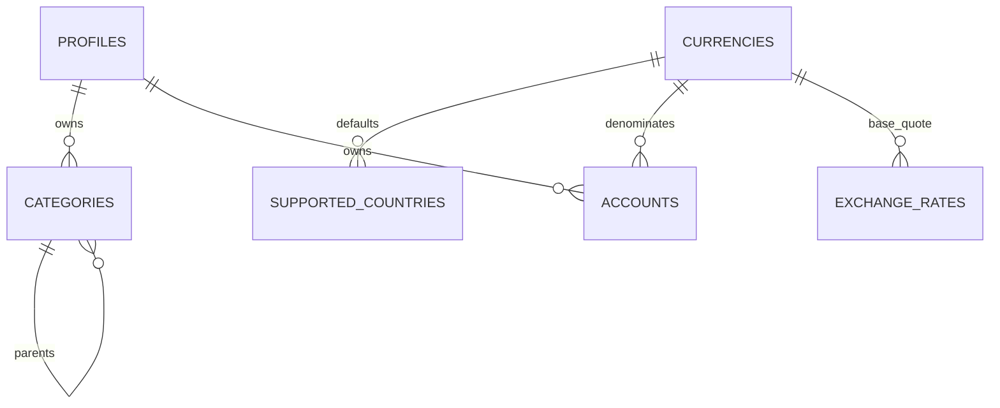

#### RLS and Authorization

- Authenticated users read enabled currencies/countries and active system
  categories. Only `reference.write` Admin APIs mutate them.
- Users CRUD only their own categories/accounts. System categories are read-only.
- Account/category delete is soft; references from committed ledger rows remain.
- Exchange rates are authenticated-readable, worker/Admin-written, never
  client-provided as authoritative.

#### APIs and Contracts

| Route | Request | Response |
|---|---|---|
| `GET /api/v1/reference/currencies` | `If-None-Match?` | enabled `{code,name,minorUnit}` plus ETag |
| `GET /api/v1/reference/countries` | same | `{code,name,defaultCurrency}` |
| `GET /api/v1/exchange-rates?base&quote&at` | validated codes/time | closest approved `{base,quote,rate,effectiveAt,provider}` or `404 FX_UNAVAILABLE` |
| `GET /api/v1/categories?kind&includeInactive` | owner; cursor for user categories | merged system/user category items |
| `POST /api/v1/categories` | `{kind,name,icon?,color?,parentId?,sortOrder?}` | created category/version |
| `PATCH/DELETE /api/v1/categories/:id` | explicit fields + expectedVersion; delete idempotent | updated item or `204` |
| `GET /api/v1/accounts?status` | owner | bounded account summaries with balance projection from Spec 005 |
| `POST /api/v1/accounts` | `{name,type,currency,institutionName?,lastFour?,includeInTotals,openingBalanceMinor?}` | `{account,...,openingTransactionId?}` after Spec 005 atomic orchestration |
| `GET/PATCH/DELETE /api/v1/accounts/:id` | owner; patch expectedVersion | account detail/update/`204` |
| Admin reference routes | `reference.read/write`; full replacement/version contracts | reference management resources |

#### Functions, Views, Jobs, and Events

- `private.resolve_category(user_id,category_id,kind)` accepts owner category or
  active system category of compatible kind.
- `private.resolve_exchange_rate(base,quote,at,max_age)` returns a rate or fails;
  it never invents a value.
- `reference.seed` is an idempotent deployment job for currencies, countries, and
  current system categories. `exchange-rate.refresh` is optional until a provider
  is approved; absence returns unavailable rather than fake data.
- Events: `category.created/updated/deleted`, `account.created/updated/archived`,
  `exchange-rate.refreshed`.

#### Business Rules

- Account currency is immutable after the first committed posting.
- Closing/archiving an account requires no pending operation; history remains.
- A category referenced by history is soft-deleted and hidden from new entry.
- Transfers use transfer kind and do not depend on an expense/income category.
- Opening balance command delegates to Spec 005; account row alone never stores
  or changes balance.

#### Security, Performance, Caching, and Clients

- Validate names/last-four lengths and ownership; never store full bank/card
  account identifiers or credentials.
- Categories/reference use the global 24-hour/versioned cache and ETags. Accounts
  are user-scoped; summaries use ledger version and no shared cache.
- Category/account query P95 <=100 ms; account endpoint <=300 ms/150 KB.
- Mobile account/category repositories and `core-finance-seeds` switch to these
  APIs; SQLite retains encrypted projections and reference versions.
- Admin reference/category/rate management uses permission-protected routes.
- Demo data remains explicit and is not inserted into production reference seeds.
- Mocks/contracts being replaced are Mobile account/category/reference seeds and
  repositories plus Admin reference/category/exchange-rate fixtures and handlers;
  the live adapters retain current service and Zod response shapes.

#### Tests, Migration, Rollback, and Observability

- Natural-key seeds, system/user category RLS, parent cycles, duplicate names,
  account lifecycle/currency immutability, opening-balance delegation, unavailable
  FX, rate freshness, pagination/ETag/cache invalidation, and contract tests.
- Migrate reference tables first, seed deterministic values, add and validate the
  owned `currencies(code)` FK on Spec 002's `user_preferences.default_currency`,
  then create categories and accounts with RLS/indexes. Existing Mobile values map through versioned adapter;
  unknown categories enter a review/default mapping, never silent reassignment.
- Rollback leaves additive references/accounts; disable new endpoint/image and use
  forward fixes. Never delete seeded code currently referenced.
- Metrics: account/category latency/counts, FX age/unavailability, cache hit/
  invalidation, seed drift, opening-balance failures, and ownership denials.

#### Acceptance Criteria and Definition of Done

- Complete schema/RLS/indexes, deterministic reference seed, APIs, Mobile/Admin
  contracts, opening-balance ledger integration, tests, budgets, cache rules,
  metrics/alerts, migration mapping, reconciliation, and rollback evidence pass.

### Phase 05 - SPEC-BE-005: Transactions, Ledger, Transfers & Financial Integrity

#### Objective and Scope

Implement the only authoritative money-mutation path: transaction headers,
immutable postings, versioned revisions, transactionally maintained balances,
same-currency transfers, fees, refunds, reversals, soft delete/undo, account
opening entries, audit/outbox, and reconciliation.

#### Dependencies

- Specs 001-004. Spec 006 supplies durable idempotency/sync envelopes; until then
  API idempotency uses the same contract with its table migration delivered before
  financial writes are enabled.
- Planning/tracking/AI/report Specs call these commands and cannot write ledger
  tables directly.

#### Owned Database Tables

| Table | Complete columns | Keys, constraints, indexes, defaults |
|---|---|---|
| `public.transactions` | `M+U`; `kind text`; `status text='confirmed'`; `currency_code char(3) FK currencies`; `category_id uuid? FK categories`; `merchant text?`; `note text?`; `occurred_at timestamptz`; `source text='manual'`; `external_ref text?`; `reverses_transaction_id uuid? FK transactions`; `deleted_at timestamptz?`; `undo_expires_at timestamptz?` | kind `income/expense/transfer/opening/refund/reversal/adjustment`; status `draft/pending/confirmed/reversed/deleted`; kind/category checks; no self reversal; partial UQ `(user_id,source,external_ref)` where ref not null; indexes user/time/id active, category/time, reverse link |
| `public.transaction_postings` | `I`; `transaction_id uuid FK transactions restrict`; `account_id uuid FK accounts restrict`; `amount_minor bigint`; `clearing_state text='confirmed'`; `posting_role text`; `occurred_at timestamptz` | amount<>0; state `pending/confirmed`; role `source/destination/fee/opening/refund/reversal/adjustment`; indexes transaction, account/time/id, pending partial; immutable |
| `audit.transaction_revisions` | `I`; `transaction_id uuid FK transactions`; `revision_no int`; `actor_id text`; `reason text`; `before_snapshot jsonb`; `after_snapshot jsonb` | revision>0; UQ transaction/revision; index transaction/time; immutable |
| `public.account_balances` | `account_id uuid PK/FK accounts`; `confirmed_minor bigint=0`; `pending_minor bigint=0`; `ledger_version bigint=0`; `reconciled_at timestamptz?`; `updated_at=now()` | ledger_version>=0; index reconciled_at; API/worker write only |

#### Dedicated ERD

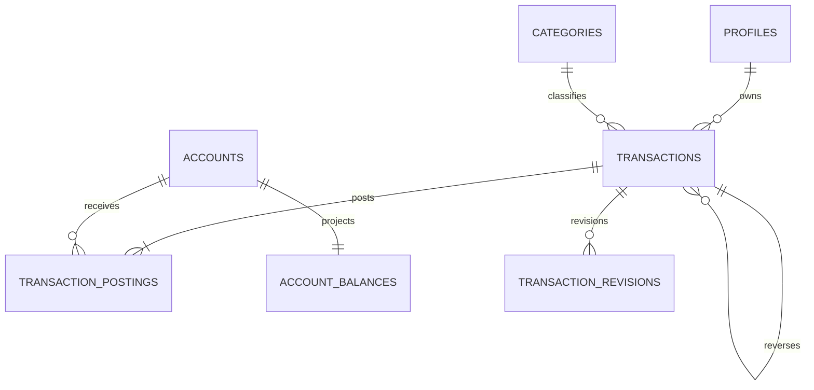

#### RLS and Authorization

- Owners select transaction headers/postings/balance projections only through
  owner-safe views/API; direct client insert/update/delete is revoked.
- All money mutation executes through guarded API/database functions using the
  caller Clerk JWT, active profile, account/category ownership, idempotency, and
  expected version.
- Admin financial reads require exact permission and audit. Admin cannot mutate a
  customer's ledger through support access unless a separately approved product
  operation exists; none is introduced here.

#### APIs and Contracts

| Route | Request | Response |
|---|---|---|
| `GET /api/v1/transactions` | cursor, `accountId?`, `categoryId?`, `kind?`, `from?`, `to?`, `query?`, max 100 | `{items:[TransactionSummary],nextCursor,ledgerVersion}` |
| `GET /api/v1/transactions/:id` | owner | header, postings, revision metadata, version |
| `POST /api/v1/transactions` | `Idempotency-Key`; `{kind:'income'|'expense',amountMinor,currency,accountId,categoryId?,merchant?,note?,occurredAt,source?,externalRef?}` | confirmed transaction and account balance |
| `PATCH /api/v1/transactions/:id` | key; `{expectedVersion,categoryId?,merchant?,note?,occurredAt?,amountMinor?,accountId?,reason}` | revised transaction/balances |
| `DELETE /api/v1/transactions/:id` | key; `{expectedVersion,reason}` | `{deletedAt,undoExpiresAt,balances[]}` |
| `POST /api/v1/transactions/:id/restore` | key; `{expectedVersion}` within undo window | restored transaction/balances |
| `POST /api/v1/transactions/:id/reverse` | key; `{expectedVersion,reason,occurredAt?}` | reversal transaction/original state |
| `POST /api/v1/transactions/:id/refunds` | key; `{amountMinor,accountId?,occurredAt,reason}` | linked refund; total cannot exceed refundable amount |
| `POST /api/v1/transfers` | key; `{sourceAccountId,destinationAccountId,amountMinor,currency,feeMinor?,feeAccountId?,occurredAt,note?}` | one transfer transaction, postings, both balances |
| `GET /api/v1/accounts/:id/summary` | owner; period? | account/balance/recent transactions/ledgerVersion |

`TransactionSummary` is `{id,kind,status,amountMinor,currency,accountIds[],
category?,merchant?,occurredAt,source,version,deletedAt?}`. Response amount is the
user-facing absolute amount; signed postings remain internal.

#### RPCs, Triggers, Jobs, and Events

- RPC/functions exactly as Section 5.4: `post_transaction`, `transfer_funds`,
  `reverse_transaction`, `soft_delete_transaction`, `restore_transaction`, and
  `reconcile_account_balance`.
- Functions lock account rows sorted by UUID, validate currency/ownership/status,
  insert revision/audit/outbox, and update balances before commit.
- Constraint trigger verifies required posting shape per transaction kind before
  transaction commit. Postings and revisions reject update/delete.
- `ledger.reconcile` scans bounded account batches, compares confirmed/pending
  posting sums, records metrics/incidents, and never silently repairs unexplained
  variance.
- Events: `transaction.created/revised/deleted/restored/reversed/refunded`,
  `transfer.created`, `balance.changed`, `ledger.reconciliation_failed`.

#### Business Rules

- Income posting is positive to destination account; expense is negative; transfer
  source negative and destination positive; optional fee is an additional negative
  posting. Same-currency transfer postings sum to negative fee or zero without fee.
- Opening transaction has exactly one posting and can be created only with account
  creation. A second active opening transaction is forbidden.
- Account and transaction currencies must match. Cross-currency is rejected.
- A full active reversal is unique. Refund total cannot exceed original eligible
  amount. Reversals/refunds are new transactions, never posting edits.
- Delete/restore changes effective ledger state through compensating projection
  logic and immutable revision, not physical row removal.
- Amount, account, or date edit creates a revision and atomically replaces effect
  through controlled postings/revision procedure; history remains reconstructable.

#### Security, Performance, and Caching

- ASVS Level 3-applicable verification, strict integer/range checks, recent auth
  for configured high-value thresholds, per-user mutation limits, deterministic
  errors, and no balance details in logs.
- Financial source data is never stale-shared cached. `account_balances` is the
  supported fast projection; Mobile may cache encrypted summaries by ledgerVersion.
- Required P95: create 350 ms, transfer 500 ms, account detail 300 ms, list 300
  ms; DB mutation 150 ms. Query plans/indexes from Section 5.6 are evidence.

#### Mobile/Admin Integration and Replaced Mocks

- Replaces Mobile `core-finance` transaction/account repository, seeds, demo-data
  finance paths, filters, delete/undo, and transfer behavior while preserving
  service interfaces through a live adapter.
- Mobile `paymentMethod` and all current input fields are included in domain
  adapters; no input is silently discarded. SQLite `REAL` values are converted
  to safe integer minor units before sync.
- Admin transaction/user financial views consume permission-protected read models;
  no Admin client financial write is added.

#### Tests, Migration, Rollback, and Observability

- Table-driven ledger tests for every kind/state, fees, opening, refunds, partial/
  full reversal, edit, delete/undo expiry, ownership/category/currency, duplicate
  operations, safe integer limits, and balance/report reconciliation.
- Concurrency tests for same account, opposite transfers, deterministic lock order,
  idempotency replay, expectedVersion, deadlock retry, and atomic rollback.
- Migrations create headers before postings/projections/revisions, constraints and
  functions before enabling write APIs, then pgTAP/RLS. Initial Mobile import uses
  Spec 006 and shadow reconciliation; no direct SQL bulk insert.
- Rollback is compatible previous image plus forward fix. Never drop/rewind ledger
  rows. Disable writes and reconcile before any emergency corrective migration.
- Metrics/alerts: mutation/list latency, lock/deadlock/retry, idempotency replay,
  posting counts, balance changes, reconciliation variance, deletion/restore,
  reversals/refunds, and error classes; no amounts/notes in metric labels.

#### Acceptance Criteria and Definition of Done

- Every invariant, RLS rule, endpoint contract, function, constraint, concurrency
  test, query plan, performance budget, Mobile/Admin adapter contract, migration,
  reconciliation, alert, runbook, and rollback rehearsal passes. No alternative
  financial write path exists.

### Phase 06 - SPEC-BE-006: Offline Sync, Idempotency & Conflict Resolution

#### Objective and Scope

Provide the only client synchronization protocol and mutation replay contract.
This phase preserves Mobile SQLite, supports incremental/delta sync, records
device/domain cursors, applies idempotent mutation envelopes, emits tombstones,
and routes version conflicts to deterministic resolution without Last Write Wins
for money.

#### Dependencies

- Specs 001-005 for identity/device, outbox, domain versions, ledger commands,
  and account/category/transaction schemas.
- Specs 007-012 register their sync projections and mutation handlers with this
  protocol; they do not create separate sync tables or idempotency stores.

#### Owned Database Tables

| Table | Complete columns | Keys, constraints, indexes, defaults |
|---|---|---|
| `private.idempotency_keys` | `I`; `actor_id text`; `scope text`; `key_hash text`; `request_hash text`; `response_status int?`; `response_body jsonb?`; `resource_ref text?`; `state text='claimed'`; `locked_until timestamptz`; `expires_at timestamptz` | state `claimed/completed/failed`; response status 100..599 when set; UQ `(actor_id,scope,key_hash)`; indexes `(expires_at)`, `(state,locked_until)`; request hash immutable |
| `public.transaction_conflicts` | `M+U`; `transaction_id uuid FK transactions`; `client_mutation_id uuid FK client_mutations`; `server_version bigint`; `client_version bigint`; `conflict_fields text[]`; `server_snapshot jsonb`; `client_snapshot jsonb`; `status text='open'`; `resolution text?`; `resolved_by text?`; `resolved_at timestamptz?` | status `open/resolved/rejected`; resolution `server/client/merged/duplicate/keep_both` only for nonfinancial duplication; versions>=0; UQ transaction/client mutation; index user/status/time |
| `public.client_sync_state` | `M+U`; `device_id uuid FK user_devices`; `domain text`; `last_cursor bigint=0`; `last_synced_at timestamptz?`; `last_acknowledged_mutation_id uuid?` | cursor>=0; UQ `(user_id,device_id,domain)`; index user/device/time |
| `public.client_mutations` | `I+U`; `device_id uuid FK user_devices`; `operation_id uuid`; `domain text`; `resource_type text`; `resource_id uuid?`; `base_version bigint?`; `payload_hash text`; `payload jsonb`; `status text='received'`; `result_ref text?`; `error_code text?`; `processed_at timestamptz?` | status `received/processing/applied/conflict/rejected`; base>=0; UQ `(user_id,operation_id)`; indexes status/created, user/device/created |

#### Dedicated ERD

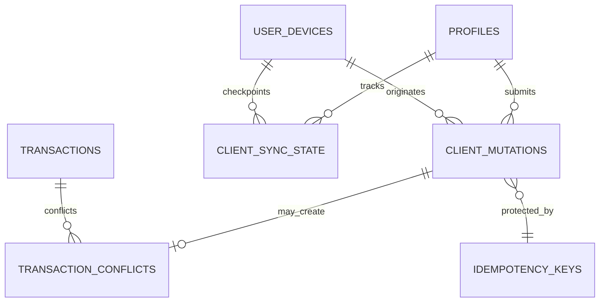

#### RLS and Authorization

- Users select only their own sync state, mutations, and conflicts. Direct writes
  are revoked; sync API/functions apply authenticated device ownership.
- Idempotency table is private. A caller can replay only its own actor/scope/key
  tuple, and a reused key with a different request hash returns
  `409 IDEMPOTENCY_KEY_REUSED`.
- A revoked device cannot push mutations but may complete a read-only final pull
  using a still-valid session only if device policy permits it.
- Conflict snapshots expose only owner-safe fields; internal/provider metadata is
  stripped before storage and response.

#### APIs and Contracts

| Route | Request | Response |
|---|---|---|
| `GET /api/v1/sync/bootstrap` | `deviceId`, optional domain list | reference versions, per-domain cursors, bounded initial snapshot URLs/pages, server time |
| `GET /api/v1/sync/delta` | `deviceId`, `domain`, `cursor>=0`, `limit<=500` | `{changes:[{cursor,resourceType,resourceId,operation,version,payload?,deletedAt?}],nextCursor,hasMore}` |
| `POST /api/v1/sync/mutations` | `Idempotency-Key`; `{deviceId,mutations:[1..100 MutationEnvelope]}` | per-operation `{operationId,status,resourceId?,version?,conflictId?,error?}`, server cursors |
| `POST /api/v1/sync/ack` | `{deviceId,domain,cursor,lastMutationId?}` | `{acknowledgedCursor,serverCursor}` |
| `GET /api/v1/conflicts` | cursor/status/domain | owner conflict summaries |
| `GET /api/v1/conflicts/:id` | owner | redacted server/client snapshots and allowed resolutions |
| `POST /api/v1/conflicts/:id/resolve` | key; `{expectedVersion,resolution,mergedPatch?}` | applied resource/version or rejected result |

`MutationEnvelope` is `{operationId:uuid,domain,resourceType,resourceId?,
baseVersion?,operation:'create'|'update'|'delete'|'restore',payload,schemaVersion}`.
Unknown domains/resources/schema versions are rejected before persistence.

#### Functions, Triggers, Jobs, and Events

- `private.claim_idempotency_key(actor,scope,key,request_hash,ttl)` returns
  `new/replay/in_progress/hash_mismatch`; completed response is immutable.
- `private.complete_idempotency_key(...)` records safe response/resource reference
  in the same transaction as mutation completion.
- `private.next_sync_cursor(user_id,domain)` allocates monotonic domain cursor;
  every sync-visible domain event stores it in outbox payload.
- `private.apply_client_mutation(...)` dispatches only to registered domain
  commands; it never performs generic dynamic SQL.
- Jobs: `idempotency.cleanup`, `sync-mutations.retry`, `sync-state.cleanup` for
  long-revoked devices, and `conflicts.expire` for resolved snapshot minimization.
- Events: `sync.mutation_applied/rejected`, `sync.cursor_advanced`,
  `conflict.opened/resolved`.

#### Business Rules

- Cursors are opaque monotonic integers scoped to user/domain; clients never
  infer global activity from them.
- Pull can repeat records; client applies resource/version idempotently. Cursors
  advance only after durable local application and explicit ack.
- Batch response preserves input operation order while processing dependencies in
  validated topological order; unsupported cross-operation references reject the
  dependent operation, not unrelated mutations.
- Money conflicts allow server/reject/explicit corrected command; `keep_both` is
  allowed only for a confirmed nonduplicate business record with a new operation
  ID and never as automatic conflict resolution.
- Tombstones contain ID, type, version, deletedAt only and persist long enough for
  the documented maximum offline window.

#### Security, Performance, and Caching

- Device/user binding, payload schema/size, batch count, mutation rate, replay,
  BOLA, and resource ownership are checked at the boundary.
- Sync payloads are compressed, contain changed fields only where contracts allow,
  and never include secrets/raw provider data.
- P95 delta <=500 ms for 500 changes and <=512 KB compressed; mutation batch
  acceptance <=800 ms excluding background domain work.
- Sync responses are private/no-store; ETags may be used only for immutable
  reference bootstrap. Redis is not used.

#### Mobile/Admin Integration and Replaced Mocks

- Mobile SQLite schema-version adapters convert local IDs/money, maintain cursor
  checkpoints, apply tombstones, retry operation IDs, and preserve local rows on
  failure. The server never asks Mobile to wipe its database.
- Existing offline transaction/account/planning/tracking conflict behavior moves
  behind the shared sync adapter. Current inconsistent `keep_both` behavior is
  normalized by resource policy.
- Admin is not an offline sync client. It reads conflict/health summaries through
  permissioned domain/operations routes and never writes client sync state.

#### Tests, Migration, Rollback, and Observability

- New/replay/hash mismatch/in-progress idempotency, batch duplicate, interrupted
  upload, cursor replay/ack, out-of-order delta, tombstone, revoked device,
  version conflict, money conflict, bounded offline window, and schema-version
  tests.
- Large dataset/delta/load tests include 100k local resources and concurrent
  devices for one user without cursor leakage.
- Create idempotency before enabling Spec 005 writes, then mutation/sync/conflict
  tables, functions, RLS, handlers, and client shadow mode. Rollback keeps server
  records and returns clients to mock/local-only reads without deleting SQLite.
- Metrics: delta/batch latency and bytes, change counts, cursor lag, replay rate,
  conflicts by domain/resolution, rejected schema/device/ownership, retry age, and
  idempotency table growth/cleanup. Alert on backlog and repeated conflicts.

#### Acceptance Criteria and Definition of Done

- All domain ownership registrations are explicit and versioned; duplicate/
  interrupted work is safe; Mobile data survives; financial conflicts never LWW;
  contracts, RLS, tests, performance, migration/shadow/rollback, metrics, alerts,
  and runbook evidence pass.

### Phase 07 - SPEC-BE-007: Financial Planning

#### Objective and Scope

Implement salary cycles, multiple budgets/category allocations, obligations and
scheduled payments, transaction matching/allocation, savings goals/movements, and
derived planning summaries. Planning records reference, but never duplicate or
replace, ledger truth.

#### Dependencies

- Specs 001-006: identity, reference/accounts, ledger commands, idempotency/sync.
- Spec 010 consumes owned views for reports; Spec 011 consumes reminder events.

#### Owned Database Tables

| Table | Complete columns | Keys, constraints, indexes, defaults |
|---|---|---|
| `public.salary_profiles` | `M+U`; `name text`; `amount_minor bigint`; `currency_code char(3) FK currencies`; `frequency text`; `expected_day smallint?`; `account_id uuid? FK accounts`; `active boolean=true` | amount>0; frequency `monthly/weekly/biweekly/custom`; expected day 1..31 when monthly; indexes user/active |
| `public.salary_receipts` | `M+U`; `salary_profile_id uuid FK salary_profiles`; `transaction_id uuid? FK transactions`; `expected_at timestamptz`; `received_at timestamptz?`; `amount_minor bigint`; `status text='expected'` | amount>0; status `expected/received/missed/ignored`; UQ profile/expected_at; indexes user/status/expected |
| `public.budgets` | `M+U`; `name text`; `currency_code char(3) FK currencies`; `period_start date`; `period_end date`; `total_minor bigint`; `status text='active'`; `deleted_at timestamptz?` | end>=start; total>=0; status `draft/active/closed/deleted`; indexes user/period/status |
| `public.budget_categories` | `M+U`; `budget_id uuid FK budgets cascade`; `category_id uuid FK categories`; `limit_minor bigint`; `rollover_minor bigint=0` | limit/rollover>=0; UQ budget/category; indexes category, user/budget |
| `public.obligations` | `M+U`; `name text`; `type text`; `currency_code char(3) FK currencies`; `principal_minor bigint`; `frequency text`; `start_date date`; `end_date date?`; `status text='active'`; `default_account_id uuid? FK accounts`; `deleted_at timestamptz?` | principal>=0; type `bill/debt/installment/subscription/other`; frequency supported set; end>=start; indexes user/status, user/end |
| `public.obligation_schedule_items` | `M+U`; `obligation_id uuid FK obligations cascade`; `due_at timestamptz`; `amount_minor bigint`; `status text='due'`; `sequence_no int` | amount>0; sequence>0; status `due/partial/paid/overdue/skipped`; UQ obligation/sequence; indexes user/status/due, obligation/due |
| `public.obligation_payments` | `M+U`; `obligation_id uuid FK obligations`; `transaction_id uuid FK transactions`; `paid_at timestamptz`; `amount_minor bigint`; `payment_method text?`; `status text='confirmed'` | amount>0; status `pending/confirmed/reversed`; UQ transaction; indexes obligation/paid, user/status |
| `public.obligation_payment_allocations` | `I+U`; `payment_id uuid FK obligation_payments cascade`; `schedule_item_id uuid FK obligation_schedule_items`; `amount_minor bigint` | amount>0; UQ payment/schedule; indexes schedule_item |
| `public.payment_matches` | `M+U`; `transaction_id uuid FK transactions`; `obligation_id uuid FK obligations`; `schedule_item_id uuid? FK obligation_schedule_items`; `confidence numeric(5,4)`; `status text='proposed'`; `reviewed_by text?`; `reviewed_at timestamptz?` | confidence 0..1; status `proposed/accepted/rejected`; UQ transaction/obligation; indexes user/status, obligation/status |
| `public.savings_goals` | `M+U`; `name text`; `currency_code char(3) FK currencies`; `target_minor bigint`; `target_date date?`; `status text='active'`; `linked_account_id uuid? FK accounts`; `deleted_at timestamptz?` | target>0; status `active/paused/completed/deleted`; indexes user/status/target_date |
| `public.savings_goal_movements` | `I+U`; `goal_id uuid FK savings_goals`; `transaction_id uuid FK transactions`; `amount_minor bigint`; `occurred_at timestamptz`; `kind text` | amount<>0; kind `contribution/withdrawal/adjustment`; UQ goal/transaction/kind; indexes goal/time, user/time |

#### Dedicated ERD

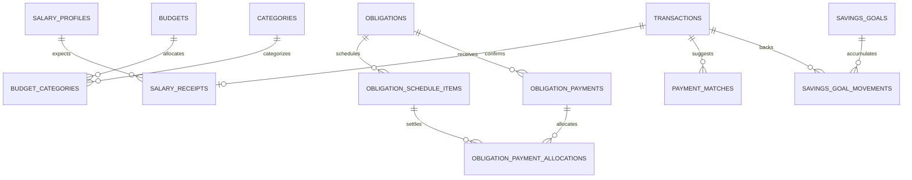

#### RLS and Authorization

- Owner CRUD for planning roots through API; dependent rows inherit and verify
  owner from root and also store `user_id` for RLS/indexing.
- Direct client writes to receipts/payments/allocations/matches/movements are
  revoked; guarded functions validate related ledger transaction ownership,
  currency, status, and amount.
- Admin read requires `planning.read`; no Admin money/planning mutation is added.

#### APIs and Contracts

| Namespace | Commands/queries and contracts |
|---|---|
| Salary | `GET/POST /salary-profiles`; `GET/PATCH/DELETE /salary-profiles/:id`; receipt list; link/unlink receipt request `{transactionId,expectedAt}`; response includes next/received cycle |
| Budgets | `GET/POST /budgets`; detail, patch, delete; `PUT /budgets/:id/categories` complete `{allocations:[{categoryId,limitMinor,rolloverMinor}],expectedVersion}`; summary `{spent,remaining,utilization,ledgerVersion}` |
| Obligations | CRUD; schedule list; `POST /obligations/:id/payments` `{transactionId,paymentMethod?,allocations:[{scheduleItemId,amountMinor}]}`; match list/decision `{decision,expectedVersion}` |
| Savings | goal CRUD; `POST /savings-goals/:id/movements` `{transactionId,kind,amountMinor}`; response `{currentMinor,remainingMinor,progress,ledgerVersion}` |
| Summary | `GET /api/v1/planning/summary?period` returns salary/budget/obligation/savings aggregates in one Mobile request |

All mutations use `Idempotency-Key`; updates use `expectedVersion`; all money is
minor-unit integer and currency-compatible with referenced transaction/account.

#### Functions, Views, Jobs, and Events

- `private.generate_obligation_schedule(obligation_id,through_date)` inserts
  deterministic sequence items and is idempotent.
- `private.allocate_obligation_payment(...)` locks schedule rows, checks payment
  sum equals allocations, updates statuses, and emits outbox atomically.
- `private.record_savings_movement(...)` validates signed transaction effect.
- Views owned: `v_salary_cycle_summary`, `v_budget_utilization`, and
  `v_obligation_status`, all `security_invoker` and ledger-version aware.
- Jobs: `planning.salary-cycle.generate`, `planning.obligation-schedule.generate`,
  `planning.payment-match.propose`, `planning.overdue.mark`, and
  `planning.reminders.emit`.
- Events use `planning.salary_*`, `planning.budget_*`, `planning.obligation_*`,
  and `planning.savings_*` names.

#### Business Rules

- Category allocations may not exceed budget total unless budget explicitly uses
  uncapped total zero? This plan forbids ambiguity: total must equal or exceed the
  sum of active category limits.
- Overlapping budgets are allowed because current Mobile supports multiple
  budgets; name/period identify each and summaries never silently merge them.
- Obligation payment is valid only with a confirmed ledger transaction; allocation
  sum equals payment amount and cannot exceed remaining scheduled amount without
  explicit prepayment allocation.
- Savings progress is sum of linked confirmed movements, not a mutable counter.
- Reversal/deletion ledger events recalculate linked planning state idempotently.

#### Security, Performance, Caching, and Clients

- Validate ownership across every referenced account/category/transaction;
  proposal/match confidence never bypasses confirmation policy.
- Planning summary may use user/period/ledgerVersion cache for 30-60 seconds and
  invalidates on planning/ledger events. Root/detail writes are uncached.
- Summary P95 <=400 ms and <=250 KB; list/detail P95 <=300 ms; schedule jobs use
  bounded horizon/batches.
- Replaces Mobile financial-planning seeds/service/repository, multiple-budget,
  salary, obligation, savings, payment-method, and matching mocks. Admin overview
  reads summaries via report/analytics adapters, not duplicate calculations.

#### Tests, Migration, Rollback, and Observability

- Salary date/month-end, overlapping budgets, allocation totals, period/currency,
  schedule generation, overdue, partial/multiple/prepayment, duplicate payment,
  reversal, match decisions, savings contribution/withdrawal, sync, RLS, and
  projection/reconciliation tests.
- Migrate root tables then dependents/views/jobs/RLS; import current Mobile data
  through Spec 006 with stable mapping and shadow summaries. Rollback disables
  writes/jobs, preserves rows, and reverts adapter while ledger remains untouched.
- Metrics: planning API/job latency, generated schedules, overdue counts, match
  acceptance/rejection, allocation failures, summary cache hit/staleness,
  reconciliation differences, and reminder backlog.

#### Acceptance Criteria and Definition of Done

- All current planning workflows and fields are represented; every derived value
  reconciles to ledger; contracts, schema/RLS, jobs/views/events, mocks, tests,
  performance/cache, migration/rollback, alerts, and runbooks pass.

### Phase 08 - SPEC-BE-008: Tracking, Imports, Parsers & Deduplication

#### Objective and Scope

Turn normalized Mobile/provider/file inputs into reviewable transaction proposals
through versioned parsers, rules, duplicate detection, history, and feedback. This
Spec does not implement device SMS capture and cannot write confirmed ledger data
outside Spec 005 commands and review policy.

#### Dependencies

- Specs 001-007 for users, reference/categories, ledger commands, sync, planning
  matching, Storage, jobs, security, and audit.

#### Owned Database Tables

| Table | Complete columns | Keys, constraints, indexes, defaults |
|---|---|---|
| `public.tracking_preferences` | `user_id text PK/FK profiles`; `enabled boolean=false`; `review_required boolean=true`; `duplicate_window_seconds int=86400`; `source_retention_days int=30`; `updated_at`; `version=1` | duplicate window 60..2592000; retention 1..365 |
| `public.user_keyword_rules` | `M+U`; `keyword text`; `match_type text='contains'`; `category_id uuid? FK categories`; `enabled boolean=true` | match `exact/contains/regex`; safe regex validation; UQ user/lower(keyword)/match; enabled index |
| `public.user_sender_rules` | `M+U`; `sender_pattern text`; `institution_id uuid? FK financial_institutions`; `enabled boolean=true` | safe pattern; UQ user/pattern; enabled index |
| `public.import_sessions` | `M+U`; `source_type text`; `source_name text?`; `status text='received'`; `item_count int=0`; `accepted_count int=0`; `rejected_count int=0`; `started_at=now()`; `completed_at timestamptz?` | source `sms/file/manual/provider`; status `received/processing/review/complete/failed`; counts>=0; user/status/time index |
| `public.import_items` | `M+U`; `session_id uuid FK import_sessions cascade`; `source_item_key text`; `normalized_hash text`; `occurred_at timestamptz?`; `amount_minor bigint?`; `currency_code char(3)? FK currencies`; `merchant text?`; `normalized_payload jsonb`; `status text='parsed'`; `transaction_id uuid? FK transactions` | status `parsed/review/accepted/rejected/duplicate/failed`; UQ session/source key; indexes hash, session/status, user/time |
| `private.import_attempts` | `I`; `session_id uuid FK import_sessions`; `attempt_no int`; `worker_id text`; `status text`; `started_at`; `completed_at?`; `error_code?` | attempt>0; status `running/succeeded/failed`; UQ session/attempt; status/time index |
| `private.raw_ingestion_payloads` | `I`; `session_id uuid FK import_sessions`; `item_id uuid? FK import_items`; `storage_ref text`; `payload_hash text`; `content_type text`; `size_bytes bigint`; `expires_at timestamptz` | size 1..configured max; UQ payload hash/session; expiry/time index; no client grant |
| `public.review_items` | `M+U`; `import_item_id uuid FK import_items`; `reason text`; `proposed_values jsonb`; `status text='pending'`; `reviewed_at timestamptz?`; `reviewed_by text?` | status `pending/accepted/rejected/edited`; UQ active import item; user/status/time index |
| `public.duplicate_candidates` | `M+U`; `left_item_id uuid FK import_items`; `right_transaction_id uuid FK transactions`; `score numeric(5,4)`; `reasons text[]`; `status text='proposed'` | score 0..1; status `proposed/duplicate/not_duplicate`; UQ pair; user/status/score index |
| `public.tracking_history` | `I+U`; `source_type text`; `source_ref text`; `outcome text`; `transaction_id uuid? FK transactions`; `occurred_at=now()` | outcome `received/parsed/reviewed/accepted/rejected/duplicate/failed`; user/time index |
| `public.tracking_feedback` | `I+U`; `history_id uuid FK tracking_history`; `feedback_type text`; `corrected_category_id uuid? FK categories`; `comment text?` | type `correct/incorrect/duplicate/not_duplicate/category`; UQ user/history/type |
| `public.financial_institutions` | `M`; `country_code char(2) FK supported_countries`; `name text`; `code text UQ`; `active boolean=true` | lowercase code; country/active index |
| `public.institution_senders` | `M`; `institution_id uuid FK financial_institutions`; `sender_pattern text`; `priority int=100`; `active boolean=true` | priority>=0; UQ institution/pattern; active/priority index |
| `public.parser_rules` | `M`; `institution_id uuid? FK financial_institutions`; `name text`; `source_type text`; `active_version_id uuid?`; `status text='draft'` | source supported; status `draft/active/disabled`; institution/status index; active_version FK added after version table |
| `public.parser_rule_versions` | `I`; `parser_rule_id uuid FK parser_rules cascade`; `version_no int`; `definition jsonb`; `created_by text FK admin_profiles`; `published_at timestamptz?` | version>0; validated definition schema; UQ rule/version; rule/published index |
| `public.parser_test_cases` | `M`; `parser_version_id uuid FK parser_rule_versions cascade`; `input_fixture text`; `expected_output jsonb`; `enabled boolean=true` | fixture/output bounded/schema-valid; version/enabled index |
| `public.merchant_rules` | `M`; `user_id text? FK profiles`; `pattern text`; `normalized_merchant text`; `priority int=100`; `active boolean=true` | safe pattern; partial UQ owner/pattern; active/priority indexes |
| `public.category_rules` | `M`; `user_id text? FK profiles`; `pattern text`; `category_id uuid FK categories`; `priority int=100`; `active boolean=true` | safe pattern/category compatibility; partial UQ owner/pattern; active/priority indexes |
| `public.unsupported_formats` | `M`; `session_id uuid FK import_sessions`; `content_hash text`; `reason text`; `sample_redacted text?`; `status text='open'`; `reviewed_at timestamptz?` | status `open/covered/ignored`; UQ session/hash; status/time index |

#### Dedicated ERD

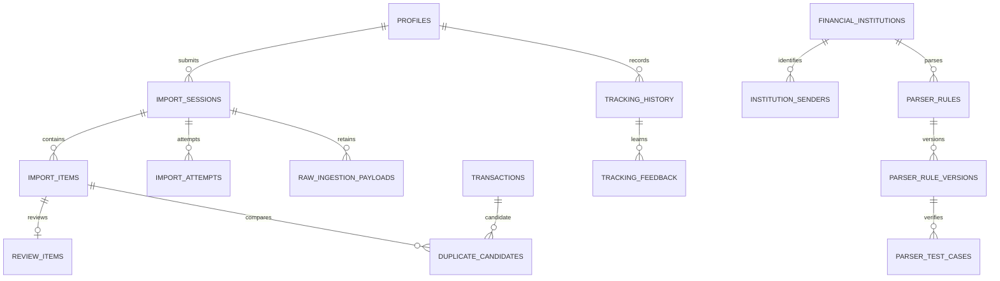

#### RLS and Authorization

- Users manage their preferences/user rules and see their sessions/items/reviews/
  candidates/history/feedback. Direct status/transaction linking is API-only.
- Institutions, senders, global parser/merchant/category rules are authenticated
  read only; Admin permissions `imports.*`/`parsers.*` own changes and publishing.
- Raw payloads/attempts are private worker/Admin-inspection only with purpose,
  redaction, retention, and audit.
- User-specific rules override global rules only for that user and cannot target
  another user's category.

#### APIs and Contracts

| Route group | Contracts |
|---|---|
| Tracking | `GET/PUT /tracking/preferences`; CRUD keyword/sender rules; `GET /tracking/history`; feedback `{historyId,type,correctedCategoryId?,comment?}` |
| Imports | `POST /imports` multipart or normalized JSON with key, source type, schema version; returns `202 session`; session/list/item/review endpoints; review decision `{decision,patch?,expectedVersion}` |
| Duplicates | candidate list/detail; decision `{duplicate:boolean,expectedVersion}`; acceptance links existing transaction or calls Spec 005 create command |
| Admin imports | bounded sessions/items/attempts/unsupported-format views and explicit retry/cancel actions |
| Admin parsers | institutions/senders/rules CRUD; version create; test-corpus run; publish only when all enabled tests pass; merchant/category rule CRUD |

Normalized event contract is `{sourceItemKey,sourceType,receivedAt,sender?,body?,
amountMinor?,currency?,merchant?,occurredAt?,metadata?}` with source-specific body
limits. Raw source is never accepted as confirmed financial truth.

Request contracts use explicit source-specific discriminated unions, a maximum
item/file count, schema version, `Idempotency-Key`, and no caller-selected parser
code. Response contracts are either `202 {sessionId,status,receivedCount}` for
asynchronous intake or bounded resources containing IDs, normalized safe fields,
review/duplicate status, parser version, validation errors, and cursors; raw
payloads, internal rule definitions, and worker errors are excluded.

#### Functions, Jobs, and Events

- `private.normalize_ingestion_item`, `private.compute_duplicate_candidates`, and
  `private.apply_tracking_rules` are deterministic and version-recorded.
- Parser definitions use a constrained rule DSL; no arbitrary code/eval/SQL.
- Jobs: `import.process`, `parser.corpus.run`, `duplicate.detect`,
  `review.auto-accept` only when user policy and confidence threshold permit,
  `raw-ingestion.purge`, and `tracking-history.compact`.
- Events: `import.received/processed/failed`, `tracking.review_required/accepted`,
  `tracking.duplicate_detected`, `parser.version_published`, and
  `tracking.feedback_received`.

#### Business Rules

- File size, row count, decompression ratio, encoding, formula injection, parser
  time, and item count are bounded. CSV export/import cells starting with formula
  characters are neutralized where applicable.
- Duplicate score uses amount/currency/time/merchant/source hash; thresholds and
  reasons are versioned, never hidden magic.
- A normalized item reaches the ledger once through a unique operation/external
  reference. Retry cannot duplicate it.
- Review acceptance reruns category/account ownership, amount/currency/date, and
  duplicate checks immediately before Spec 005 command.
- Raw source expires per user/policy; derived safe history may remain longer.

#### Security, Performance, Caching, and Clients

- Treat all files/messages/provider payloads as hostile; scan uploads, forbid
  executable content, validate magic bytes, block path traversal/XXE/zip bombs/
  regex denial, redact Admin samples, and guard provider URLs against SSRF.
- Parser/reference rules may use versioned reference cache; user/session/review
  data is not shared cached. Workers stream/batch items and enforce timeouts.
- Import acceptance <=300 ms; status/list <=500 ms; 10k-row processing/reporting
  runs async with measurable throughput and bounded memory.
- Replaces Mobile automatic-tracking service/fixtures/default keywords/history/
  feedback and Admin imports/parsers/rules handlers. Backend does not claim SMS
  capture; Mobile sends normalized events when native capture exists.

#### Tests, Migration, Rollback, and Observability

- Parser corpus for every published version; malformed encoding, oversized/
  compressed/formula/regex payloads, sender priority, user/global rules,
  duplicates near boundaries, review edits, retries, retention, RLS, and contract
  tests. Performance tests use large representative files and user histories.
- Create reference/rule tables before sessions/items/review/history. Seed current
  fixture rules as draft versions, run corpus, then explicitly publish. Rollback
  switches active parser version atomically and preserves sessions/raw retention.
- Metrics: import queue/throughput/duration/failure, parser version/pass rate,
  unsupported rate, duplicate score/decision, review age, auto-accept, raw storage/
  purge, worker memory, and ledger acceptance errors; alert on backlog/regression.

#### Acceptance Criteria and Definition of Done

- Every accepted item is traceable to source, parser/rule versions, review, and
  one ledger command; hostile inputs are bounded; no duplicate confirmed write;
  all schema/RLS/APIs/jobs/events/mocks/tests/performance/migration/rollback/
  observability and corpus evidence pass.

### Phase 09 - SPEC-BE-009: Voice, OpenRouter AI & Financial Assistant

#### Objective and Scope

Implement voice capture processing, transaction proposals, assistant consent and
conversations, evidence snapshots, action previews, OpenRouter model routing,
privacy/ZDR, prompt/schema versions, evaluations, safety, quotas, cost, fallback,
and outage isolation. AI is advisory and cannot directly mutate finance.

#### Dependencies

- Specs 001-008 for secrets/worker/Storage, identity/consent, authorization,
  categories/accounts, ledger commands, sync, planning, and tracking proposals.
- Spec 012 provides entitlement/quota plan data; before billing cutover, a safe
  explicit default quota is configured server-side.

#### Owned Database Tables

| Table | Complete columns | Keys, constraints, indexes, defaults |
|---|---|---|
| `public.voice_sessions` | `M+U`; `locale text`; `storage_ref text?`; `status text='uploaded'`; `duration_ms int`; `expires_at timestamptz`; `confirmed_at timestamptz?` | locale `ar/en`; duration 1..120000; status `uploaded/processing/proposed/confirmed/expired/failed`; user/status/time index |
| `public.voice_transcripts` | `I+U`; `session_id uuid FK voice_sessions cascade`; `provider text`; `model text`; `text_redacted text`; `confidence numeric(5,4)?`; `language text` | confidence 0..1; UQ session; session/time index |
| `public.voice_proposals` | `M+U`; `session_id uuid FK voice_sessions`; `schema_version int`; `proposal_type text`; `payload jsonb`; `status text='draft'`; `expires_at timestamptz`; `confirmed_at timestamptz?`; `executed_transaction_id uuid? FK transactions` | schema>0; type supported financial proposal; status `draft/validated/confirmed/executed/rejected/expired`; UQ session active; user/status index |
| `public.voice_proposal_fields` | `I+U`; `proposal_id uuid FK voice_proposals cascade`; `field_name text`; `value_json jsonb`; `confidence numeric(5,4)?`; `source_span text?` | confidence 0..1; UQ proposal/field; proposal index |
| `public.voice_category_preferences` | `M+U`; `merchant_pattern text`; `category_id uuid FK categories`; `confidence numeric(5,4)` | confidence 0..1; safe pattern; UQ user/pattern |
| `public.assistant_consents` | `I+U`; `policy_version text`; `granted_at timestamptz`; `revoked_at timestamptz?` | UQ user/policy; one active policy partial |
| `public.assistant_conversations` | `M+U`; `title text?`; `status text='active'`; `last_message_at timestamptz=now()`; `deleted_at timestamptz?` | status `active/archived/deleted`; user/last-message index |
| `public.assistant_messages` | `I+U`; `conversation_id uuid FK assistant_conversations cascade`; `role text`; `content_redacted text`; `prompt_version_id uuid? FK ai_prompt_versions` | role `user/assistant/system`; conversation/time index; bounded content |
| `public.assistant_response_snapshots` | `I+U`; `message_id uuid FK assistant_messages`; `schema_version int`; `evidence_refs jsonb`; `model text`; `provider text` | schema>0; evidence JSON array; UQ message |
| `public.assistant_action_previews` | `M+U`; `message_id uuid FK assistant_messages`; `action_type text`; `payload jsonb`; `status text='draft'`; `expires_at timestamptz`; `confirmed_at timestamptz?`; `executed_resource_id uuid?` | status proposal lifecycle; UQ message/action active; user/status/expiry index |
| `public.assistant_feedback` | `I+U`; `message_id uuid FK assistant_messages`; `rating smallint`; `reason text?` | rating -1/1; UQ user/message |
| `private.ai_providers` | `M`; `key text UQ`; `display_name text`; `approved boolean=false`; `zdr_capable boolean=false`; `training_policy text`; `retention_reviewed_at timestamptz?` | policy `unknown/no_training/may_train`; approved requires review; enabled index |
| `private.ai_models` | `M`; `provider_id uuid FK ai_providers`; `model_id text UQ`; `capabilities text[]`; `approved boolean=false`; `max_context int`; `structured_output boolean`; `cost_policy jsonb` | max_context>0; capabilities GIN only if measured; provider/approved index |
| `private.ai_feature_routes` | `M`; `workload text UQ`; `primary_model_id uuid FK ai_models`; `fallback_model_ids uuid[]='{}'`; `provider_allowlist text[]`; `zdr_required boolean=true`; `max_price jsonb`; `limits jsonb`; `enabled boolean=true` | nonempty allowlist; validated pricing/limits; enabled index |
| `private.ai_prompt_versions` | `I`; `workload text`; `version_no int`; `template text`; `schema_version int`; `status text='draft'`; `approved_by text? FK admin_profiles`; `published_at timestamptz?` | versions>0; status `draft/testing/approved/retired`; UQ workload/version; status index |
| `private.ai_prompt_test_cases` | `M`; `prompt_version_id uuid FK ai_prompt_versions cascade`; `fixture_redacted jsonb`; `expected_rules jsonb`; `enabled boolean=true` | valid bounded JSON; version/enabled index |
| `private.ai_usage_events` | `I`; `user_id text? FK profiles`; `workload text`; `model text`; `provider text`; `input_tokens int`; `output_tokens int`; `estimated_cost numeric(18,8)`; `latency_ms int`; `fallback_used boolean=false`; `request_id text` | nonnegative counts/cost/latency; indexes user/time, workload/time, request; no prompt |
| `private.ai_failure_events` | `I`; `user_id text?`; `workload text`; `model text?`; `provider text?`; `failure_code text`; `schema_failure boolean=false`; `request_id text` | indexes workload/time, request; no raw content |
| `public.ai_response_reports` | `M+U`; `message_id uuid FK assistant_messages`; `report_type text`; `reason text`; `status text='open'`; `reviewed_at timestamptz?` | status `open/reviewed/actioned/dismissed`; UQ user/message/type; status/time index |
| `private.ai_safety_rules` | `M`; `key text UQ`; `workload text`; `rule_type text`; `configuration jsonb`; `enabled boolean=true` | validated rule schema; workload/enabled index |

#### Dedicated ERD

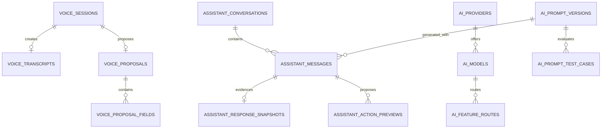

#### RLS and Authorization

- Users access only own voice/assistant/feedback/report rows and require active
  consent for assistant processing. Direct client writes to transcript, proposal
  status execution, evidence, routes, prompts, usage, failures, or safety are
  revoked.
- Admin AI routes require exact `ai.*` permissions; prompt/model publishing and
  privacy policy changes require recent MFA and audit.
- OpenRouter key and provider response are worker-only. Storage objects require
  owner/session and expire.

#### APIs and Contracts

| Route group | Contracts |
|---|---|
| Voice | `POST /voice/sessions` metadata -> signed upload; `POST /:id/process` idempotent -> `202`; status/proposal reads; `POST /proposals/:id/confirm` `{expectedVersion,editedFields?}` -> Spec 005 transaction; reject endpoint |
| Assistant | consent get/put/revoke; conversation CRUD/list; `POST /conversations/:id/messages` `{content,contextScope}` -> streamed/nonstreamed response; preview confirm/reject; feedback/report |
| Admin AI | providers/models/routes read/update, prompt version/test/publish, usage/failure/report/safety lists/actions; all bounded and redacted |

Structured voice output is exactly `{schemaVersion:1,type,amountMinor,currency,
categoryId?,accountId?,date,merchant?,note?,confidence}`. Assistant action preview
is `{schemaVersion,actionType,payload,evidenceIds[],expiresAt}`. Clients never send
model/provider/routing/ZDR/price parameters.

#### Functions, Jobs, Events, and Business Rules

- `private.validate_ai_proposal(workload,schema,payload,user)` performs deterministic
  schema, ownership, currency, amount, date, category/account, entitlement, and
  safety validation.
- `private.confirm_ai_action(preview_id,expected_version)` locks preview, checks
  user/recent state/expiry, reauthorizes, then invokes the owned domain command.
- Jobs: `voice.transcribe_extract`, `assistant.respond`, `ai.evaluate_route`,
  `ai.usage_rollup`, `ai.proposals.expire`, `voice-media.purge`.
- Events: `voice.proposal_ready/confirmed/failed`, `assistant.response_ready`,
  `assistant.action_confirmed/rejected`, `ai.fallback_used`, `ai.budget_threshold`,
  `ai.provider_failed`.
- Routing uses approved primary/fallback only, `data_collection:deny`, ZDR required
  for sensitive work, parameter support required, max price and token limits.
- A `BEFORE INSERT OR UPDATE` trigger resolves every `fallback_model_ids` element,
  rejects duplicates/the primary model/unapproved models, and verifies provider
  allowlist, required capabilities, structured-output support, and equivalent
  ZDR/privacy policy before a route can be enabled.
- Schema failure retries once with same approved policy. No compliant route means
  safe unavailable response, never weaker privacy.
- AI output cannot execute tools/SQL/internal APIs; deterministic backend action
  confirmation is the sole mutation bridge.

#### Security, Performance, Caching, and Clients

- Apply prompt-injection defenses, minimum data, aliasing/redaction, no raw prompt/
  completion logs, provider-retention review, no-training policy, ZDR, per-user
  quotas, abuse limits, key spending cap, 70/85/95 percent alerts, hard budget stop.
- Voice max 120 seconds; token limits/model candidates are exactly Section 7.
- Conversations may cache only non-sensitive reference prompt fragments. User
  responses/proposals are private/no-store. Provider prompt caching is allowed only
  under approved ZDR policy and never treated as application cache.
- OpenRouter calls use separate pool/circuit breaker; first-byte/full latency,
  timeout, cancellation, token/cost are measured. Core finance never waits on AI.
- Replaces Mobile voice fixtures/analyzer, assistant service, proposal/evidence
  mocks, and Admin AI-management handlers. Release-mode unavailable analyzers
  become explicit feature-unavailable states, not silent fixtures.

#### Tests, Migration, Rollback, and Observability

- Arabic/English voice fixtures, noisy/missing fields, schema strictness, invalid
  amount/currency/date/category/account, consent, expiry, confirmation replay,
  authorization, prompt injection, tool/SQL attempts, data redaction, ZDR/allowlist,
  fallback equivalence, outage, cost/quota, and structured-output evaluation.
- Create provider/model/route/prompt/safety config before user AI rows; seed only
  reviewed config, not secrets. Shadow AI compares mocks/evaluations without
  financial execution; enable confirmations last. Rollback disables routes/jobs,
  preserves conversations/proposals/usage, and deletes temp media by policy.
- Metrics/alerts: provider/model/workload latency, tokens/cost, quota/budget,
  fallback, schema/evaluation failures, injection blocks, proposal confirmation/
  expiry, circuit state, queue age, and media purge; never label raw content.

#### Acceptance Criteria and Definition of Done

- Clients cannot call/select providers; every route is approved/ZDR/privacy safe;
  evaluations and schemas pass; prompt injection gains no authority; AI outage does
  not affect finance; no direct financial mutation exists; complete contracts,
  RLS, config, jobs/events, mocks, tests, budgets, migration/rollback, alerts, and
  privacy evidence pass.

### Phase 10 - SPEC-BE-010: Reports, Analytics, Exports & Email Delivery

#### Objective and Scope

Provide consistent Home/dashboard/report analytics from ledger/planning truth,
scheduled reports, immutable output snapshots, asynchronous exports, private
downloads, and actual email delivery attempts. Search/navigation/attention remain
derived APIs, not speculative tables.

#### Dependencies

- Specs 001-009 for identity/RLS, ledger/planning/tracking/AI data, worker, Storage,
  audit, and performance conventions. Spec 011 may deliver in-app report-ready
  notifications; email delivery remains owned here.

#### Owned Database Tables

| Table | Complete columns | Keys, constraints, indexes, defaults |
|---|---|---|
| `public.report_schedules` | `M+U`; `report_type text`; `frequency text`; `timezone text`; `next_run_at timestamptz`; `delivery_channel text`; `recipient text?`; `enabled boolean=true`; `last_run_at timestamptz?` | supported report/frequency; channel `download/email`; recipient required/normalized for email; UQ user/report/frequency/channel; index enabled/next_run |
| `private.report_output_attempts` | `I`; `schedule_id uuid? FK report_schedules`; `user_id text FK profiles`; `report_type text`; `period_start date`; `period_end date`; `ledger_version bigint`; `snapshot jsonb`; `storage_ref text?`; `delivery_status text='queued'`; `provider_message_id text?`; `attempt_count int=0`; `error_code text?`; `expires_at timestamptz` | period valid; ledger>=0; status `queued/generating/ready/sending/delivered/failed/expired`; attempts>=0; UQ schedule/period where schedule not null; indexes user/time, status/time, expires |

#### Dedicated ERD

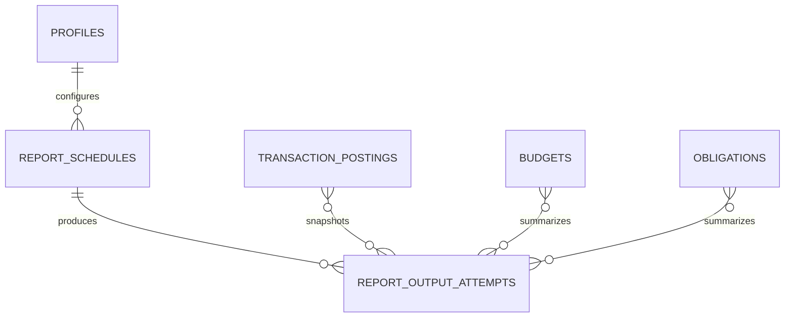

The last three links are logical snapshot dependencies recorded by ledger/version
and evidence IDs, not direct many-to-many foreign-key tables.

#### RLS and Authorization

- Owners CRUD schedules and read own attempt status/download. Snapshot and provider
  delivery fields are private; safe API DTO exposes report content/status only.
- Admin analytics requires exact analytics/report permissions and returns
  aggregated/minimized results; user-level report access requires a separately
  authorized support grant and audit.
- Signed download URLs require owner/recent auth for sensitive exports and expire
  in minutes. Email recipient changes require verification/recent auth.

#### APIs and Contracts

| Route | Request | Response |
|---|---|---|
| `GET /api/v1/dashboard/home?period` | owner | one payload with balances, income/expense, budget/obligation/savings summary, recent items, ledgerVersion |
| `GET /api/v1/reports/summary?type&period` | validated report/period | versioned aggregate/evidence metadata |
| `POST /api/v1/reports` | key; `{type,periodStart,periodEnd,format:'json'|'csv'|'pdf',delivery:'download'|'email',recipient?}` | `202 {attemptId,status}` |
| `GET /api/v1/reports/:attemptId` | owner | status, summary metadata, safe error, download URL only when ready |
| `GET/POST/PATCH/DELETE /api/v1/report-schedules...` | schedule contract + expectedVersion | schedule/`204` |
| `POST /api/v1/reports/:id/retry-delivery` | key; owner/recent auth | new attempt state, no duplicate generation when snapshot reusable |
| Admin analytics/export routes | bounded filters, no arbitrary SQL/dataset | aggregate pages or async job IDs |

#### Views, Functions, Jobs, Events, and Business Rules

- Owned `security_invoker` views: `v_monthly_financial_summary` and
  `v_category_spending_summary`. Spec 005 owns account balance summary; Spec 007
  owns salary/budget/obligation views.
- `private.capture_report_snapshot(user,type,period,ledger_version)` reads a
  repeatable-read consistent version and stores immutable JSON with schemaVersion,
  generatedAt, evidence/ledger versions.
- Jobs: `report.generate`, `report.email.deliver`, `report.schedule.enqueue`,
  `report.output.expire`, and `analytics.refresh` only for approved materialized
  views after measurement.
- Events: `report.requested/ready/delivery_succeeded/delivery_failed/expired`,
  `export.ready`.
- Initial email transport is deployment-supplied SMTP over required TLS with
  runtime secrets `EMAIL_SMTP_HOST`, `EMAIL_SMTP_PORT`, `EMAIL_SMTP_USERNAME`,
  `EMAIL_SMTP_PASSWORD`, and `EMAIL_FROM`; there is no secondary transport fallback.
  It uses an idempotency key, verified sender, no sensitive subject detail, minimal
  body, private expiring link, and SMTP `Message-ID`. `delivered` means the SMTP
  server accepted the message, not inbox receipt. Any configured delivery-status
  webhook must use the global signed, replay-safe provider webhook policy.
- Reports query postings/versioned planning projections; dashboard cache cannot
  become truth. Output retries do not create different financial snapshots unless
  user explicitly requests regeneration.

#### Security, Performance, Caching, and Clients

- Prevent CSV formula injection, HTML/template injection, unauthorized period/
  user selection, signed-URL leakage, oversized exports, recipient enumeration,
  provider webhook spoofing, and log content leakage.
- Home cache key/TTL and report cache key/TTL follow Section 8. User/ledgerVersion
  isolation is mandatory. Historical immutable snapshot may be reused until
  expiry. No shared user report cache.
- Home P95 400/P99 800 ms <=250 KB; cached summary 800/1500 ms <=300 KB; expensive
  report returns 202 <=300 ms and runs bounded/streamed in worker.
- Replaces Mobile reports service/repository/schedules/output mocks and Admin
  overview analytics/export fixtures. Recipient syntax-only simulation becomes
  actual verified delivery status. Mobile stores encrypted summaries/download
  metadata, not long-lived signed URLs.

#### Tests, Migration, Rollback, and Observability

- Ledger/planning golden reports, timezone/month boundaries, empty/large data,
  owner/nonowner/Admin, snapshot consistency during concurrent mutation, CSV/PDF
  safety, signed URL expiry, SMTP TLS/auth/accept/reject/timeout/retry,
  idempotent `Message-ID`, configured status-webhook signature/replay, schedule
  DST/idempotency, cache invalidation, and query-plan/load tests.
- Create views then schedule/attempt tables/jobs/RLS. Shadow compare all current
  mock dashboard/report calculations across representative fixture data before
  adapter switch. Rollback disables schedules/delivery, preserves snapshots, and
  serves previous client adapter; generated files expire normally.
- Metrics: dashboard/view/query latency, cache hit/staleness, report queue/generate/
  size/failure, delivery latency/bounce/retry, signed URL issuance, schedule lag,
  aggregate reconciliation, and provider status. Alert on backlog/failures/drift.

#### Acceptance Criteria and Definition of Done

- Home/report data reconciles to ledger/planning at recorded version; large work
  is async and bounded; downloads/email are private/idempotent; complete schemas,
  views/contracts, RLS, jobs/events, mocks, tests, query plans/budgets, migration/
  shadow/rollback, metrics/alerts, and provider runbook pass.

### Phase 11 - SPEC-BE-011: Notifications, Support & Content

#### Objective and Scope

Implement in-app/push notification delivery and preferences, bounded campaigns,
support tickets/messages/internal notes/attachments, product feedback and abuse
reports, and localized help/content publishing. This phase replaces the current
simulated communication surfaces without exposing financial data on lock screens
or internal support context to customers.

#### Dependencies

- Specs 001-003 for worker/Storage, profiles/devices/push tokens, RBAC/audit,
  support access, file security, and outbox.
- Domain Specs 005-010 and 012 publish events; this Spec owns notification
  rendering/delivery, not their business events.

#### Owned Database Tables

| Table | Complete columns | Keys, constraints, indexes, defaults |
|---|---|---|
| `public.notification_events` | `M+U`; `type text`; `title text`; `body_safe text`; `data jsonb='{}'`; `read_at timestamptz?`; `acted_at timestamptz?`; `expires_at timestamptz?` | bounded title/body/data; expiry>created; indexes user/read/time partial unread, user/type/time, expires |
| `public.notification_preferences` | `M+U`; `channel text`; `event_type text`; `enabled boolean=true`; `quiet_hours jsonb='{}'` | channel `in_app/push/email`; validated quiet-hours/timezone; UQ user/channel/event; user/channel index |
| `public.notification_templates` | `M`; `key text`; `locale text`; `channel text`; `template_version int`; `subject text?`; `body text`; `status text='draft'`; `published_at timestamptz?`; `created_by text FK admin_profiles` | locale `ar/en`; channel supported; version>0; status `draft/testing/published/retired`; UQ key/locale/channel/version; published index |
| `public.notification_campaigns` | `M`; `name text`; `audience_definition jsonb`; `template_id uuid FK notification_templates`; `status text='draft'`; `scheduled_at timestamptz?`; `created_by text FK admin_profiles`; `approved_by text?` | status `draft/approved/scheduled/running/paused/completed/cancelled`; validated bounded audience; status/schedule index |
| `private.notification_deliveries` | `I`; `event_id uuid? FK notification_events`; `campaign_id uuid? FK notification_campaigns`; `user_id text FK profiles`; `channel text`; `provider text`; `status text='queued'`; `attempt_count int=0`; `provider_ref text?`; `delivered_at timestamptz?`; `error_code text?`; `next_attempt_at timestamptz?` | exactly one event/campaign source; attempts>=0; status `queued/sending/delivered/failed/suppressed`; UQ source/user/channel; status/time and user/time indexes |
| `public.support_categories` | `M`; `key text UQ`; `name text`; `sort_order int=0`; `active boolean=true` | key lowercase; active/sort index |
| `public.support_tickets` | `M+U`; `category_id uuid FK support_categories`; `subject text`; `status text='open'`; `priority text='normal'`; `assigned_admin_id text? FK admin_profiles`; `last_message_at timestamptz=now()`; `closed_at timestamptz?` | status `open/waiting_customer/waiting_support/resolved/closed`; priority `low/normal/high/urgent`; user/status/time, assigned/status indexes |
| `public.support_messages` | `I`; `ticket_id uuid FK support_tickets cascade`; `sender_id text`; `sender_type text`; `body text`; `created_at=now()` | sender `customer/admin/system`; bounded body; ticket/time index; sender ownership validated by trigger/API |
| `private.support_internal_notes` | `I`; `ticket_id uuid FK support_tickets cascade`; `admin_id text FK admin_profiles`; `body text`; `created_at=now()` | bounded body; ticket/time index; no customer grant |
| `private.support_attachments` | `I`; `message_id uuid FK support_messages cascade`; `storage_ref text UQ`; `filename_safe text`; `content_type text`; `size_bytes bigint`; `scan_status text='pending'`; `scanned_at timestamptz?` | size 1..configured max; status `pending/clean/rejected/failed`; message/status index |
| `public.feedback_items` | `M+U`; `type text`; `subject text?`; `body text`; `status text='new'`; `assigned_admin_id text? FK admin_profiles` | type `bug/idea/experience/other`; status `new/reviewing/planned/resolved/closed`; user/time, status/time indexes |
| `public.abuse_reports` | `M`; `reporter_id text FK profiles`; `resource_type text`; `resource_id text`; `reason text`; `status text='open'`; `reviewed_by text? FK admin_profiles`; `reviewed_at timestamptz?` | status `open/reviewing/actioned/dismissed`; UQ active reporter/resource; status/time index |
| `public.content_items` | `M`; `key text UQ`; `type text`; `status text='draft'`; `published_at timestamptz?`; `created_by text FK admin_profiles` | type `article/faq/policy/announcement`; status `draft/review/published/retired`; type/status index |
| `public.content_translations` | `M`; `content_id uuid FK content_items cascade`; `locale text`; `title text`; `body text` | locale `ar/en`; UQ content/locale; published content lookup index |

#### Dedicated ERD

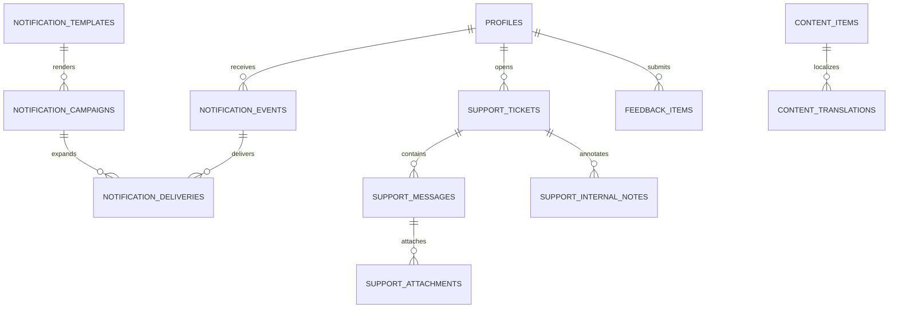

#### RLS and Authorization

- Users read/update own notification read/action state and preferences; event
  creation/delivery state is server-only.
- Users CRUD messages/attachments only within own open ticket and cannot choose
  sender type/admin assignment/status. Internal notes are never in customer RLS,
  views, API DTOs, exports without explicit privacy rule, or Realtime channels.
- Published content/categories are authenticated-readable; Admin changes require
  `communications.*`, `support.*`, or `content.*` permissions and audit.
- Campaign approval is separate from creation; creator cannot self-approve when
  audience exceeds configured threshold.

#### APIs and Contracts

| Route group | Contracts |
|---|---|
| Notifications | list cursor/type/unread; detail; `POST /notifications/:id/read`; action `{actionKey,expectedVersion}`; preferences get/put complete matrix |
| Support | categories; ticket CRUD/list/detail; message create `{body,attachmentUploadIds[]}`; attachment signed upload/finalize; close/reopen rules |
| Content | published list/detail/search by locale/type; no draft content to customer |
| Feedback | create/list/detail own feedback; abuse report create/status |
| Admin communications | template/version/test/publish; campaign create/preview/approve/schedule/pause/cancel; delivery page/retry |
| Admin support/content | ticket assignment/status/reply/internal-note; feedback/abuse workflow; content translation/publish/retire |

Notification item response is `{id,type,title,body,dataSafe,readAt,actedAt,
expiresAt,actions[]}`. Push payload contains only event ID, safe title/body, and
route key; the client fetches protected details after authentication.

Request contracts use DTO allowlists, resource versions, idempotency on delivery/
state-changing retries, server-generated attachment keys, and bounded campaign
audience definitions. Response contracts return owner-safe notification/ticket/
content resources, cursor metadata, safe delivery status/error codes, and signed
upload/download instructions only; internal notes, provider payloads, token
ciphertext, audience SQL, and scan internals are never returned.

#### Functions, Jobs, Events, and Business Rules

- `private.create_notification_event(user,type,data)` selects published template,
  enforces preference/quiet-hours policy, renders allowlisted variables, and
  creates event/delivery idempotently.
- `private.assert_ticket_participant(ticket_id,actor)` and attachment finalize
  function validate ownership, scan state, object key, hash, and size.
- Jobs: `notification.dispatch`, `notification.delivery.retry`,
  `notification.campaign.expand`, `notification.expire`,
  `support-attachment.scan`, and `content.publish.schedule` only if current Admin
  contract includes scheduling; otherwise publishing is immediate approved action.
- Events: `notification.delivered/failed/read/acted`, `support.ticket_opened/
  message_added/status_changed`, `content.published/retired`, `feedback.received`.
- Delivery is at least once with UQ source/user/channel. Quiet hours suppress or
  defer push, never in-app storage. Sensitive domain amounts/details are omitted
  from push/lock-screen content.
- Ticket state transitions are explicit; customer reply moves waiting-customer to
  waiting-support and Admin reply does the reverse unless resolved.

#### Security, Performance, Caching, and Clients

- Template output is context-encoded/sanitized; variable allowlist prevents stored
  XSS/header injection. Campaign audience is bounded, previewed, authorized, rate
  limited, and cannot be arbitrary SQL.
- Upload pipeline follows Section 3.3; filename is display metadata only; object
  keys are server-generated; rejected files are deleted.
- Content/reference cache is locale/version keyed (5 minutes); notifications,
  tickets, notes, deliveries are private/no shared cache. Realtime sends safe
  invalidation/event IDs only.
- Notification/ticket lists P95 <=400 ms; campaign expansion async/batched; push
  provider outage does not block domain transaction.
- Replaces Mobile notification mock/platform, preferences/actions, support service,
  hardcoded articles, ticket/message mocks, and Admin communication/support/content
  handlers including current no-op behavior.

#### Tests, Migration, Rollback, and Observability

- Preferences/quiet hours/timezones, template locale/escaping, dedupe/retry,
  provider failure, campaign preview/approval/bounds/pause, lock-screen redaction,
  ticket participant/state/internal-note isolation, upload attack/scan, content
  draft/publish, RLS/BOLA/BFLA, Realtime safety, and contract tests.
- Create templates/preferences/events before delivery/jobs; support/content roots
  before dependents; seed categories/content/templates as reviewed deterministic
  data. Shadow delivery records without sending, then limited internal cohort,
  then production. Rollback disables dispatch/campaign jobs but preserves events,
  tickets, and content; pending delivery is replayable.
- Metrics: event/delivery queue, success/failure/retry/suppression, provider latency,
  unread/action, campaign expansion, ticket response/age/status, attachment scan,
  content cache, and permission denials. Alert on provider/backlog/scan failure.

#### Acceptance Criteria and Definition of Done

- Safe notifications, real support/content workflows, internal-note isolation,
  secure attachments, bounded campaigns, all contracts/schema/RLS/jobs/events/
  mocks/tests/performance/cache/migration/rollback/metrics/alerts and provider
  runbook pass.

### Phase 12 - SPEC-BE-012: Stripe Billing, Plans & Entitlements

#### Objective and Scope

Implement Stripe-backed plan catalog, prices, customer/subscription lifecycle,
idempotent operations, signed event inbox, payment/failure history, promotions,
server-derived entitlements, and reconciliation. Billing availability remains
isolated from deterministic personal-finance functionality.

#### Dependencies

- Specs 001-003 for secrets/worker, identity, recent auth/MFA, RBAC/audit.
- Spec 009 consumes entitlements/AI quotas; Spec 011 may send billing
  notifications; this Spec owns billing events and state.

#### Owned Database Tables

| Table | Complete columns | Keys, constraints, indexes, defaults |
|---|---|---|
| `public.subscription_plans` | `M`; `key text UQ`; `name text`; `features jsonb`; `status text='active'`; `sort_order int=0` | status `draft/active/retired`; validated entitlement schema; status/sort index |
| `public.subscription_prices` | `M`; `plan_id uuid FK subscription_plans`; `provider text='stripe'`; `provider_price_id text UQ`; `currency_code char(3) FK currencies`; `amount_minor bigint`; `interval text`; `active boolean=true` | amount>=0; interval `month/year/one_time`; plan/active/currency index |
| `public.billing_customers` | `user_id text PK/FK profiles`; `provider text='stripe'`; `provider_customer_id text UQ`; `created_at=now()`; `updated_at=now()`; `version=1` | provider `stripe`; no client write |
| `public.user_subscriptions` | `M+U`; `price_id uuid FK subscription_prices`; `provider_subscription_id text UQ`; `status text`; `current_period_start timestamptz`; `current_period_end timestamptz`; `cancel_at_period_end boolean=false`; `ended_at timestamptz?` | status `incomplete/trialing/active/past_due/canceled/unpaid/paused`; period valid; user/status index |
| `private.subscription_operations` | `I`; `subscription_id uuid? FK user_subscriptions`; `user_id text FK profiles`; `operation_id uuid UQ`; `type text`; `requested_by text`; `status text='requested'`; `effective_at timestamptz?`; `error_code text?`; `provider_ref text?` | type `create/change/cancel/resume`; status `requested/processing/succeeded/failed`; user/time, status/time indexes |
| `private.stripe_webhook_events` | `I`; `provider_event_id text UQ`; `event_type text`; `payload_hash text`; `payload jsonb`; `signature_verified_at timestamptz`; `status text='received'`; `attempt_count int=0`; `processed_at timestamptz?`; `last_error_code text?` | status `received/processing/processed/failed`; attempts>=0; status/time, event-type/time indexes; payload retention/redaction policy |
| `public.payment_events` | `I+U`; `subscription_id uuid? FK user_subscriptions`; `provider_event_id text FK private.stripe_webhook_events(provider_event_id)`; `type text`; `amount_minor bigint`; `currency_code char(3) FK currencies`; `status text`; `occurred_at timestamptz` | amount>=0; type/status allowlists; UQ provider event/type; user/time, subscription/time indexes |
| `private.payment_failures` | `M`; `payment_event_id uuid FK payment_events`; `failure_code text`; `decline_category text?`; `retryable boolean=false`; `next_retry_at timestamptz?`; `resolved_at timestamptz?` | UQ active payment failure; retry/time index |
| `public.promotional_codes` | `M`; `code_hash text UQ`; `discount_type text`; `discount_value numeric(18,4)`; `starts_at timestamptz`; `ends_at timestamptz?`; `max_redemptions int?`; `active boolean=true` | type `percent/fixed`; percent 0<value<=100; fixed>0; end>start; max>0; active/time index |
| `public.promotion_redemptions` | `I+U`; `promotion_id uuid FK promotional_codes`; `subscription_id uuid? FK user_subscriptions`; `redeemed_at=now()` | UQ promotion/user; user/time index |
| `private.billing_reconciliations` | `I`; `period_start timestamptz`; `period_end timestamptz`; `provider_count int`; `local_count int`; `difference_count int`; `status text`; `details_ref text?`; `completed_at timestamptz?` | valid period/counts>=0; status `running/matched/differences/failed`; status/time index |

#### Dedicated ERD

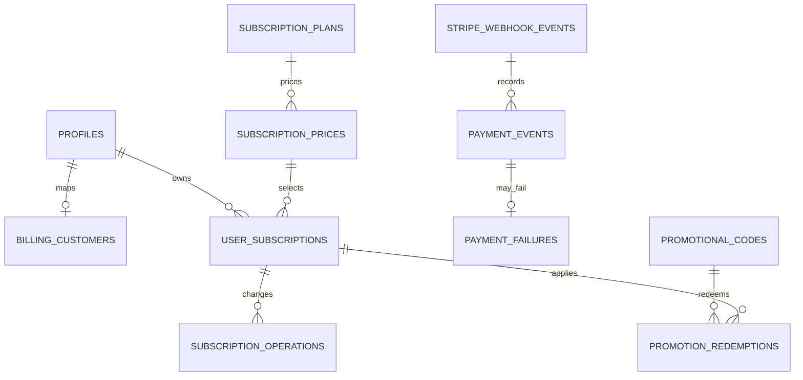

#### RLS and Authorization

- Users read active plan/price catalog and own customer-masked subscription,
  payment, operation, redemption, and entitlement projections. No direct writes.
- Stripe inbox/failures/reconciliation are private. Raw provider payload never
  reaches clients and is retained only as approved.
- Billing mutation requires active user, exact owner, recent auth for cancel/
  change where policy demands, idempotency, and server-selected provider IDs.
- Admin billing routes require `billing.*`, MFA for manual retry/correction, and
  immutable audit. No Admin can grant entitlement by editing client-visible state.

#### APIs and Contracts

| Route | Request | Response |
|---|---|---|
| `GET /api/v1/billing/plans` | locale/currency | active plans/prices/features, version/ETag |
| `GET /api/v1/billing/subscription` | owner | current subscription/status/period/cancel flag/entitlements/operation status |
| `POST /api/v1/billing/checkout-session` | key; `{priceId,promotionCode?}` | approved Stripe checkout URL/session expiry; no arbitrary return URL |
| `POST /api/v1/billing/subscription/change` | key/recent auth; `{priceId,expectedVersion}` | `202 operation` |
| `POST /api/v1/billing/subscription/cancel` | key/recent auth; `{atPeriodEnd:boolean,expectedVersion}` | `202 operation` |
| `POST /api/v1/billing/subscription/resume` | key/recent auth; `{expectedVersion}` | `202 operation` |
| `GET /api/v1/billing/payments` | cursor/status | masked payment/failure page |
| `POST /webhooks/stripe` | raw signed Stripe event | `202` after signature/replay/schema/inbox persistence |
| Admin billing routes | plan/price read; subscription/payment/failure/event/reconciliation read; permitted retry/reconcile actions | bounded redacted resources |

#### Functions, Jobs, Events, and Business Rules

- `private.current_entitlements(user_id,at)` derives features from verified active/
  trial subscription and plan version; it never trusts Mobile/Admin claims.
- `private.apply_stripe_event(event_id)` locks inbox/customer/subscription, applies
  monotonic provider state, writes payment/operation/audit/outbox atomically.
- Jobs: `stripe.webhook.process`, `billing.operation.execute`,
  `billing.payment.retry` only according to Stripe/provider policy,
  `billing.reconcile`, and `billing.promotion.expire`.
- Events: `billing.customer_created`, `subscription.created/changed/cancelled/
  status_changed`, `payment.succeeded/failed`, `billing.reconciliation_failed`.
- Stripe event is authoritative for final subscription/payment status. API command
  creates an operation; it does not mark entitlement active before verified event.
- Provider event ID is unique and replay safe. Out-of-order events compare provider
  object/event timestamps and do not regress terminal/newer state.
- Promotion code plaintext is normalized/hashed for lookup and never returned.

#### Security, Performance, Caching, and Clients

- Verify raw body Stripe signature/tolerance/secret rotation, event schema/account,
  safe URLs, operation idempotency, amount/currency/price allowlists, SSRF, provider
  timeout, and webhook/body/log redaction. No card/payment credentials stored.
- Plan catalog may cache 5 minutes/versioned. Entitlement can use request-scoped or
  very short user/version cache invalidated by billing events; permission-critical
  checks fail closed to DB when cache uncertain.
- Billing query P95 <=400 ms; operation acceptance <=300 ms; provider work async.
  Circuit breaker/outage cannot block core finance APIs.
- Replaces Mobile subscription/settings mocks and Admin revenue/billing fixtures/
  handlers. `stripe_mock` is removed only after signed sandbox E2E and Spec 014.

#### Tests, Migration, Rollback, and Observability

- Catalog/version/currency, checkout URL, customer uniqueness, command replay,
  valid/invalid/replayed/out-of-order webhooks, lifecycle transitions, entitlement
  derivation, promotion bounds, payment failures/retries, provider outage, RLS/
  Admin permissions/MFA, reconciliation, cache invalidation, and contract tests.
- Create catalog/customer/subscription before operations/inbox/payment/failure/
  promotion/reconciliation. Seed approved plans/prices from Stripe IDs per
  environment; never copy production IDs to local. Shadow webhook/reconciliation
  in Stripe test mode before cutover. Rollback disables commands/worker, preserves
  inbox/state, replays after fix, and never fabricates entitlement.
- Metrics/alerts: webhook age/signature/failure/replay, operation latency/failure,
  subscription states, payment failure/retry, entitlement cache, provider latency/
  circuit, reconciliation difference, and anomalous promotion use.

#### Acceptance Criteria and Definition of Done

- Stripe is the verified status source; entitlement cannot be client/Admin forged;
  webhooks/operations are idempotent/reconcilable; provider outage is isolated;
  all schema/RLS/contracts/jobs/events/mocks/tests/performance/cache/migration/
  rollback/metrics/alerts and billing runbook pass.

### Phase 13 - SPEC-BE-013: Performance, Caching, Observability & Operations

#### Objective and Scope

Harden the whole backend against production data/load and provide operational job
inventory, provider health, system incidents, settings, feature flags,
maintenance, performance/caching governance, alerts, backup/restore, RPO/RTO,
disaster recovery, capacity tests, and operational Admin surfaces. Domain job
behavior remains owned by its domain Spec; this Spec owns scheduling/visibility.

#### Dependencies

- Spec 001 begins instrumentation; Specs 002-012 expose owned metrics/jobs/events
  and satisfy their local budgets. This phase validates them together.
- Spec 014 consumes release evidence and runbooks.

#### Owned Database Tables

| Table | Complete columns | Keys, constraints, indexes, defaults |
|---|---|---|
| `private.scheduled_jobs` | `M`; `key text UQ`; `owner_spec smallint`; `job_type text`; `schedule text?`; `enabled boolean=true`; `timeout_seconds int`; `max_attempts int`; `configuration jsonb='{}'` | owner 1..14; timeout 1..86400; attempts 1..20; validated cron/config; enabled/type index |
| `private.job_runs` | `I`; `scheduled_job_id uuid? FK scheduled_jobs`; `job_type text`; `owner_spec smallint`; `status text='queued'`; `queued_at=now()`; `started_at timestamptz?`; `completed_at timestamptz?`; `correlation_id text`; `result_summary jsonb='{}'` | status `queued/running/succeeded/failed/cancelled/dead_letter`; indexes status/queued, job/time, correlation |
| `private.job_attempts` | `I`; `job_run_id uuid FK job_runs cascade`; `attempt_no int`; `worker_id text`; `status text`; `started_at`; `completed_at?`; `error_code?`; `next_attempt_at?` | attempt>0; status `running/succeeded/failed`; UQ run/attempt; retry/time index |
| `private.provider_health_checks` | `I`; `provider text`; `check_type text`; `status text`; `latency_ms int`; `checked_at=now()`; `error_code text?` | status `up/degraded/down/unknown`; latency>=0; provider/time, status/time indexes |
| `private.system_incidents` | `M`; `title text`; `severity text`; `status text='open'`; `started_at timestamptz`; `resolved_at timestamptz?`; `public_summary text?`; `owner_id text? FK admin_profiles` | severity standard; status `open/investigating/monitoring/resolved`; status/severity/time index |
| `private.system_settings` | `M`; `key text UQ`; `value jsonb`; `sensitivity text='internal'`; `updated_by text FK admin_profiles` | sensitivity `public/internal/restricted`; restricted never API-exposed; JSON schema by key |
| `private.feature_flags` | `M`; `key text UQ`; `description text`; `default_enabled boolean=false`; `status text='active'` | status `draft/active/retired`; active index; security-invariant denylist |
| `private.feature_flag_rules` | `M`; `flag_id uuid FK feature_flags cascade`; `priority int`; `audience jsonb`; `enabled boolean=true` | priority>=0; validated bounded audience; UQ flag/priority; flag/enabled/priority index |
| `private.maintenance_windows` | `M`; `starts_at timestamptz`; `ends_at timestamptz`; `scope text`; `message text`; `status text='scheduled'`; `created_by text FK admin_profiles` | end>start; status `scheduled/active/completed/cancelled`; status/time index |

#### Dedicated ERD

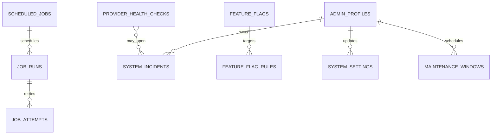

#### RLS and Authorization

- All owned tables are private/API-only. Operations reads require `operations.*`;
  job retry/cancel, settings/flags, maintenance, incident changes, backup/restore,
  and DR actions require exact permissions, recent MFA, reason, and audit.
- Feature flag/settings values cannot contain secrets and cannot weaken auth,
  authorization, RLS, audit, idempotency, financial integrity, webhook validation,
  encryption, or release gates.
- Public maintenance status is a safe derived response only; internal incident,
  provider, capacity, and backup details never leak.

#### APIs and Contracts

| Route group | Contracts |
|---|---|
| Operations | health summary, providers, incidents, queues, workers, job runs/attempts with cursor/filter; retry/cancel only when owning job declares operation safe |
| Settings | key/schema/version list and patch `{value,expectedVersion,reason}`; restricted values redacted |
| Feature flags | flag/rule CRUD, evaluation preview for synthetic context, activate/retire; clients receive only approved resolved flags |
| Maintenance | list/create/update/cancel/activate with time/scope/message/version |
| Performance | read-only endpoint/query/cache/queue/sync/provider P50/P95/P99 dashboards and budget status |
| Recovery | backup status and restore-drill evidence metadata; no backup contents/download through Admin API |

No endpoint runs arbitrary SQL, shell command, URL check, migration, backup restore,
or job payload supplied by the client.

Request contracts accept only documented filters, enum actions, expected resource
versions, reason text, and server-known job/setting/flag identifiers. Response
contracts expose redacted status, timestamps, P50/P95/P99 values, bounded series,
safe error codes, evidence references, and cursors; job payloads, secrets, backup
contents, provider responses, internal incident notes, and cache keys are excluded.

#### Functions, Jobs, Events, and Business Rules

- `private.register_job(key,owner_spec,...)` validates exclusive key ownership.
  Domain Specs register definitions; this Spec schedules and records runs.
- `private.evaluate_feature_flag(key,user_context)` uses bounded server-derived
  attributes, deterministic priority, default fallback, and versioned result.
- Owned jobs: `operations.provider-health`, `operations.capacity-evaluate`,
  `operations.cache-invalidate`, `operations.backup-verify`,
  `operations.restore-drill`, `operations.dr-rehearse`,
  `operations.maintenance-activate/complete`, and job-history retention.
- Events: `operations.job_failed/dead_letter`, `operations.provider_degraded`,
  `incident.opened/resolved`, `configuration.changed`,
  `configuration.flag_changed`, `operations.maintenance_started/ended`,
  `operations.backup_verified/restore_drill_failed`.
- Domain jobs retain one owner; operations retry invokes their declared idempotent
  command and records a new attempt, not copied business logic.

#### Performance, Caching, Backup, and Disaster Recovery

- Enforce complete Section 8 cache matrix, index/query-plan evidence, P95/P99,
  payload/timeout/page limits, Mobile aggregates/delta sync, Admin server queries,
  load/stress/recovery, and no unbounded/N+1 rules.
- Redis remains absent until evidence documents failing requirement, measured
  Postgres/in-process/gateway alternative, data/security model, capacity/cost,
  invalidation/HA/rollback, and approval. Adding Redis requires a plan revision.
- Collect endpoint/database/cache/queue/worker/provider/sync/AI/billing/reconcile
  metrics with safe cardinality. Alerts exist before production and carry runbook.
- Production database target RPO <=15 minutes and RTO <=2 hours. Encrypted backup,
  PITR, Storage coverage, quarterly isolated restore, ledger/RLS/file/application
  verification, measured evidence, and owner signoff are mandatory.
- DR runbook covers dependency order, credentials, traffic, DB/Storage restore,
  provider/webhook revalidation, smoke/security tests, reconciliation,
  communication, and return to primary.

#### Security and Client Integration / Replaced Mocks

- Operations surfaces satisfy OWASP access, misconfiguration, supply chain,
  integrity, logging/alerting, and fail-safe exception requirements.
- Admin health/jobs/governance/settings/feature flag/maintenance fixtures and phase
  state handlers switch to read/write operations APIs. Mobile receives only safe
  resolved flags/maintenance status through meta/config adapter.
- No client receives internal metrics, provider errors, job payloads, settings,
  incident notes, backup details, or cache keys.

#### Tests, Migration, Rollback, and Observability

- Job registration/ownership, schedule/timezone, concurrent claims, retry/dead
  letter/cancel safety, provider health timeout, incident lifecycle, settings
  schema/version, flag priority/default/security denylist, maintenance, Admin
  permissions/MFA/audit, metrics cardinality, alerts/runbooks, and UI contracts.
- Load/stress/cold-cache/invalidation/large-data/query-plan/sync/financial
  concurrency/report/queue recovery tests; image and dependency scans.
- Backup corruption/restore/PITR/RPO/RTO/Storage, application image rollback,
  expand-migrate-contract, worker/webhook replay, and full reconciliation drills.
- Create operational tables after foundation and register existing domain jobs
  idempotently. Settings/flags default fail-safe. Rollback disables new scheduler/
  UI, keeps run/incident/evidence history, and domain workers continue own queues.
- This Spec owns the aggregate observability dashboards and alerts; domain Specs
  retain their metric definitions. Alert delivery itself uses Spec 011.

#### Acceptance Criteria and Definition of Done

- All global budgets and query plans pass on production-like scale; alerts fire
  and route to runbooks; job ownership is unique; no unsafe flag/setting/operation;
  backup/restore/DR meet RPO/RTO; no Redis without approved evidence; all schema/
  RLS/APIs/jobs/events/mocks/tests/migration/rollback/observability artifacts pass.

### Phase 14 - SPEC-BE-014: Client Cutover, Mock Migration & Production Readiness

#### Objective and Scope

Move existing Mobile/Admin repository/service boundaries from mocks to the live
backend one domain at a time, prove contract parity, preserve Mobile SQLite,
remove production mock fallback, rehearse migrations/rollback/recovery, and
assemble release evidence. This phase deliberately creates no server feature,
table, endpoint, function, job, or event.

#### Dependencies

- Specs 001-013 accepted with live adapters available behind current interfaces.
- Current Mobile/Admin tests, fixtures, Zod schemas, repository contracts, and
  explicit demo mode remain reference inputs.

#### Owned Database Tables and Persistent Objects

- None. Creating a cutover/shadow/mapping table is forbidden; deployment state is
  configuration/version control and evidence is retained in CI/release artifacts.
- Existing domain tables remain owned by Specs 001-013. Cutover scripts call public
  APIs or approved migrations and never write domain tables ad hoc.

| Table design | Complete columns, types, keys, constraints, indexes, defaults, and nullability |
|---|---|
| None | Not applicable: this Spec owns no table and must not create persistent cutover state. |

#### Dedicated ERD

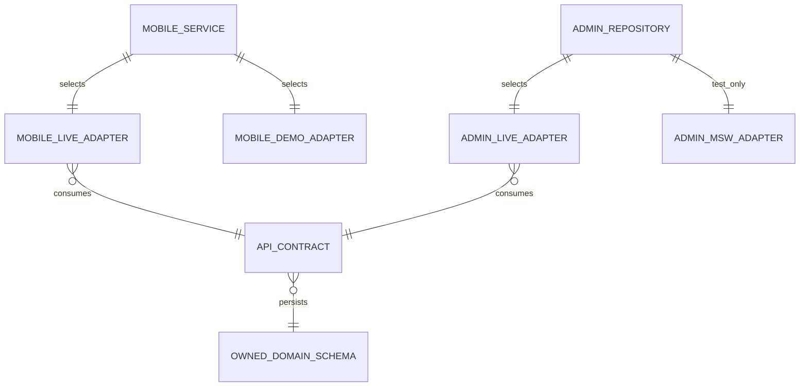

These entities are contract boundaries, not new database tables.

#### RLS and Authorization Verification

- No new policy. Re-run the complete 122-table owner/nonowner/Admin/worker RLS and
  grant matrix against the release candidate.
- Verify production Mobile/Admin use Clerk tokens only, no client role/service key,
  Admin exact permissions, recent-auth/MFA, support grants, and safe Realtime.
- Production configuration with missing/invalid auth/API/mock values fails closed.

#### APIs and Request/Response Contracts

- Owns no endpoint or DTO. It runs parity against every endpoint/DTO owned by
  Specs 001-013 and current Mobile service/Admin repository contracts.
- Contract manifest records client call, live endpoint, request mapper, response
  mapper, error mapping, pagination/sync behavior, mock source, test evidence, and
  cutover/rollback switch.
- Unknown fields/states/errors are explicit adapter failures; no silent fallback,
  discarded financial field, fabricated response, or client-side calculation.

#### Client and Mock Cutover Matrix

| Cutover wave | Mobile/Admin sources replaced | Owning live Specs | Required evidence |
|---|---|---|---|
| 1 Identity | auth/app shell/preferences/settings; Admin user/device/access | 002-003 | Clerk/RLS/session/RBAC/security E2E |
| 2 Reference/accounts | core finance seeds/accounts/categories | 004 | reference/version/account parity |
| 3 Ledger/sync | transactions/filter/delete/undo/demo data/offline conflicts | 005-006 | ledger/concurrency/delta/offline no-loss |
| 4 Planning | salary/budgets/obligations/payments/savings | 007 | projection and field parity |
| 5 Tracking | tracking fixtures/keywords/history/import/parser Admin handlers | 008 | corpus/dedupe/review/retention parity |
| 6 Voice/AI | voice analyzer/fixtures, assistant service, Admin AI handlers | 009 | evaluation/ZDR/proposal/confirmation safety |
| 7 Reports | report repository/schedules/recipient simulation/Admin analytics | 010 | shadow aggregates/export/email delivery |
| 8 Engagement | notifications/support/articles/Admin communication handlers | 011 | delivery/ticket/content/internal-note isolation |
| 9 Billing | subscription/settings and Admin billing/Stripe mocks | 012 | signed sandbox webhook/entitlement/reconcile |
| 10 Operations | Admin health/jobs/governance/settings/flags | 013 | metrics/alerts/job/flag/DR UI parity |

Production rules:

- Mobile selects `live`, `demo`, or test adapter explicitly at build/runtime policy;
  production cannot select demo.
- Admin MSW is test/development only, fails the production build when enabled, and
  `onUnhandledRequest` fails rather than bypassing to an unexpected network path.
- Every wave starts read shadow comparison, then internal cohort, then bounded
  write cohort, then full traffic, with rollback switch and observation window.
- Old mocks remain for deterministic tests/demo until parity; production imports
  are removed after each accepted wave.

#### Functions, Jobs, Events, and Business Rules

- None owned. Cutover automation invokes CI/deployment commands and domain-owned
  APIs/jobs only. It cannot invent a generic migration or replay event.
- Mobile local drafts, PIN/biometric material, temporary view state, and device-only
  preferences stay local. Sensitive SQLite data remains encrypted.
- Existing local records upload via Spec 006 envelopes. Invalid legacy `REAL`
  money, missing category/payment method, or incompatible data enters explicit
  user/review error; no silent rounding/drop/default transaction.
- A wave rolls back on security, financial integrity, contract, data loss,
  performance, provider, or observability gate failure.

#### Security, Performance, Caching, and Operations

- Run complete OWASP ASVS/API/MASVS traceability and release-blocking gates from
  Section 6. Zero exploitable Critical/High findings.
- Verify P95/P99/payload/query/cache/sync/queue/provider/AI/billing budgets and no
  unbounded/N+1 query on release candidate data.
- Verify secrets absent from bundles/images/logs, production mocks/debug disabled,
  signed webhooks, AI ZDR/allowlist, Stripe entitlements, encrypted Mobile local
  data, RLS, audit, and fail-closed errors.
- Rehearse N-1 app rollback, migration failure/forward fix, worker/webhook replay,
  backup restore/DR RPO/RTO, Storage, and ledger/billing/report reconciliation.

#### Tests

- Contract snapshot/schema diff for every endpoint and client mapper.
- Mobile unit/integration/E2E for online/offline/bootstrap/delta/retry/conflict/
  background refresh/data preservation and every current domain workflow.
- Admin unit/integration/Playwright for all 101 current pages/routes, role matrix,
  server pagination/filter/search/export, errors/loading/empty states, and mock-off
  production mode.
- Domain E2E, OWASP/security, concurrency, load/stress, provider outage, migration,
  rollback, restore/DR, reconciliation, and smoke tests from Specs 001-013.
- Bundle/static scan for mock imports, test utilities, provider/service secrets,
  unsafe URLs, and direct OpenRouter/Supabase service-role/Stripe calls.

#### Migration, Rollback, and Observability

- No schema migration owned. Maintain a versioned cutover checklist and adapter
  configuration per wave. Backfill/upload is domain-owned and resumable.
- Shadow comparisons record counts/hashes/differences without PII. Financial
  differences stop the wave; they are never accepted through tolerance.
- Rollback switches client/server traffic to the last accepted adapter/image while
  preserving newly committed backend data and sync operation IDs. Forward sync
  after rollback must remain idempotent.
- Release dashboard combines every domain's latency/error/queue/provider/sync/
  reconciliation/security metrics, wave cohort/version, and rollback indicators.

#### Acceptance Criteria and Definition of Done

- All ten waves pass contract and behavior parity with no hidden production mock.
- Mobile SQLite and pending mutations survive; Admin permissions are server-owned;
  all financial/report/billing values reconcile; security/performance/recovery
  gates pass; rollback/DR are demonstrated.
- Contract manifest, mock-removal report, test results, migration/rollback/runbooks,
  OWASP evidence, performance/query plans, provider approvals, RPO/RTO proof,
  observability/alerts, owner signoffs, and final release checklist are complete.

## 14. Compact Ownership Index

### Platform and Trust

#### SPEC-BE-001 - Backend, Docker & Supabase Foundation

Owns NestJS package initialization, module boundaries, OpenAPI/error conventions,
Supabase CLI configuration, SQL migration/test layout, Storage buckets,
outbox/queue/worker primitives, Docker/Compose, CI, secrets, health endpoints,
graceful shutdown, structured logs, and deployment migration jobs.

Acceptance: API and worker images build reproducibly, run non-root, report correct
liveness/readiness, shut down safely, connect to local Supabase, publish OpenAPI,
and pass dependency/image/secret scans without implementing domain features.

#### SPEC-BE-002 - Authentication, Profiles, Preferences & Sessions

Owns one Clerk application for Mobile/Admin, native Clerk-Supabase third-party
auth, JWT verification, profile/preferences/onboarding/device/push data, signed
idempotent Clerk webhooks, session/device visibility, revocation, account
recovery, and Mobile auth contract replacement.

Acceptance: Clerk `sub` ownership works through RLS, webhook replay is harmless,
revoked sessions/devices fail closed, account existence is not disclosed, and
Mobile/Admin authentication contract tests pass.

#### SPEC-BE-003 - Admin RBAC, RLS, Audit & Security Foundation

Owns database RBAC, Admin profiles/invitations/assignments, exact permission
checks, RLS/grants, immutable audit/security events, support access, incidents,
privacy exports/deletion, retention/holds, MFA/reverification, OWASP traceability,
security alerting, and Admin security/privacy contract replacement.

Acceptance: complete owner/nonowner/Admin/worker RLS matrix passes; no client role
header grants access; every privileged mutation audits actor/reason/before/after;
privacy/support workflows require verification and expire safely.

### Financial Source of Truth

#### SPEC-BE-004 - Reference Data, Categories & Accounts

Owns currencies/countries, system and user categories, accounts, exchange-rate
metadata, account ordering/status, opening-balance command contract, reference
seeds, account/category Mobile adapters, and indexed account/category reads.

Acceptance: references seed idempotently, category ownership/system visibility is
correct, opening balance routes to the ledger rather than an account field, and
summary reads meet payload/query budgets.

#### SPEC-BE-005 - Transactions, Ledger, Transfers & Financial Integrity

Owns transaction headers/postings/revisions, balance projection, atomic posting,
same-currency transfers, fees, refunds, reversals, soft delete/undo, deterministic
locks, reconciliation, financial audit/outbox events, and transaction/account
summary endpoints.

Acceptance: all financial invariants and concurrency cases pass; a duplicate or
partial mutation is impossible; historical reports reconcile to postings; P95
mutation budgets pass on production-like data.

#### SPEC-BE-006 - Offline Sync, Idempotency & Conflict Resolution

Owns idempotency storage, client mutations, device/domain cursors, delta sync,
tombstones, bounded batches, retry/replay, optimistic-version conflicts, explicit
money conflict review, and preservation/migration of current Mobile SQLite data.

Acceptance: interrupted sync resumes without loss/duplication, operation replay
returns the original result, cross-device conflicts are deterministic, and no
financial conflict uses Last Write Wins.

### Product Domains and Intelligence

#### SPEC-BE-007 - Financial Planning

Owns salary/cycles, budgets/category budgets, obligations/schedules/payments/
allocations/matches, savings goals/movements, planning projections, alerts, and
planning mock replacement.

Acceptance: planning money links to ledger transactions, duplicate allocations
are constrained, status transitions are validated, and planning summaries
reconcile to source transactions.

#### SPEC-BE-008 - Tracking, Imports, Parsers & Deduplication

Owns normalized ingestion, user tracking preferences/rules, import sessions/items/
attempts/raw retention, institutions/senders, versioned parser/rule/test corpus,
merchant/category rules, unsupported formats, duplicate candidates, review,
history, and feedback.

Acceptance: hostile/oversized imports fail safely, fixture corpus passes, duplicate
decisions are idempotent, source retention expires, and no parser result writes a
confirmed transaction without review policy.

#### SPEC-BE-009 - Voice, OpenRouter AI & Financial Assistant

Owns voice sessions/transcripts/proposals/preferences, assistant consent/
conversation/evidence/action previews/feedback, OpenRouter gateway, approved
model/provider routes, fallbacks, ZDR/privacy, prompt/schema versions, usage/cost,
safety rules, evaluations, quotas, circuit breaker, and AI mock replacement.

Acceptance: clients cannot select/call providers, secrets/raw prompts are absent,
structured schemas pass evaluations, fallbacks preserve privacy, budgets alert/
stop correctly, prompt injection gains no privilege, and AI cannot mutate money
without validated user confirmation.

#### SPEC-BE-010 - Reports, Analytics, Exports & Email Delivery

Owns ledger/planning analytics views, Home/dashboard/report summaries, schedules,
immutable output snapshots, asynchronous exports, private signed downloads,
email delivery attempts, delivery retry/status, and Mobile/Admin report parity.

Acceptance: reports inherit ownership, snapshots record ledger version, large work
is asynchronous/streamed, signed URLs expire, email attempts are idempotent, and
shadow aggregates reconcile to postings within defined latency budgets.

### Engagement and Commercial Operations

#### SPEC-BE-011 - Notifications, Support & Content

Owns notification events/preferences/templates/campaigns/deliveries, push/in-app
actions, support categories/tickets/messages/internal notes/attachments, feedback,
abuse reports, content/translations, secure upload processing, and related mocks.

Acceptance: lock-screen content contains no sensitive finance data, internal notes
never reach customers, campaigns are bounded/authorized, attachment quarantine
works, and retries/deduplication are observable.

#### SPEC-BE-012 - Stripe Billing, Plans & Entitlements

Owns plans/prices/customers/subscriptions/operations, Stripe signed event inbox,
payments/failures/promotions/redemptions, server-derived entitlements, retries,
provider timeouts, reconciliation, and billing mock replacement.

Acceptance: signatures/replay/idempotency pass, clients cannot grant entitlement,
provider/local state reconciles, sensitive actions reverify identity, and Stripe
outage does not affect core finance.

### Hardening and Cutover

#### SPEC-BE-013 - Performance, Caching, Observability & Operations

Owns indexes/query-plan evidence, caching matrix, performance budgets, Mobile
aggregates, Admin server queries, observability/alerts, job/admin operations,
provider health, incidents, settings, feature flags, maintenance, load/stress
testing, capacity thresholds, backup/restore, RPO/RTO, disaster recovery, and
reconciliation dashboards. Redis remains gated by measured evidence.

Acceptance: critical P95/P99, payload, query, sync, cache, queue, and recovery
budgets pass; alerts fire; quarterly-style restore rehearsal meets RPO/RTO; and no
feature flag can weaken authentication, authorization, RLS, audit, or financial
integrity.

#### SPEC-BE-014 - Client Cutover, Mock Migration & Production Readiness

Owns live Mobile/Admin adapters, per-domain mock mapping, contract/OpenAPI parity,
demo/test separation, shadow reads, phased write cutover, production mock removal,
N-1 compatibility, migration/deployment/rollback rehearsals, final security/
performance/recovery gates, runbooks, and launch evidence.

Acceptance: all required domains run live without hidden mock fallback; Mobile
offline data survives; Admin permissions are server-enforced; ledger/reports/
billing reconcile; rollback is demonstrated; and every release-blocking gate in
this document has evidence.

## 15. Dependency and Delivery Order

```text
001
 |-- 002 -- 003
 |          |
 +-- 004 -- 005 -- 006 -- 007
                  |      |
                  +-- 008 -- 009 -- 010
                         |       |
                         +-- 011 -- 012

013 begins with 001 instrumentation and hardens every completed domain.
014 starts adapter preparation early but performs final cutover only after
001-013 satisfy their acceptance gates.
```

- Spec 001 provides queue/outbox/worker primitives so asynchronous domain Specs
  do not wait for Spec 013.
- Spec 003 defines security invariants before protected business domains ship.
- Specs 004-006 establish the financial source of truth before planning,
  tracking, AI, and reports depend on it.
- Specs 013 and 014 are not invitations to postpone performance/security. Their
  controls are applied continuously and provide final system-wide evidence.

## 16. Definition of Done for Every Spec

Every Spec Kit package must contain `spec.md`, `plan.md`, and `tasks.md` under
`apps/api/specs/<number-name>/` when implementation begins, and must include:

- Current Mobile/Admin contract and mock inventory for its domain.
- Scope, exclusions, dependencies, API/RPC/events/jobs, owned tables, and data
  flow.
- Validation, authorization, RLS, privacy, audit, idempotency, error, rate-limit,
  timeout, performance, cache, and failure behavior.
- Migration, seed/backfill, compatibility, rollback, reconciliation, and
  observability requirements.
- Unit, contract, integration, E2E, security, performance, concurrency, and
  recovery tests appropriate to risk.
- OWASP ASVS/API/MASVS traceability entries with implementation and test evidence.
- Explicit acceptance criteria and no unresolved production-critical decision.

No Spec is complete because code exists. It is complete only when its contracts,
financial/security invariants, tests, migrations, observability, operational
runbook, and rollback evidence all pass.
