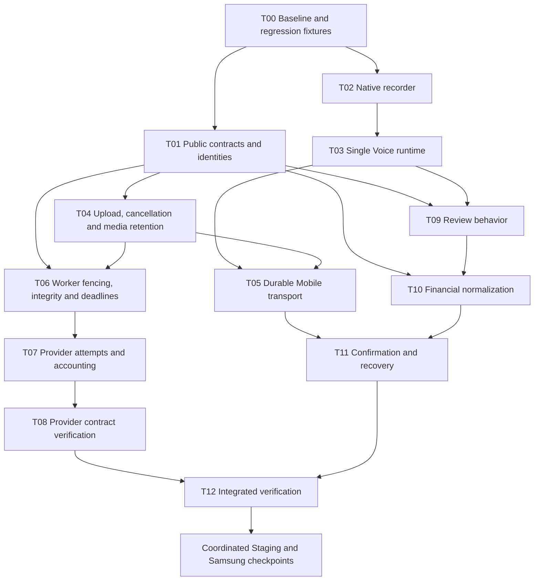

# Masarifi Voice — Independent Review and Master Repair Plan

**Status: implementation and release blocked pending approval.**

**Intended plan file:** `D:\MY Work\0Part_Time\MASREFY _Final\docs\superpowers\plans\2026-10-01-master-voice-repair-plan.md`

**File status:** not created. This chat’s developer-enforced Plan Mode prohibits file writes, including documentation. The complete plan is presented below; saving this exact document is the first action after leaving Plan Mode. Existing handoffs and evidence remain unchanged.

## 1. Executive diagnosis

Voice is **not one provider correction away from reliability**.

The evidence establishes that the previous MIME repair allowed real Samsung recordings to pass upload and Worker media validation. The subsequent Vertex HTTP 400 is real, but its exact rejected request field remains unknown.

Independent source review found additional blockers before and after that boundary:

- The Home interaction explicitly requires a second tap in a common permission path.
- Recording and asynchronous cleanup lack one authoritative owner.
- The native adapter does not fully implement Expo Android’s recording/error contract.
- The real session response does not satisfy Mobile’s strict response schema.
- Upload recovery is recorded too late to survive several ordinary failures.
- Cancel does not cancel accepted server work.
- Worker leases, timeouts, retries and accounting do not describe one bounded operation.
- Valid proposals can become impossible to confirm.
- Confirmation can commit a transaction while Mobile reports failure.

**The underlying components are usable; their coordination is not sufficiently sound.** Retain Expo Audio, Zustand, private Storage, the existing API/Worker, governed OpenRouter routing, SQLCipher and the ledger. Repair ownership, public contracts, durable operation identity and outcome reconciliation. A replacement state framework, new transcription vendor or provider/model switch is unnecessary.

### Evidence boundaries

| Evidence | What it establishes |
|---|---|
| Historical Samsung receipts | Real recordings reached create/upload/process and passed Worker media validation after the MIME fix. |
| Historical provider receipts | Vertex returned HTTP 400 / `INVALID_ARGUMENT`; the specific rejected field was not identified. |
| Historical financial evidence | No successful Voice transcript, proposal or financial confirmation was established by those attempts. |
| Current source inspection | The defects below exist in the reviewed implementation independently of the provider failure. |
| Fresh automated checks | Four existing Mobile suites passed: **96 tests**. Their coverage does not establish Samsung acceptance. |
| Fresh isolated source checks | Reproduced concurrent recorder allocation, missing adapter release after prepare failure, strict session-schema rejection and the noon-UTC date failure. |

The date check executed the actual ledger normalizer: a same-day Voice timestamp was rejected at `06:00Z` and `11:54:59Z`, then accepted at `11:55Z`. In Riyadh, that creates a failure window before **14:55**.

No production source was edited. No deployment, APK build/install, new recording, paid inference or quota-consuming request was performed.

### Baselines that must remain distinct

- Reviewed checkout: `eae3ecbcf9bdfbdbf846df109f2e5319abe5d63e`.
- Last Staging deployment described by the handoff: `410a3b1cf9c9bfd57b48be1c53b27f45eb6c7167`.
- Retained diagnostic candidate: `dc7d8617a7bcf8dcd372df310d4951dd7d3f402d`, with successful historical CI; its changes improve diagnostics, not the request contract.
- Last evidenced Samsung APK: `eae3ecb`.

These are historical deployment/device facts, not a fresh inspection of the running server or connected phone.

## 2. Findings and root-cause relationships

### Confirmed defects

“Confirmed” below means established by source, a deterministic check or retained physical evidence. It does **not** mean every race has been reproduced on Samsung.

| ID | Finding and evidence/root cause | Consequence | Repair |
|---|---|---|---|
| D01 | Home requests permission and returns without continuing Start. Its test explicitly expects the second tap. Cancel resets permission state. | First tap can appear ineffective even when Android permission is already granted. | T03 |
| D02 | Global Voice state and a singleton recorder are controlled by hook-local locks, timers, recovery flags and cleanup effects. Late results lack an attempt/owner fence. | Cancel, navigation, remount or identity changes can be followed by stale state changes or cleanup of newer work. | T02–T03 |
| D03 | Recorder exclusivity is checked before awaited permission/preparation work. Prepare failure lacks complete adapter cleanup. | Two concurrent starts can allocate two recorders; failures can leave an unreleased recorder object. Both reproduced with the actual adapter and controlled dependencies. | T02 |
| D04 | Android native Stop can report failure through `recordingStatusUpdate` while its promise resolves. The adapter ignores these events and trusts `uri`. UI elapsed time supplies duration. | Invalid recordings can progress; short recordings can carry stale/zero duration; native interruption and UI state can disagree. | T02 |
| D05 | `get_voice_session` returns database-derived fields that Mobile’s strict `sessionSchema` rejects. Eight unexpected fields were reproduced. | Polling/recovery can fail even after a successful provider response. | T01 |
| D06 | Create/process keys are generated per invocation; pending metadata is saved only after process acceptance. Stop cleanup deletes audio on failures. Requests lack bounded cancellation. | Lost responses and network interruption can orphan accepted work or force another recording unnecessarily. | T05 |
| D07 | Tokens are obtained from mutable global providers; owner equality is checked only after processing has been submitted. Caches and pending cleanup are insufficiently scoped. | Old work can continue under a changed identity or clear another attempt’s state. Server ownership checks do not prevent every client-side wrong-owner submission. | T03, T05 |
| D08 | `discardPending` removes local metadata; it does not cancel the server session or reject its proposal. Processing UI lacks a consistent cancellation path. | Cancel can hide work that continues processing or reappears later. | T04–T05 |
| D09 | The gateway’s three-second “connection” timeout actually waits for HTTP response headers from a non-streaming completion. Storage’s timeout ends before body consumption. | Healthy slow inference can be aborted; a stalled download body can block Worker progress and shutdown. | T06 |
| D10 | Worker claims up to 25 jobs before processing four at a time. Leases are 120 seconds, matching the provider timeout without processing headroom or renewal. Claim/completion predicates are incomplete. | Jobs can lose their lease before starting or while still running; expired work can be reclaimed. | T06 |
| D11 | Gateway fallback and Worker retry compose into potentially four upstream dispatches. Attempts are not durably accounted as one bounded operation. | Retries can exceed the intended per-operation attempt envelope. | T07 |
| D12 | PROCESS reserves quota under one operation ID; Worker dispatch/success accounting uses CREATE’s operation ID. Usage is handled after output parsing and does not fully represent failed-but-billable attempts. | Reservation reconciliation, quota counting and cost attribution can diverge. | T07 |
| D13 | The finalized content hash is stored but not compared with downloaded bytes before inference. | Finalization does not prove which bytes the Worker submitted. | T06 |
| D14 | Null optional merchant/note values become conflicting fields; all conflicts block Save. Date/note correction paths are incomplete. Income without category is mapped as ready but rejected by domain validation. | Valid proposals can reach a dead end. | T09 |
| D15 | Live review exposes unsupported transaction types and controls whose values are not persisted or used by live analysis. | Users can select transfer/obligation/payment/preference behavior the live contract cannot honor. | T09 |
| D16 | Capture date/timezone context is not supplied to the live model request. Confirmation converts the selected date to noon UTC. | Relative dates lack a reliable reference; valid morning confirmations fail ledger validation. | T01, T08, T10 |
| D17 | Same-operation confirmation can replace an active decision lease. Resume does not preserve a canonical original version/key contract; executed replay does not verify the original decision payload. | Concurrent retries can invalidate each other, strand confirmation or replay inconsistently. Existing ledger uniqueness still provides protection. | T11 |
| D18 | Ledger commit and Voice completion are separate. Completion does not mark the session confirmed. Client cache deletion/pending cleanup and awaited notifications happen around the financial outcome. | A committed transaction can appear as “save failed”; restart recovery can reject an executed proposal instead of showing the saved result. | T11 |
| D19 | `signedUpload(seconds)` reports the requested expiry but does not pass it to Storage’s signing operation. | The advertised five-minute expiry is not an enforced signed-token lifetime. | T04 |
| D20 | Retained physical requests reached Vertex and received HTTP 400. The diagnostic revisions still did not identify a rejected field. | Successful inference remains blocked; a particular schema/audio parameter cannot yet be named as the root cause. | T08 |

The eight extra session fields in D05 are `contentType`, `sizeBytes`, `finalizedAt`, `operationId`, `attemptCount`, `nextAttemptAt`, `updatedAt` and `deletedAt`. This was a source-shaped contract reproduction, not a newly captured Staging response.

### High-confidence defects

| ID | Finding | Qualification and required test |
|---|---|---|
| H01 | Account aliases expose too little distinguishing information while extraction requires an account. Multiple similar accounts therefore cannot be selected reliably from speech. | The ambiguity is clear from the supplied context. Wrong physical account selection has not been demonstrated. Require human account confirmation when selection is ambiguous. |
| H02 | Overall model confidence is reused as field confidence. Mobile also labels transcript language from the UI/session locale rather than the saved transcription language. | These are misleading representations; their exact effect on Arabic/English acceptance requires successful processing. |
| H03 | Proposal validation and ledger validation differ on safe integers, dates, text and financial references. Validation occurs partly after confirmation is claimed. | Deterministic rejection can strand a proposal after the user authorizes it. Test the actual ledger bridge, not a manually inserted transaction. |

### Risks requiring tests

- Samsung interruption cases: very short recording, microphone contention, permission revocation, phone call, screen lock, background during preparation and delayed native completion.
- Whether an outstanding signed upload URL can recreate a deleted object, leaving media after the purge record has forgotten its key.
- Exact OpenRouter-to-Vertex audio MIME/schema translation.
- Refusal, truncated output, reasoning/output-token exhaustion, malformed usage and canonical model identifiers in successful provider envelopes.
- SQL `NULL`, invalid calendar dates and oversized monetary values at every confirmation trust boundary.
- Alias-list truncation and reference changes between extraction, review and confirmation.
- Recovery after force-stop at each network boundary.

These require targeted evidence. They must not be reported as observed Samsung failures.

### Not a defect / previously fixed

- **M4A MIME:** the explicit declaration corrected the evidenced Samsung `audio/mpeg` mismatch. Three owner-confirmed recordings passed the later Worker media gate.
- **Recording preset:** explicit `HIGH_QUALITY` preparation corrected a real configuration issue; it does not prove lifecycle safety.
- **Start guard reset:** the prior `finally` repair prevents one stuck hook guard; it does not establish global exclusivity.
- **Home review Cancel:** the button exists; its local-only behavior remains incomplete.
- **Storage path and restricted-role repairs:** retain them. Current source uses the authorized API availability path.
- **Diagnostics:** d318/410a/dc7 improve visibility, not provider compatibility.
- **Ledger foundation:** atomic ledger mutation, idempotency and unique external references are valuable protections. No duplicate Voice transaction was physically demonstrated.
- **No automatic save:** provider analysis produces proposals rather than directly mutating finance. Preserve this separation.
- **Authentication, bootstrap, SQLCipher and router fixes:** no evidence justifies replacing or undoing them.
- The interrupted diagnostic tap described in the handoff is not, by itself, proof of a new native failure.
- Reserved budget is not the same as an upstream charge.

### External-contract conclusions

OpenRouter documents base64 `input_audio` and provider-dependent formats including M4A. That supports the general request shape, not proof that this specific translated request is valid. [OpenRouter audio documentation](https://openrouter.ai/docs/guides/overview/multimodal/audio).

Google documents structured-output restrictions and possible schema-related HTTP 400 responses. Neither that documentation nor `require_parameters` identifies the rejected field here. Do not assume `const`, `oneOf`, nullable fields or M4A is the cause without a discriminating reproduction. [Google structured output](https://cloud.google.com/vertex-ai/generative-ai/docs/multimodal/control-generated-output), [OpenRouter structured outputs](https://openrouter.ai/docs/guides/features/structured-outputs).

Expo exposes recorder status/events and native duration limiting. Its public Stop signature is `Promise<void>`; the inspected Android implementation additionally demonstrated why promise resolution alone is insufficient. [Expo SDK 55 Audio](https://docs.expo.dev/versions/v55.0.0/sdk/audio/).

Supabase documents signed upload URLs as valid for two hours. The current adapter supplies no shorter lifetime to that operation. Actual deployed token expiry was not measured in this review. [Supabase signed upload URLs](https://supabase.com/docs/reference/javascript/storage-from-createsigneduploadurl).

## 3. Required state machine and architecture

### Ownership rules

1. One application-scoped Voice runtime owns recording, timers, requests and recovery.
2. Home and the dedicated Voice screen consume the same commands and state; neither owns global cleanup.
3. Every asynchronous operation captures `{ownerId, ownerRevision, attemptId}`. Check all three before applying results, deleting files, clearing journals or changing authentication state.
4. The native adapter independently serializes recording operations. UI guards are not its mutex.
5. One durable operation identity survives transport retry. A new recording creates a new identity.
6. Provider work cannot create a financial transaction.
7. After an uncertain confirmation, reconcile the existing decision before allowing another confirmation or recording.

### State behavior

| State | Required behavior |
|---|---|
| Ready / recoverable capture failure | One tap checks current permission and proceeds to preparation when granted. |
| Requesting permission | Grant continues the same tap only if owner/attempt and foreground state remain valid. Denial creates a clear recoverable state. |
| Preparing | Duplicate Start is ignored. Cancel/background invalidates the attempt; late preparation must release its recorder. |
| Recording | State reflects native recording status. Stop finalizes once. Cancel discards. Native duration limit is authoritative. |
| Stopping | Stop and Cancel share one terminal operation. Cancellation wins over upload initiation until handoff has been committed. |
| Uploading / finalizing | Retain recoverable operation metadata. Network Retry resumes the same operation; it does not record again. |
| Processing | Poll authoritative state. Background suspends polling; foreground resumes. Cancel requests server cancellation. |
| Reviewing | All required fields are correctable. Cancel rejects the proposal. Re-record first discards the old operation. |
| Confirming / outcome unknown | Freeze the authorized decision. Reconcile using its original operation key. Do not offer a misleading “Cancel transaction” action. |
| Saved | Show the authoritative transaction result. Notification/cache failures cannot change it to a financial failure. |
| Cancel requested / cancelled | Distinguish local intent from server acknowledgement. Late results cannot reopen review. |
| Expired / terminal failure | Explain whether Retry resumes transport, checks an outcome or requires a new recording. Never silently spend again. |

**Lifecycle defaults**

- Background/navigation away during preparation or recording cancels capture; never auto-resume the microphone.
- A permission dialog’s transient inactive state must not be mistaken for a completed background cancellation.
- Background/navigation after upload preserves the server operation and pauses presentation work.
- Foreground recovery must not automatically confirm a proposal.
- Sign-out/account change aborts local work and fences all late callbacks. Recovery runs only for the authenticated owner.
- App lock cancels capture and conceals review content without altering the working authentication/bootstrap flow.
- Force-stop before upload completion may require re-recording. Recovery must say so clearly, clean the abandoned capture and avoid creating another paid operation automatically.

### Minimum architecture changes

- Add one Voice runtime beside existing application runtimes; keep the root navigator mounted.
- Reuse Zustand and the existing service boundaries.
- Add one owner-scoped Voice operation journal using the existing SQLCipher database helpers. Store operation metadata and the exact explicitly authorized confirmation request; never audio bytes or provider credentials.
- Keep public API response projection explicit.
- Add authenticated, bounded audio upload and owner-scoped cancellation/recovery endpoints.
- Use the existing ledger command path with durable confirmation identity and result reconciliation.
- Add durable provider-attempt accounting because an in-memory retry count cannot survive Worker failure.

### Public interfaces

- Fix existing session GET to return exactly the documented Mobile-compatible projection.
- Introduce an explicit Voice contract-version header for the repaired create/confirmation flow; preserve existing read projections.
- Create accepts capture time/timezone and media metadata, including hash. Its new response identifies the authenticated upload path and enforced upload deadline.
- Add `PUT /api/v1/voice/sessions/:id/audio`.
- Add idempotent `POST /api/v1/voice/sessions/:id/cancel`.
- Add `GET /api/v1/voice/sessions/:id/recovery`, returning the authoritative phase, proposal reference and, when applicable, confirmation/transaction outcome.
- New confirmation accepts the reviewed date’s normalized timestamp and offset alongside the existing edited fields. These are execution context, not extra model-output fields.
- Represent cancellation compatibly in existing session reads as terminal failure with `VOICE_CANCELLED`; the recovery endpoint can expose `cancelled`.
- Do not add recovery fields to an old strict response without explicit versioning.

## 4. Dependency order

Independent tasks may be implemented sequentially or in isolated work after approval. Dependency completion, rather than discovery order, controls integration.

### Verification groups used below

- **M:** targeted Mobile tests, typecheck, lint and Voice/frontend boundary checks.
- **A:** API AI unit/contract tests and OpenAPI drift checks.
- **D:** isolated local database integration, migration/checksum, restricted-role and ownership tests.
- **F:** actual ledger/confirmation integration and recovery tests.
- **P:** authentication/profile/bootstrap, owner switching, SQLCipher, app lock, RBAC, Assistant and unrelated finance regressions.
- **R:** required exact-SHA repository CI, once the integrated candidate is ready.

Tests must use local isolated dependencies and a fake upstream. No developer test command may silently call OpenRouter.

## 5. Mechanical implementation tasks

### T00 — Freeze the baseline and establish truthful regression fixtures

**Problem / intended behavior:** previous green suites omit important contracts and sometimes encode broken behavior. Establish reproducible failures without changing deployed state.

**Relevant modules:** existing Mobile recorder, live Voice API, hook and Home tests; API Voice contract, Worker recovery, confirmation, quota and Storage tests.

**Implementation approach / smallest change:**

- Save this plan and preserve all handoffs.
- Record checkout SHA, tracked diff and relevant dependency versions.
- Compare the retained dc7 diagnostic change against the implementation base; incorporate only its reviewed diagnostic coverage when needed.
- Replace hand-authored “happy” session fixtures with actual SQL/API projection fixtures.
- Add controllable promises/events for permission, preparation, Stop, upload, poll and confirmation. Keep the real application adapters under test.
- Model the installed Expo Android event behavior; do not replace it with a promise-only idealization.

**Test first / expected RED:** first tap fails to record; two starts allocate twice; prepare failure does not release; real session projection fails parsing. These failures must be assertions about behavior, not missing mocks/imports.

**Targeted verification:** rerun the four reviewed suites and the new reproductions.

**Broader gates:** M and A after their respective fixes.

**Dependencies:** none.\
**Affected:** tests/documentation only.\
**Deployment/APK:** neither.\
**Samsung acceptance:** none at this step; preserve the historical device baseline.\
**Safety/rollback:** do not stage unrelated handoffs, reset the checkout, alter credentials or dispatch CI merely to establish a baseline.

---

### T01 — Repair public contracts and separate operation identities

**Problem / intended behavior:** D05, D12 and D16. Public responses must match their consumers; capture, processing and confirmation identities must have explicit purposes.

**Relevant code:**

- [Mobile live Voice API](<D:/MY Work/0Part_Time/MASREFY _Final/apps/mobile/src/services/live/voice-api-service.ts>)
- [AI service](<D:/MY Work/0Part_Time/MASREFY _Final/apps/api/src/ai/ai.service.ts>)
- [AI repository](<D:/MY Work/0Part_Time/MASREFY _Final/apps/api/src/ai/ai.repository.ts>)
- [AI SQL functions](<D:/MY Work/0Part_Time/MASREFY _Final/supabase/migrations/20260903090200_phase09_ai_functions.sql>)

**Implementation approach / smallest change:**

- Project session GET explicitly, as proposal GET already does. Keep strict Mobile validation.
- Define and test the new create/recovery contract before adding fields.
- Preserve the CREATE operation ID. Persist a separate PROCESS operation ID during finalization; return it in Worker input and use it for reservation/accounting correlation.
- Persist capture timestamp and offset supplied by the repaired client. Validate bounds; use session creation time only for legacy records and label that fallback.
- Return actual transcript language/confidence through the new recovery/result contract.
- Use forward migrations; never edit an applied migration.

**Test first / expected RED:** actual database → repository → HTTP output fails the existing Mobile parser; finalization/work input exposes a different operation ID from the reservation; capture context is absent.

**Targeted verification:** contract tests exercise the real service projection and Mobile schema, including nonempty proposal fields and nullable values.

**Broader gates:** A, D; shared Assistant contracts in P.

**Dependencies:** T00.\
**Affected:** Mobile contract, API, Worker input, database. No credentials or governed route change.\
**Deployment/APK:** backend migration/release and APK, at the coordinated checkpoint.\
**Samsung acceptance:** a later successful session must move through polling into review without a generic parsing failure; correlate one processing identity across receipts.\
**Safety/rollback:** retain old read shapes and existing ownership predicates. Do not expose storage references, claim tokens or raw internal rows.

---

### T02 — Make the native recorder a serialized, event-aware resource

**Problem / intended behavior:** D03–D04. At most one recorder exists; successful capture requires native evidence; every terminal path releases resources.

**Relevant code:**

- [Recorder adapter](<D:/MY Work/0Part_Time/MASREFY _Final/apps/mobile/src/services/platform/voice-recorder-service.ts>)
- [Voice service contract](<D:/MY Work/0Part_Time/MASREFY _Final/apps/mobile/src/services/contracts/voice-capture-service.ts>)

**Implementation approach / smallest change:**

- Acquire adapter exclusivity before the first `await`.
- Represent preparation and recording as one owned operation, with one terminal promise shared by Stop/Cancel.
- Subscribe to native recording events before starting. Validate `isRecording` after `record()`.
- Retain explicit `HIGH_QUALITY` preparation and M4A declaration.
- Use `record({ forDuration: 60 })`.
- Capture native duration immediately before Stop; retain native status observations for automatic completion. Do not read post-Stop Android duration as though it remains populated: the inspected native implementation resets it.
- Require a successful terminal event and usable file before returning `{uri, durationMs, contentType, recordedAt}`. Promise resolution plus a stale URI is insufficient.
- Bound the wait for a terminal event; timeout means interrupted capture, never upload.
- Release listeners/recorder and delete invalid/discarded media in cleanup paths that cannot mask the original error.
- A cancellation during preparation fences its eventual result and releases it before another recorder starts.

**Test first / expected RED:** simultaneous Start; prepare rejection; resolved Stop followed by `hasError`; native Start no-op; double Stop; Stop/Cancel overlap; delayed completion; native duration differing from the UI timer.

**Targeted verification:** adapter tests with Android-shaped events and resource counts.

**Broader gates:** M; retain preset/MIME regressions.

**Dependencies:** T00.\
**Affected:** Mobile only.\
**Deployment/APK:** APK required; no standalone build per patch.\
**Samsung acceptance:** first capture, rapid taps, immediate Stop, repeated Stop, Cancel during preparation/recording, native 60-second cap, microphone contention and background interruption. Invalid/interrupted capture must not create a server session.\
**Safety/rollback:** no Expo version change or native patch unless this adapter repair is proven insufficient. Preserve the working format.

---

### T03 — Give Voice one lifecycle owner

**Problem / intended behavior:** D01–D02 and D07. Views must not compete to own a global operation.

**Relevant code:**

- [Voice hook](<D:/MY Work/0Part_Time/MASREFY _Final/apps/mobile/src/features/voice/useVoiceCapture.ts>)
- [Voice store](<D:/MY Work/0Part_Time/MASREFY _Final/apps/mobile/src/state/voice-capture.ts>)
- [Home](<D:/MY Work/0Part_Time/MASREFY _Final/apps/mobile/src/features/home/HomeSummary.tsx>)
- [Application layout](<D:/MY Work/0Part_Time/MASREFY _Final/apps/mobile/app/_layout.tsx>)

**Implementation approach / smallest change:**

- Move lifecycle effects and in-flight command ownership into one Voice runtime mounted alongside existing runtimes.
- Make `useVoiceCapture` a consumer of that runtime; remove per-view global cleanup.
- Add explicit preparing/uploading/recovering/confirmation-unknown states where existing labels conceal different behavior.
- Route both entry surfaces through one Start command: permission check → request if needed → prepare → native recording.
- Fence every asynchronous completion and cleanup with owner revision and attempt ID.
- Preserve known permission across ordinary Cancel; resynchronize it on foreground/settings return.
- Implement the lifecycle policy from Section 3. Re-record waits for capture cleanup.
- Clear owner-scoped in-memory proposal caches on identity change.
- A stale 401 must not expire a newer authenticated session.

**Test first / expected RED:** grant on first tap; already-granted first tap; two mounted consumers; old view unmount; cancel-then-late-start; old poll after new capture; owner switch before token resolution; permission/settings recovery.

**Targeted verification:** hook/Home/route tests with deferred promises and native events.

**Broader gates:** M and P, especially always-mounted navigation and authentication ownership.

**Dependencies:** T02.\
**Affected:** Mobile.\
**Deployment/APK:** APK only, coordinated.\
**Samsung acceptance:** cold launch first tap, permission grant, deny/settings/grant, Home↔Voice navigation, background/foreground and app lock. One microphone indicator and one visible operation only.\
**Safety/rollback:** no changes to Clerk bootstrap, profile reconciliation, encryption keys or router gating.

---

### T04 — Enforce upload expiry, server cancellation and media cleanup

**Problem / intended behavior:** D08 and D19; late-upload retention risk. Cancellation and upload deadlines must be server-enforced.

**Relevant modules:** AI controller/service/repository/Storage, Voice SQL functions and privacy deletion handler.

**Chosen approach:** use an authenticated API upload for the repaired client. This avoids pretending a two-hour Storage capability expires after five minutes. Keep the existing private bucket and server credential.

**Implementation approach / smallest change:**

- Add the bounded audio PUT endpoint under existing authentication/owner checks.
- Enforce the existing configured upload window server-side. Check deadline and cancellation both before accepting bytes and before acknowledging persistence.
- Validate declared type/size, count actual bytes and compute the hash using existing Node facilities. Never log request bodies.
- Stream to the private object path with overwrite disabled. An identical replay returns the existing receipt; a different hash is a conflict.
- Add idempotent session Cancel under a row lock. It rejects any unconfirmed proposal, fences Worker claims and schedules media deletion.
- Confirmation already accepted/executed returns its authoritative outcome rather than claiming cancellation succeeded.
- Retain cleanup references until deletion is confirmed. Cover uploads completing concurrently with cancellation.
- For legacy signed URLs, retain tombstones and perform a final sweep after their actual capability lifetime. Do not forget the key after an early delete.
- Stop issuing legacy signed upload grants when the repaired Staging client is installed. Old Voice creation should fail safely; unrelated APIs remain available.

**Test first / expected RED:** upload after deadline; wrong owner; oversized/mismatched body; identical/different replay; cancel before finalization; cancel during Worker processing; late upload after cancel; Storage deletion failure/retry.

**Targeted verification:** local Storage integration and restricted API/Worker-role tests, including account deletion.

**Broader gates:** A, D and privacy/RBAC portions of P.

**Dependencies:** T01.\
**Affected:** Mobile upload contract, API, database, Worker cleanup. No credential/budget change.\
**Deployment/APK:** coordinated backend/migration and APK required.\
**Samsung acceptance:** cancel upload/processing, interrupt connectivity, return after the deadline; no proposal resurrection or financial mutation. Confirm cleanup with metadata-only server evidence.\
**Safety/rollback:** keep tombstones across rollback. Never roll back by restoring long-lived grants as though they enforce the shorter deadline.

---

### T05 — Make Mobile transport recoverable without re-recording by default

**Problem / intended behavior:** D06–D08. A lost response must not create a new logical operation.

**Relevant code:**

- [Live Voice API](<D:/MY Work/0Part_Time/MASREFY _Final/apps/mobile/src/services/live/voice-api-service.ts>)
- [Pending-session storage](<D:/MY Work/0Part_Time/MASREFY _Final/apps/mobile/src/storage/voice-pending-session.ts>)
- [Encrypted database helpers](<D:/MY Work/0Part_Time/MASREFY _Final/apps/mobile/src/storage/database.ts>)

**Implementation approach / smallest change:**

- Add one Voice journal table through the existing local migration mechanism.
- Use `openDatabase(expectedUserId)` and `runExclusiveDatabaseTransaction`; do not introduce another SQLCipher connection/key path.
- Persist attempt identity, stable create/process/cancel keys and capture/media metadata before network work.
- Update progress after each acknowledged boundary. Use compare-and-update/delete by attempt ID.
- Bind owner/token validation before every authenticated request and after every awaited token acquisition.
- Use AbortController and wall-clock deadlines for upload, JSON requests and polling. Poll timeout means “still pending/check again,” not “create another job.”
- Retry create/process with the original body/key. Ask the recovery endpoint what happened after response loss.
- Preserve the local file during recoverable in-process upload failure. Delete after acknowledged upload or discard.
- After process death before upload completion, reconcile first; if no usable completed upload exists, cancel the abandoned operation and request a new recording.
- Migrate the current owner’s legacy pending metadata once; do not read another owner’s journal.

**Test first / expected RED:** lose create response; lose upload response; lose process response; restart after each; cancel while pending storage writes; owner changes during token resolution; old cleanup races a new journal entry.

**Targeted verification:** live-adapter tests with real serialization and controlled transport failures.

**Broader gates:** M and encrypted storage/owner-isolation checks in P.

**Dependencies:** T03–T04.\
**Affected:** Mobile and local database; consumes T04 API.\
**Deployment/APK:** APK required.\
**Samsung acceptance:** airplane mode during upload, reconnect, background during processing and force-stop after process acceptance. Resume the same session without another quota reservation.\
**Safety/rollback:** no audio/transcript in AsyncStorage; no automatic resubmission under a different account. Preserve unresolved confirmation entries.

---

### T06 — Bound Worker execution and fence every result

**Problem / intended behavior:** D09–D10 and D13. One valid claim must own one bounded processing attempt over verified bytes.

**Relevant code:**

- [AI Worker](<D:/MY Work/0Part_Time/MASREFY _Final/apps/api/src/ai/ai.worker.ts>)
- [AI gateway](<D:/MY Work/0Part_Time/MASREFY _Final/apps/api/src/ai/ai.gateway.ts>)
- [AI Storage](<D:/MY Work/0Part_Time/MASREFY _Final/apps/api/src/ai/ai.storage.ts>)
- Existing claim, work-input, result-save, completion and purge SQL functions.

**Implementation approach / smallest change:**

- Claim only available concurrency, bounded by the existing batch limit. Do not lease a waiting batch of 25.
- Renew active claims at a fraction of the existing lease; renewal must check token, live status, expiry and cancellation.
- Apply those predicates to input, dispatch eligibility, result persistence and terminal completion.
- Propagate cancellation through download, provider request and shutdown. Check already-aborted signals before dispatch/fallback.
- Remove the incorrect three-second non-streaming response-header deadline. Retain the governed total provider deadline.
- Keep Storage’s deadline active through body consumption; cancel readers on failure.
- Compare downloaded size and SHA-256 with finalized metadata before gateway invocation.
- Bound each job around download, governed inference and database completion; keep lease renewal valid during that interval.
- Run expiry/purge work between bounded processing batches so one workload cannot indefinitely prevent cleanup.

**Test first / expected RED:** queued claims expire before starting; inference lasts longer than three seconds but within policy; Storage headers arrive but body stalls; already-aborted dispatch; hash mismatch; cancellation after download; stale Worker completes after another claim.

**Targeted verification:** fake-clock Worker tests plus two-Worker local database lease tests.

**Broader gates:** A, D and Assistant Worker regression tests in P.

**Dependencies:** T01, T04.\
**Affected:** Worker, gateway/Storage helpers, database functions.\
**Deployment/APK:** backend/migration only; no additional APK.\
**Samsung acceptance:** background/return during one processing operation; timeout recovery must not launch another recording. Lease races are proven locally, then correlated by server metadata.\
**Safety/rollback:** no timeout/budget increase in governed configuration. A lost fence prevents persistence and further dispatch.

---

### T07 — Make retries, usage and reservations describe one operation

**Problem / intended behavior:** D11–D12. At most two governed upstream dispatches per logical Voice operation, including fallback and recovery.

**Relevant modules:** gateway `complete/attempt`, Worker `voice/process`, repository usage methods, reservation/rollup SQL.

**Implementation approach / smallest change:**

- Add durable provider-attempt records keyed by PROCESS operation and attempt number.
- Atomically authorize each dispatch before sending it. Reuse existing route/provider/privacy policy checks.
- Permit no more than two dispatches total. Worker reclaim must not reset that count.
- Reserve the required worst-case amount before each permitted dispatch within existing budgets. Extend the same logical reservation for a fallback only when policy allows.
- Keep one user quota event per operation.
- Record safe usage/generation metadata before validating model content, where the upstream envelope provides it.
- Aggregate billed attempts and retain conservative holds for unknown outcomes.
- Do not blindly redispatch an attempt whose network outcome is unknown after a crash.
- Prevent stale-reservation cleanup from releasing an unresolved in-flight/unknown attempt merely because time elapsed.
- Preserve the distinction between reservation estimates and provider charges.

**Test first / expected RED:** primary/fallback then Worker retry exceeds two dispatches; successful usage lands under CREATE; malformed output loses valid usage; crash after dispatch resets retry allowance; stale rollup releases an unknown attempt.

**Targeted verification:** local quota/budget/recovery integration with fake upstream receipts.

**Broader gates:** A, D; Assistant accounting regressions in P.

**Dependencies:** T06.\
**Affected:** Worker, gateway accounting interface, database.\
**Deployment/APK:** backend/migration only.\
**Samsung acceptance:** one approved recording produces one quota event and correctly reconciled attempt receipts. Device testing must not deliberately spend additional quota to exercise retry permutations.\
**Safety/rollback:** never release unknown cost as zero; never raise limits. Preserve the attempt ledger across rollback.

---

### T08 — Resolve the provider contract using discriminating evidence

**Problem / intended behavior:** D20 and provider risks. Obtain a successful completion through the existing governed Gemini route without guessing away controls.

**Relevant modules:** gateway request construction, `VOICE_OUTPUT_SCHEMA`, Worker audio/context construction and retained dc7 diagnostics.

**Implementation approach / smallest change:**

1. Build an offline test of the **exact current request envelope** using fabricated metadata and an existing synthetic fixture. Assert model, provider-only routing, fallback policy, ZDR, no-training, strict schema, MIME, output cap and request size.
2. Add capture timestamp, reference local date and timezone offset from T01 to the model context.
3. Compare the actual schema dialect and request parameters with current official contracts. Distinguish Google `responseSchema` from `responseJsonSchema`; do not assume OpenRouter forwards one unchanged.
4. Incorporate the retained bounded diagnostic sanitizer. Record only allowlisted structural rejection information, safe status/stage, schema fingerprint, media metadata and correlation IDs.
5. Handle refusal, truncation and malformed envelopes explicitly without treating them as successful proposals.
6. If a specific request incompatibility is demonstrated, write its exact RED regression and change only that request construction. Preserve canonical output validation.
7. If static evidence cannot isolate the rejection, carry the instrumented candidate to the bounded release canary. **An opaque repeat 400 is a stop condition**, requiring a content-free provider trace/support investigation—not another speculative deployment.

**Test first / expected RED:** known exact incompatibility when established; otherwise the initial tests expose missing capture context, envelope classification or diagnostic coverage. Do not fabricate a RED test claiming to reproduce the unknown Vertex defect.

**Targeted verification:** gateway/Worker contract tests and AR/EN synthetic output fixtures.

**Broader gates:** A, privacy tests and unchanged governed policy assertions.

**Dependencies:** T07.\
**Affected:** Worker/gateway; prompt context. Governed prompt publication only if an actual prompt change is required.\
**Deployment/APK:** backend candidate; no extra APK unless Mobile contract changes.\
**Samsung acceptance:** one approved physical clip must produce valid transcript and extraction. A provider 200 alone does not pass this task.\
**Safety/rollback:** no provider/model substitution, format conversion by guesswork, relaxed schema, new logging of content, budget increase or repeated paid probes.

**Known limit:** the exact HTTP 400 repair cannot honestly be specified from the retained evidence. This task supplies a fixed investigation procedure and stop rule; the implementer must not invent the missing diagnosis.

---

### T09 — Make review complete, correctable and honest

**Problem / intended behavior:** D14–D15, H01–H02. Supported proposals must be reviewable; visible choices must correspond to persisted behavior.

**Relevant code:**

- [Voice review](<D:/MY Work/0Part_Time/MASREFY _Final/apps/mobile/src/features/voice/VoiceReview.tsx>)
- [Review group](<D:/MY Work/0Part_Time/MASREFY _Final/apps/mobile/src/features/voice/VoiceReviewGroup.tsx>)
- [Voice domain validation](<D:/MY Work/0Part_Time/MASREFY _Final/apps/mobile/src/domain/voice-capture.ts>)
- Live proposal mapping and existing `TransactionDateField`.

**Implementation approach / smallest change:**

- Make null optional merchant/note values valid; normalize cleared optional text to null.
- Keep expense category required; allow income category to be absent, matching the supported live contract.
- Add editable date and note controls using the installed transaction date component and existing form controls.
- Show actual transcript language; do not manufacture per-field certainty from transcript confidence.
- Require explicit account selection/confirmation when multiple valid accounts are ambiguous.
- Revalidate account currency and category kind when type/account/currency changes; clear incompatible selections.
- In live mode expose only single expense/income.
- Hide unsupported payment-method persistence, transfer/obligation controls, transcript re-analysis and “always use this category” promises. Leave unrelated demo functionality intact.
- Make removal of the only proposal equivalent to explicit discard through the runtime.
- Show a distinct cancellation action in capture/upload/processing/review where cancellation remains meaningful.

**Test first / expected RED:** null merchant/note; income without category; low-confidence date; type/category change; language differs from UI locale; ambiguous accounts; unsupported control promises.

**Targeted verification:** domain, mapping and component tests with full server-generated fields.

**Broader gates:** M, AR/EN accessibility/RTL and existing demo review tests.

**Dependencies:** T01, T03.\
**Affected:** Mobile.\
**Deployment/APK:** APK required.\
**Samsung acceptance:** correct amount/account/category/date/note in both languages; Cancel leaves finance unchanged; unsupported speech is clearly rejected rather than converted into one transaction.\
**Safety/rollback:** do not silently discard edits or reinterpret unsupported financial intents.

---

### T10 — Normalize the reviewed financial command before claiming confirmation

**Problem / intended behavior:** D16 and H03. Anything presented as confirmable must satisfy the real ledger boundary.

**Relevant modules:** live confirmation serialization, AI Voice DTO/service, proposal validation SQL and existing ledger normalizer.

**Implementation approach / smallest change:**

- Keep the selected calendar date as a date, rather than round-tripping it through UTC noon.
- The client uses the selected local day and its actual offset to construct the reviewed timestamp. For today, retain a valid capture timestamp when appropriate; otherwise use the selected local day’s start.
- Send the timestamp and selected-date offset as Voice execution context. Verify that they match the reviewed calendar date and pass existing ledger time limits.
- Persist the normalized command used for confirmation so retries cannot recalculate it using another clock/timezone.
- Validate safe integer minor units, currency, optional text, calendar validity, account ownership/currency/status and category compatibility before claiming the decision.
- Reuse ledger validation; do not create a weaker second money parser.
- Recheck mutable references through the existing ledger transaction.
- A definitive rejection with no committed ledger result can return to editable review under the decision fence. An uncertain result must enter reconciliation.

**Test first / expected RED:** Riyadh morning “today”; yesterday near midnight; positive/negative timezone offsets; selected-date daylight-saving offset; invalid dates; future timestamp; unsafe integer; control text; changed/deleted account or category.

**Targeted verification:** real `AiService → LedgerService` integration, asserting transaction, balance and history.

**Broader gates:** F, D and ordinary manual-transaction tests in P.

**Dependencies:** T01, T09.\
**Affected:** Mobile, API, Voice confirmation metadata in database.\
**Deployment/APK:** backend/migration and APK.\
**Samsung acceptance:** an approved “today” confirmation before 14:55 Riyadh must succeed with the displayed date and correct amount/sign.\
**Safety/rollback:** preserve ledger validation and accounting. Do not solve the failure by allowing future transactions or changing the device clock.

---

### T11 — Make confirmation recoverable and observably exactly once

**Problem / intended behavior:** D17–D18. One explicit authorization produces one authoritative transaction outcome, including response loss and restart.

**Relevant modules:** AI confirmation service/repository, `confirm_ai_action`, `complete_ai_action`, Mobile confirmation journal/runtime and existing ledger idempotency.

**Implementation approach / smallest change:**

- Before POST, durably store the exact authorized request, original proposal version and stable confirmation key in the owner’s encrypted journal.
- On first claim, persist the canonical decision hash, original version, normalized command and ledger command key.
- Reject changed payloads under the same key, including executed replays.
- Return in-progress for an active decision lease; do not steal it.
- Resume only after lease expiry, with the stored command/key. Never derive a new ledger key from the proposal’s later version.
- Keep existing ledger idempotency and unique external reference.
- After ledger success, atomically mark the Voice proposal executed and session confirmed, recording the transaction ID.
- If completion fails after commit, recovery locates/replays the same ledger result and completes Voice bookkeeping.
- For legacy confirmed records lacking the new identity metadata, reconcile an existing receipt first. If no unambiguous receipt exists, stop for review rather than generating a new financial command.
- Show Saved as soon as the authoritative execution receipt is known. Journal cleanup, notification and cache-refresh failure must not convert it to Save Failed.
- Preserve unresolved confirmation state across restart. Cancel/re-record remains unavailable until its outcome is known.

**Test first / expected RED:** double confirm; active-lease retry; crash before ledger call; commit then completion failure; dropped HTTP response; local journal cleanup failure; notification hang; restart with executed proposal; changed payload under the same key.

**Targeted verification:** real ledger-backed integration, not tests that insert a transaction manually. Assert exactly one transaction, one balance effect and correct replayed resource ID.

**Broader gates:** F, D, M and shared Assistant confirmation regressions in P.

**Dependencies:** T05, T10.\
**Affected:** Mobile/local database, API, Voice database functions.\
**Deployment/APK:** coordinated backend/migration and APK.\
**Samsung acceptance:** double tap Confirm, lose connectivity around response, reopen and restart; show the same transaction once, with unchanged balance after retries.\
**Safety/rollback:** never delete or reverse a valid transaction as cleanup. Keep unresolved journals and server receipts across rollback.

---

### T12 — Prove the integrated flow and add safe observability

**Problem / intended behavior:** isolated mocks currently permit incompatible boundaries to pass independently.

**Relevant modules:** existing Voice contract/integration/recovery suites, Mobile journey tests and AI observability.

**Implementation approach / smallest change:**

- Add one integrated offline journey using real API serialization, local database/Storage, real Worker orchestration, fake upstream responses, the actual Mobile parser and the real ledger command.
- Cover AR expense and EN income, review correction, cancellation and explicit confirmation.
- Inject response loss at create/upload/process/confirm and late completion after cancellation.
- Emit bounded phase metadata: attempt/session/processing identity, phase, safe error code, elapsed time, byte count, MIME, hash match, provider attempt count and confirmation outcome.
- Keep high-cardinality correlation out of metric labels.
- Never emit audio, transcripts, prompts, financial descriptions, signed URLs, bearer tokens or unrestricted provider error strings.
- Maintain an evidence table showing code checks, local integration, Staging checks and physical checks separately.

**Test first / expected RED:** full current flow fails at session parsing before review; confirmation recovery and optional fields fail once preceding blockers are isolated.

**Targeted verification:** integrated tests with all external inference disabled.

**Broader gates:** M, A, D, F, P, then R once.

**Dependencies:** T08, T11 and all preceding repair tasks.\
**Affected:** tests and existing observability; no new telemetry service.\
**Deployment/APK:** included in the coordinated candidate.\
**Samsung acceptance:** correlate each approved physical attempt end-to-end without exporting its private content.\
**Safety/rollback:** observability must remain useful with privacy controls intact. Missing evidence is a failed checkpoint, not permission to repeat a paid recording.

## 6. Release checkpoints

### Checkpoint A — Local implementation complete

Required before any CI dispatch or release:

- All task-specific RED→GREEN evidence recorded.
- Integrated fake-provider path passes.
- No known stale-owner, double-recorder, duplicate-dispatch or uncertain-confirmation defect remains.
- Local database migrations and restricted-role tests pass.
- Authentication, profile/bootstrap, SQLCipher, session, RBAC, ledger and Assistant regressions pass.
- Exact Vertex field-level uncertainty remains explicitly documented if unresolved.

Run targeted suites during development. Run the broad local gate once after integration, repeating only affected checks after subsequent changes.

### Checkpoint B — One coordinated candidate

- One reviewed candidate SHA.
- One required CI run for that SHA.
- One backend image and one APK containing the integrated changes.
- Backend/migrations first; compatible APK installation second.
- Verify image digest, API/Worker SHA, APK hash/signature and migration version.
- Preserve a known rollback image and compatible APK.
- No diagnostic-only deployment series.

Fresh Staging preflight must verify existing privacy policy, route, quotas and remaining budget. Historical quota or key-usage values must not be treated as current.

### Checkpoint C — Physical lifecycle acceptance without inference

After explicit approval for physical testing:

- Use the real Samsung device and repaired APK.
- Exercise permission, preparation, recording and cancellation.
- Use Cancel before upload for these checks.
- Confirm no server session, reservation or inference was created.
- Validate interrupted/invalid Stop locally where possible without submitting media.

A native lifecycle failure stops progression to paid acceptance.

### Checkpoint D — One bounded provider acceptance

- Obtain the owner-approved recording scope and verify current quota.
- Use one fictional physical recording through the full application path.
- Stop at the first failing boundary.
- A repeat opaque 400 stops paid testing and triggers the T08 investigation rule.
- Do not change provider/model, privacy controls, credentials, budgets or Production.
- Provider success requires valid transcript, extraction, proposal persistence and visible review—not just HTTP 200.

If a backend-only correction is proven necessary, run its affected tests and exact-SHA release gates. Do not rebuild the APK unless Mobile or native dependencies changed.

### Checkpoint E — Arabic/English and financial acceptance

Use a bounded approved set, normally four successful processing sessions:

1. English proposal → review → Cancel.
2. Arabic proposal → review/correction → Cancel.
3. English income → explicit Confirm.
4. Arabic expense → explicit Confirm.

The first successful provider canary counts toward this set. Do not add a fifth attempt merely because a previous receipt was incomplete. Network/restart checks should be combined with these sessions or executed offline.

The prior approvals for review-and-cancel recordings do **not** authorize new financial confirmations. The future physical execution scope must expressly include the two fictional test transactions.

### Rollback rules

- Prefer forward-compatible, additive migrations.
- Disable only the Voice route when a release blocker requires containment; preserve unrelated functionality.
- Retain pending confirmations, provider-attempt records and media tombstones.
- Do not destructively roll back database evidence.
- An old APK/backend must not process new unresolved confirmation records with the old semantics.
- Never “clean up” successful test transactions by direct SQL or silent reversal.
- Production remains out of scope.

## 7. Final Samsung acceptance checklist

A release is accepted only when all applicable items have dated evidence tied to the candidate SHA/APK.

### Interaction and native recording

- [ ] Cold-launch first tap starts recording when permission is already granted.
- [ ] First permission grant continues the original interaction.
- [ ] Denial, permanent denial and Settings return recover correctly.
- [ ] Rapid taps allocate one recorder.
- [ ] Preparing, recording, stopping and cancellation have accurate visible states.
- [ ] Immediate Stop either yields a valid recording or a clear interruption without upload.
- [ ] Stop/Cancel overlap does not upload discarded audio.
- [ ] Native duration cap works without relying on the JS timer.
- [ ] Microphone indicator stops after Cancel, background, navigation and app lock.
- [ ] Returning to the app never resumes recording automatically.

### Upload, processing and recovery

- [ ] Declared MIME, actual container, byte count and hash agree.
- [ ] Interrupted upload resumes/reconciles the same operation.
- [ ] Lost create/process response does not create duplicate sessions or reservations.
- [ ] Background/foreground and force-stop recover accepted work.
- [ ] Cancel reaches the server and prevents proposal resurrection.
- [ ] Expired/cancelled media is purged, including late-upload races.
- [ ] Another owner never receives the prior owner’s audio, proposal or error side effects.
- [ ] One logical operation obeys the dispatch cap and accounting policy.

### Arabic and English review

- [ ] Arabic speech produces an Arabic transcript; English speech produces an English transcript independently of UI locale.
- [ ] Income/expense, amount, currency and date match the fictional phrase.
- [ ] Account ambiguity requires explicit resolution.
- [ ] Required corrections are possible, including date.
- [ ] Optional blank merchant/note values do not block confirmation.
- [ ] Unsupported intents remain unsupported.
- [ ] Cancel leaves transaction count, balance and history unchanged.

### Explicit financial confirmation

- [ ] No financial mutation occurs before Confirm.
- [ ] Confirm creates exactly one correct transaction.
- [ ] Amount, direction, currency, account, category, date and retained notes match the reviewed decision.
- [ ] Double tap, response loss and retry return the same transaction.
- [ ] A committed result remains Saved despite notification/cache cleanup failure.
- [ ] Balance and history change exactly once.
- [ ] Restart preserves the transaction and does not re-confirm it.
- [ ] Morning “today” confirmation succeeds in Riyadh.
- [ ] Authentication, profile/bootstrap, session, app lock, encryption and unrelated finance still work.

**Approval boundary:** this document is the proposed repair specification. No implementation, deployment, APK work, additional recording or financial confirmation has been performed or authorized by this analysis phase.
